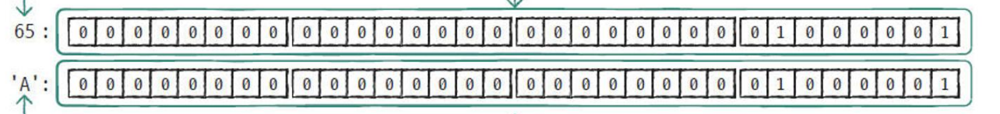

# C언어 day1

날짜: 2025년 12월 8일

## 주의 하면서 공부해야 할 점(커리큘럼)

기초

1. char, int, float / double → 메모리 저장구조, 형변환
2. array, pointer, function → 개념에 대해 정확하게 인지하고 있어야 함. 다양한 확장 타입 생성 및 활용
3. local, global → 파일을 분리하고 활용하는 project를 통하여 연습하는 것이 중요
4. function → 함수 작성
5. code review 연습

---

알고리즘

1. 재귀 호출 → 꼭 써야하는 경우들이 존재함. (몇 번 반복하고 언제 끝내야 할지 모를 때 활용하면 좋음)
2. (자료 구조) 스택, 큐, 배열 → 언제 활용하는지
3. 링크드리스트 → 이중 연결 리스트 정도의 동작 구현
4. BFS, DFS → 다양한 자료 저장

---

+ 알고리즘 문제 풀이

## 1-1. C언어 프로그램의 구조

- 기본 함수 모양

```c
반환값의종류 함수이름(함수인자종류)
{
    정해진 기능 수행;
    return 반환값;
}

---
#include <stdio.h>

int main(void)
{
    printf("Hello!");
    return 0; // 0의 의미 = 오류 없이 정상적으로 처리 되었다는 의미
}
```

- printf 함수 사용법

```c
printf("Hello");           // Hello! 출력
printf("%d", 10);          // 정수 10 출력
printf("%lf", 3.5);        // 실수 3.500000 출력
printf("%d", 10 + 20);     // 정수 30 출력
```

## 1-4 C언어에서의 정수 상수, 정수형 리터럴

- C언어에서의 진법별 수의 표현


0~15까지는 10진수 2진수 16진수의 변환 자연스럽게 진행되어야 함.

16진수에서 10진수 4씩 커지게 되면 0 → 4→ 8→ C

- 정수 상수 13의 메모리 표현 (1bits의부호, 31bits의 가수부)
    
    13 = 00000000 / 00000000 / 00000000 / 00001101/
    
    가장 큰 자리 비트의 경우 부호를 표기함 
    

- 정수 상수 -10의 메모리 표현
    - 음수는 2의 보수 표현 사용
    
    한번에 2의 보수로 표현하는 방법 = 뒤에서 처음 나오는 1까지 그대로, 앞부분은 반전
    
    ex) 10 → 00000000 / 00000000 / 00000000 / 00001010
    -10 → 11111111 / 11111111 / 11111111 / 11110110
    

## 1-5a. C언어에서의 실수 상수, 실수형 리터럴

- 실수 상수 - 소수점 표기법
    
    ex) 3.4 / -1.5 / 10.
    
- 실수 상수 - 지수 표기법
    
    ex) 3.14 x 10^-5 → 3.14e-5
    

- 실수 상수 - IEEE 754 표준 (1bit - 부호 비트, 11bits - 지수부, 52bits - 소수부로 구성)
    
    
    
    예시로 설명
    
    13.25와 -13.25로 표현해 봅시다.
    
    13.25를 표현하기
    
    step 1. 정수부와 소수부를 나누어주고, 2진수로 표현하자
    
    13.25(10)=13(10)=0.25(10)=1101(2)+0.01(2)=1101.01(2)
    
    step 2. 정규화를 해볼까요?
    
    정규화는 간단하게 말하면 소수점 앞에 1이 하나가 남을 때까지 소수점을 이동시켜주는 것과 같아요
    
    1101.01 = 1.10101 23
    
    이런식으로 변경하는 겁니다. 혹시 어려우신가요? 우리에게 더 친숙한 10진수로 한번 해볼께요
    
    13.25 = 1.325  101
    
    이것과 동일한 개념이라 생각하면 쉬워요
    
    step 3. 그럼 지수부는 왜 필요할까요?
    
    23 이 부분이 있잖아요. 이 부분을 표현하기 위해 필요한겁니다.
    
    그럼 여기서 바이어스라는 개념이 나오는데 왜 필요할까요?
    
    바이어스라는 개념은 쉽게 말해 지수부분을 표현할 때 23 이 나올 수도 있고2-3이 나올 수도 있잖아요
    
    이걸 지수부분이 음수일때 양수일때를 더 편하게 표현하기 위해 사용하는거에요
    
    float의 경우 지수부가 8bits로 -127~127을 표현할 수 있기 때문에 127이 바이어스 값이 됩니다.
    
    double의 경우는 지수부가 11bits로 -210 ~ 210 이므로 210이 바이어스 값이 되겠죠?
    
    아무튼 바이어스를 사용하여 23을 표현하면
    
    지수부는 127 + 3 = 130 = 10000010
    
    이렇게 표현 됩니다.
    
    step 4. 이제 1~3과정을 다 합쳐주면
    
    13.25 = 0 10000010 10101000000000000000000
    
    아 여기서 빠진 설명은 소수부분이기때문에 정수와 다르게 이진법 뒤에 0이 붙는겁니다.
    
    그리고 마지막
    
    13.25 = 1 10000010 10101000000000000000000 에요!!! 부호만 바꿔주면 끝!!!
    

## 1-5b. C언어에서의 문자 상수, 문자형 리터럴



A는 ASCII 65

a는 ASCII 97

만약 코드 진행 중

```c
x = 'a';
x -32;
x - ('a'-'A'); // 이 둘의 값은 컴파일 과정에서 동시에 처리되어 동일하게 여김
```

## 1-6. 변수

- 변수의 개념
    - 변수의 선언 : 메모리 할당하고 해당 메모리에 이름을 부여하는 것
    - 변수를 선언하려면
        1. 변수의 타입
        2. 메모리 크기
            
            1 + 2 → 데이터 타입, 자료형
            
        3. 변수 이름
        
        3가지 정보가 필요하다.
        
    - **메모리는 자료형이 무엇이냐에 따라서 그 형식에 맞게 출력되는 것이지 비트가 따로 정해저 있는 것이 아니다.**
    
- 변수 선언 방법
    - 모든 변수는 반드시 선언 후 사용 가능
    - 모든 변수는 사용 전에 초기화해야 한다. → 쓰기 동작을 먼저 해야한다.
    - 선언 + 초기화 동시 가능
        
        ```c
        int n1 = 0; // 선언과 동시에 초기화
        int n2;
        n2 = 10; // 선언 후 초기화
        ```
        
    
- 자료형
    - 정수 자료형
        
        각 자료형과 byte 크기 암기 필요
        
        
        
        기본적으로 signed unsigned 작성 안되어 있으면 signed가 디폴트
        
        but, char의 경우 컴파일러에 따라 다르기 때문에 직접 작성해 주는 것을 권고
        
    - 실수 자료형
        
        
        
        실수 자료형을 사용할 경우 소수점 몇 번째 자리까지 사용할지 정하고 사용해야 한다.
        
    - 자료형 관련 예약어
        - 자료형 관련 예약어 : char, double, float, int, long, short, signed, unsigned, struct(구조체), union(유니온) → 나중에 편하게 bit 연산 가능, enum(C++에서 범위 제약을 주는 것)
        - 제어문 : break. case, continue, default, do, else, for, ~~goto~~, if, return, switch, while
        - 기억클래스 : auto, extern, register, static
        - 기타 : const(제약을 주는 경우), sizeof, typedef(배열 포인터, 포인터 배열, 함수 포인터 등을 직접 자료형으로 저장하는 방법), volatile(컴파일러가 최적화하는 것을 방지, 어떤 행동을 반복할 경우 컴파일러가 안하려 하는데 그걸 해야한다고 명령하는 것)
    
    - 식별자 규칙
        - 대문자, 소문자, 숫자, _ 만 사용
        - 숫자로 시작할 수 없음

## 1-7a. char 형 변수

- char 형 변수 선언 및 초기화
    
    ```c
    char ch1 = 'A';
    char ch2 = 65;
    
    printf("문자 %c의 아스키 코드 값 : %d\n", ch2, ch1);
    // 문자 A의 아스키 코드 값 : 65
    ```
    

## 1-7b. int 형 변수

- 메모리에 값 저장, 서식 문자
    
    ```c
    unsigned int a, b;
    a = 4294967295;
    b = -1;
    
    printf("a = %d, %u\n", a, a);
    printf("b = %d, %u\n", b, b);
    // a = -1, 4294967295
    // b = -1, 4294967295
    // 둘이 다른 값이 들어간것 처럼 보이지만 메모리에 저장된 값은 동일하다.
    ```
    

## 1-7c. 실수형 변수

```c
float num = 123456789.0f; // 뒤에 f를 작성해야 한다

float a = 1.23456789f;
double b = 1.23456789;
// a와 b는 크기가 다름
```

## 1-7d. 문자열 변수

- 문자열은 char 배열에 저장됨
- 배열의 크기는 \0(null character)를 위해 1 이상 크게 확보

```c
char fruit[6] - 'apple';
```

## 1-7f. 주소연산자와 sizeof

- 변수 선언 = 메모리를 할당하는 작업
    - 변수는 이름, 값, 메모리 크기, 메모리 주소, 데이터의 종류 특성을 가지게 됨
- sizeof 연산자 : 변수가 사용하는 메모리 크기를 구할 수 있음
- & : 변수의 메모리 주소를 얻음
    - %p : 주소를 화면에 출력할 때 사용하는 format 문자

```c
int num = 10;
int* p = &num; // p : 정수형 변수의 주소를 저장할 수 있는 변수로 num의 주소로 초기화

printf("%zu %zu\n:", sizeof(num), sizeof(p));
printf("%p %p\n", p, &num);
printf("%d %d\n", *p, num);
//*p : 정수형 변수의 주소에 접근하여 정수 값을 가져오거나, 저장함
// L-value의 경우 저장, R-value의 경우 가져오는 동작
```

- sizeof 연산
    - sizeof는 컴파일 타임에 타입이나 변수의 크기를 바이트 단위로 계산하는 연산
    - 타입과 변수 모두에 사용할 수 있다
    - sizeof(배열명)의 경우 배열의 전체 크기를 반환한다.
        
        ```c
        void func(int a[10]) {
            printf("%d\n", sizeof(a)); // 4 출력
        }
        
        int main(void){
            int a[10] = { 0 };
            func(a);
            printf("%d\n", sizeof(a)); // 40 출력
            return 0;
        }
        ```
        
    - 공용체, 구조체의 크기 계산에서는 내부 패딩도 포함한다.
    - sizeof(상수)의 경우 상수 literal의 타입에 대한 크기를 반환한다.
    - %zu : size_t를 화면에 출력할 때 사용하는 format 문자
        
        ```c
        char ch = 'A';
        printf("%zu %zu\n", sizeof(ch), sizeof('A')); // 1 4 출력
        ```
        
    

## 1-8. const를 사용한 변수

```c
int income = 0;
double tax;
const double tax_rate = 0.12; // tax_rate라는 변수명으로는 수정 불가능

income = 456;
tax = income * tax_rate;
printf("세금은 : %1lf입니다.\n", tax);
// 세금은 : 54.7입니다.
```

```c
int main(void) {
    int a = 10;
    a = 20;
    printf("%d\n", a);
    return 0;
}
// 20 출력

int main(void) {
    const int a = 10;
    a = 20;
    printf("%d\n", a);
    return 0;
}
// 오류 발생, const 사용하면 a는 변경 불가능

int main(void) {
    int x = 10;
    int y = 20;
    const int  *a = &x;
    a = &y; // *a를 직접 변경하지 못하는 것이지 a는 변경할 수 있음
    printf("%d\n", *a);
    return 0;
}
//20 출력
```

## 1-9. 표준 입력

- 자료형에 따른 입력 변환 문자
    
    
    
- 숫자 입력
    
    ```c
    int a;
    scanf("%d", &a);
    printf("입력된 값 : %d\n", a);
    // 10 -> 입력된 값 : 10
    ```
    
- 문자 입력
    - 문자열 입력 시 Enter, 공백, 탭 등의 문자를 구분자로 인식한다.
    
    ```c
    #define _countof(array) (sizeof(array) / sizeof(array[0]))
    char grade;
    char name[20];
    
    (void)scanf("%c", &grade);
    scanf_s("%s", name, (unsigned int)_countof(name));
    printf("%s의 학점은 %c입니다.\n", name, grade);
    /*
    A
    홍길동
    홍길동의 학점은 A입니다.
    */
    /*
    B
    홍 길동
    홍의 학점은 A입니다.
    */
    ```