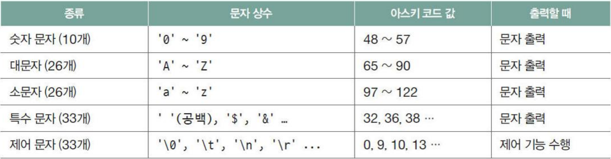
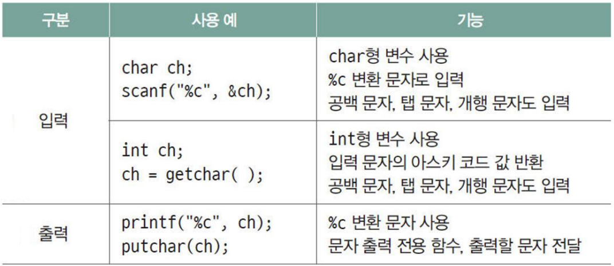

# C언어 day04

날짜: 2025년 12월 11일

## 포인터, 배열 복습 예제

```c
#define _CRT_SECURE_NO_WARNING
#include <stdio.h>

int main(void) {
    int a[4] = { 4, 1, 2, 3 };
    int b[6] = { 5, 10, 20, 30, 40, 50 };
    int c[5] = { 5, 100, 200, 300, 400 };
    int* arr[3] = { a, b, c };

    int M = sizeof(arr) / sizeof(arr[0]);

    for (int i = 0; i < M; i++) {
        int N = arr[i][0];
        for (int j = 1; j < N; j++) {
            printf("%d ", arr[i][j]);
        }
        printf("\n");
    }

    return 0;
}

/*----------upgrade-----------*/

#if 0
#define _CRT_SECURE_NO_WARNINGS
#include <stdio.h>

#define SIZE(a) (sizeof(a) / sizeof((a)[0]))

int dynamic_ary_print(int** arr, int size);
int main(void) {
    int a[4] = { 4, 1, 2, 3 };
    int b[6] = { 6, 10, 20, 30, 40, 50 };
    int c[5] = { 5, 100, 200, 300, 400 };
    int* arr[3] = { a, b, c };
    dynamic_ary_print(arr, SIZE(arr));
    return 0;
}

int dynamic_ary_print(int** arr, int size) {
    int* p = NULL;

    for (int i = 0; i < size; i++) {
        p = arr[i];
        for (int j = 1; j < p[0]; j++) {
            printf("%d ", p[j]);
        }
        printf("\n");
    }
}
#endif

/*
1 2 3
10 20 30 40
100 200 300 400
*/
```

## 문자

- 문자 상수, 아스키 코드
    - 아스키 코드
        
        
        
- 문자 입출력 함수
    
    
    
- 문자 입출력
    
    ```c
    #define _CRT_SECURE_NO_WARNING
    #include <stdio.h>
    
    int main(void) {
        char ch1, ch2;
        //이렇게 작성해야지 글씨만 읽음
        (void)scanf(" %c %c", &ch1, &ch2);
        //(void)scanf("%c%c", &ch1, &ch2);
        // -> 공백, enter도 포함해서 읽음
        printf("[%c%c]", ch1, ch2);
        return 0;
    }
    ```
    
    ```c
    #define _CRT_SECURE_NO_WARNING
    #include <stdio.h>
    
    int main(void) {
        char ch;
        ch = getchar;
        printf("입력할 문자 : ");
        putchar(ch);
        putchar('\n');
        return 0;
    }
    ```
    
- 문자 배열 입출력
    
    ```c
    #if 1
    #define _CRT_SECURE_NO_WARNINGS
    #include <stdio.h>
    #define size_ary(a) sizeof(a)
    
    void my_gets(char* str, int size) {
        int ch, i = 0;
        for (i = 0; i < size-1; i++) { // size가 30 이상이 되지 않게 관리
            ch = getchar();
            if (ch == '\n') break; // enter가 입력되면 멈춤
            str[i] = (char)ch;
        }
        str[i] = '\0'; // -> 문자열은 마지막에 \0이 있어야 함 -> 없으면 그냥 쭉.. 나옴
    }
    
    int main() {
        char str[30] = { 0 };
        my_gets(&str, size_ary(str));
        printf("%s\n", str);
        return 0;
    }
    #endif
    ```
    

## C프로세스의 메모리 사용

- 텍스트 영역
    - 코드 영역 : 실행할 프로그램의 코드를 올려 놓을 공간
    - .rodata : 읽기 전용 영역, global const, 문자열(” ”) → 쓰기 불가능
- 데이터 영역 : 프로그램 종료 시까지 유지해야 할 데이터 저장 공간
    - .data : RW 가능 영역, static, global 변수 중 초기값을 갖는 변수
    - .bss : RW 가능 영역, static, global 변수 중 초기값을 갖지 않는 변수 → 실행 전 일괄 초기화
- 스택 영역 : 잠시 사용하고 삭제할 데이터 저장 공간, local 변수 → 크기가 한정되어 있음
- 힙 영역 : 프로그래머가 원하는 방식으로 쓸 수 있는 공간, malloc, calloc, realoc 함수를 사용해 할당 받음

## 문자열 상수

- 문자열 상수의 저장
    - 문자열 배열은 문자열 저장 공간을 읽고 쓰기가 가능한 스택에 가지고 있음
    - 문자열 상수는 문자열 저장 공간이 rodata(읽기만 가능) 영역에 가지고 있음.
    
    ```c
    char *dessert = "apple"; // dessert는 포인터 변수
    char fruit[20] = "banana";
    
    dessert = "banana"; // 가능, dessert는 스택 공간에 있음
    strcpy(fruit, "banana"); // NULL문자까지 복사함
    // rodata에서 바나나 주소로 가서 b, a, ...로 fruit에 복사함
    memcpy(fruit, "banana", sizeof("banana")); // strcpy와 다르게 주소를 주고 몇 바이트 복사
    // 바나나 문자열 크기 -> NULL문자를 포함한 길이 = 7 만큼 복사하게 함
    memmove(fruit, "banana", sizeof("banana")); //move를 cpy보다 권장함
    // cpy와 다르게 주소가 이동하는 것 -> 만약 메모리가 겹치는 상황에서 cpy는 올바른 동작 X
    ```
    

- const 사용으로 안전하게
    - 변경할 수 없는 경우 const로 변경을 금지해 두면 compile 단계에서 오류 확인 가능
    - const는 대상의 뒤에 표기하며, 기본 자료형을 대상으로 할 경우 앞에 표기
    
    ```c
    char* dessert1 = "apple";
    const char * dessert2 = "apple";
    char const * const dessert3 = "apple";
    
    dessert1 = 'A'; // 절대 불가능함
    dessert2[0] = 'A'; // runtime에서 error발생
    dessert3[0] = 'A'; // runtime에서 error발생
    dessert2 = "Banana" // 변경 가능함. -> 변수명이 아니라 주소를 활용해 변경
    dessert3 = "Banana" // 변경 불가능함. -> 그 주소에 있는 것도 변경하지 마.
    ```
    
    - “apple”이라는 문자열이 rodata에 있는데 이건 절대로 바꿀 수 없는 것임.
    - char * dessert는 결국 이 “apple”의 a부분의 주소를 알려주는 것이고 상수로 생각하고 변경 불가