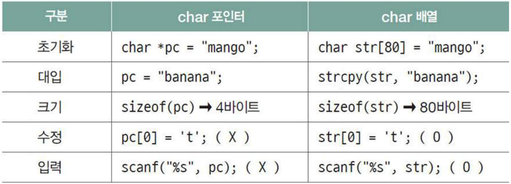
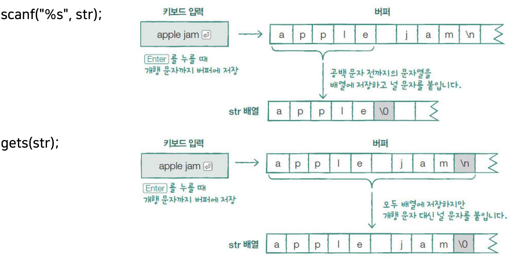
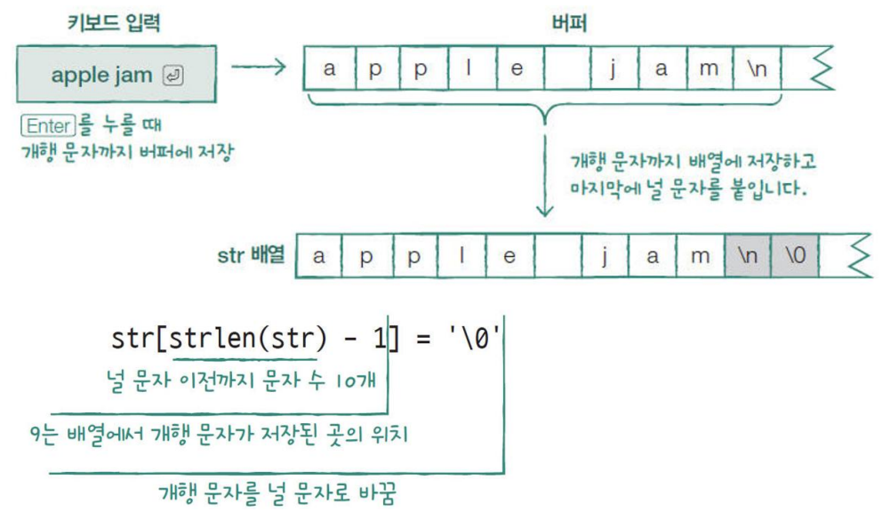
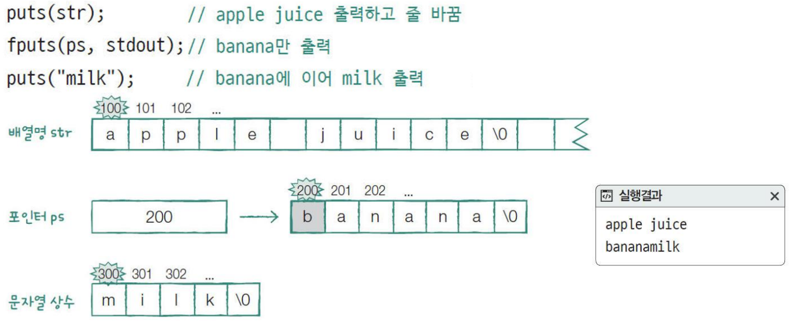
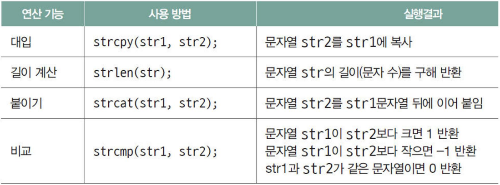
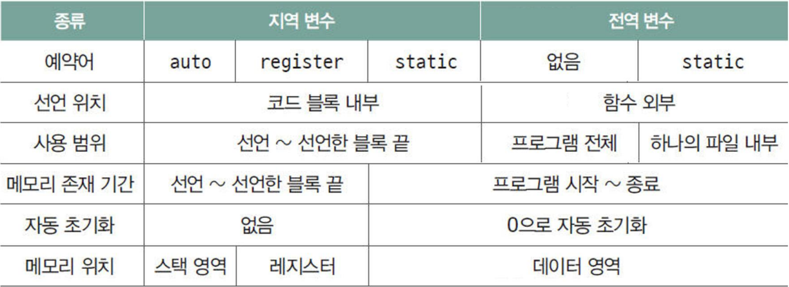
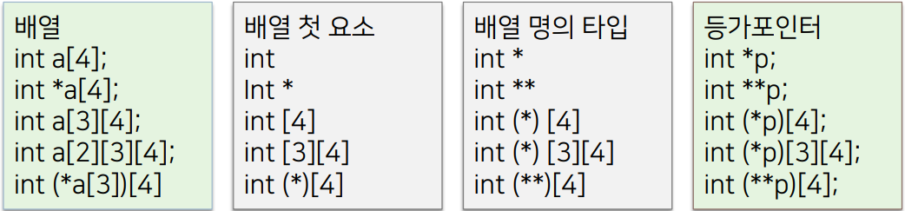

# C언어 day05

날짜: 2025년 12월 12일

## const를 사용한 변수

- `const int * a;` , `int const * b` → *a, *b를 상수로 정의
    - const가 기본 자료형 앞 또는 뒤에 있기 때문에 a, b를 사용해 int 값 변경 불가
    
    ```c
    int x = 10;
    int y = 20;
    const int * a = &x;
    int const * b = &x;
    //*a = y; // 오류: *a는 상수이므로 값을 변경할 수 없음
    //*b = y; // 오류: *b는 상수이므로 값을 변경할 수 없음
    x = 40; // x 자체는 변경할 수 있음
    a = &y; // a와 b는 다른 주소를 가리킬 수 있음
    b = &y;
    
    printf("*a =%d, *b=%d\n", *a, *b);
    // *a = 20, *b = 20
    ```
    
- `int * const a` → a를 상수로 정의
    - const가 * 뒤에 있기 때문에 a를 사용하여 int * 값을 변경하지 못함
    
    ```c
    int x = 10;
    int y = 20;
    int * const a = &x;
    *a = y; // *a를 통해 값을 변경할 수 있음
    //a = &y; // 오류: a는 상수 포인터이므로 다른 주소를 가리킬 수 없음
    printf("*a =%d\n", *a); // *a = 20
    ```
    
- `const int * const a;` → *a, a 를 상수로 정의
    
    ```c
    int x = 10;
    int y = 20;
    const int* const a = &x;
    
    // *a = y; // 오류: *a는 상수이므로 값을 변경할 수 없음
    // a = &y; // 오류: a는 상수 포인터이므로 다른 주소를 가리킬 수 없음
    ```
    
- const 상수의 특징
    - 매크로 상수보다 const 상수를 사용하는 것이 안정적
        
        → const 상수는 컴파일러에 의해서 직접 처리됨.
        
    - 다른 함수에 똑같은 이름의 변수를 선언하고 상수화 한다면 그 함수 내 다른 세율을 적용할 수 있음
    - 함수 내부에 선언할 경우, 자동변수와 마찬가지로 상수의 사용 범위가 함수 내부로 제한됨
- define vs. const
    
    ```c
    #define Tax_Rate 0.11
    double TaxA(int income){
        #define Tax_Rate 0.03
        return ( (double) income * Tax_Rate);
    }
    double TaxB(int income){
        return ( (double) income * Tax_Rate);
    }
    int main(void){
        printf("Tax_Rate (3%%) : %.1lfWn", TaxA(1000000));
        printf("Tax_Rate(11%%) : %. 1lfWn", TaxB(1000000));
    }
    // Tax_Rate (3%) : 30000.0
    // Tax_Rate (11%) : 30000.0
    ```
    
    define은 타입 체크 이런것 없이 그냥 읽고 변경
    
    ```c
    const double Tax_Rate = 0.11;
    double TaxA(int income){
        const double Tax_Rate = 0.03;
        return ( (double) income * Tax_Rate);
    }
    double TaxB(int income){
        return ( (double) income * Tax_Rate);
    }
    int main(void){
        printf("Tax_Rate (3%%) : %.1lfWn", TaxA(1000000));
        printf("Tax_Rate (11%%) : %. 1lfWn", TaxB(1000000));
    }
    // Tax_Rate (3%) : 30000.0
    // Tax_Rate (11%) : 110000.0
    ```
    
- 문자열 배열과 문자열 상수(포인터)의 차이
    - 문자열 배열은 문자열 저장 공간을 읽고 쓰기가 가능한 스택에 가지고 있음
    - 문자열 상수는 문자열 저장 공간이 rodata 영역에 가지고 있음
    
    
    

## 문자열 입출력

- scanf. gets로 문자열 입력
    
    
    
- fgets로 문자열 입력 받기
    
    `fgets(str, sizeof(str), stdin)`
    
    
    
- puts, fputs로 문자열 출력하기
    
    puts는 출력 후 줄 바꿈, fputs는 줄 바꿈하지 않음
    
    
    
- 문자열 관련 함수
    - 문자열 관련 함수는 string.h를 include하여 사용한다
    
    
    
    위 4가지를 코드로 작성해 보기
    
    - `strcpy`
        
        ```c
        #include <string.h>
        
        char *
        strcpy(char *to, const char *from)
        {
          char *save = to;
        
          for (; (*to = *from); ++from, ++to);
          return save;
        }
        ```
        
    - `strlen`
        
        ```c
        #include <string.h>
        
        size_t
        strlen(const char *str)
        {
          const char *s;
        
          if (str == 0)
            return 0;
          for (s = str; *s; ++s);
          return s-str;
        }
        ```
        
    - `strcat`
        
        ```c
        #include <string.h>
        
        char *
        strcat(char *s, const char *append)
        {
          char *save = s;
        
          for (; *s; ++s);
          while ((*s++ = *append++)); // 대입한 값이 \0이 되는 순간까지 진행
          return save;
        }
        ```
        
    - `strcmp` * 중요 *
        
        ```c
        #include <string.h>
        
        int
        strcmp(const char *s1, const char *s2)
        {
          while (*s1 == *s2)
          {
            if (*s1 == 0) // s1과 s2가 완전히 동일하다
              return 0;
            s1++;
            s2++;
          }
          // *(unsigned const char *)s1 -> unsigned const char s1
          return *(unsigned const char *)s1 - *(unsigned const char *)(s2);
        }
        ```
        
    - `strncpy(복사 받을 배열명, 복사할 문자열, 복사할 문자수);`
        
        ```c
        #include <string.h>
        
        char *
        strncpy(char *dst, const char *src, size_t n)
        {
          if (n != 0) {
            char *d = dst;
            const char *s = src;
        
            do {
              if ((*d++ = *s++) == 0)
              {
            while (--n != 0)
              *d++ = 0;
            break;
              }
            } while (--n != 0);
          }
          return dst;
        }
        ```
        

## 변수의 사용 영역

- 변수 종류별 특징
    
    
    
    - c.f) 프로그램 응집도와 결합도
        
        응집도 높을 수록 좋음
        
        종류
        
        - 우연적 응집도 (낮음)
        - 논리적 응집도
        - 시간적 응집도
        - 절차적 응집도
        - 통신적 응집도
        - 순차적 응집도
        - 기능적 응집도 (높음, good)
        
        결합도 낮을 수록 좋음
        
        종류
        
        - 내용 결합도 (높음)
        - 공통 결합도
        - 외부 결합도
        - 제어 결합도
        - 스탬프 결합도
        - 자료 결합도 (낮음, good)
- 지역 변수는 선언된 함수 블록에서만 사용 가능
    - 선언된 블록이 끝나면 저장 공간이 메모리에서 사라짐
    
    ```c
    #define _CRT_SECURE_NO_WARNING
    #include <stdio.h>
    
    int main(void) {
        int a = 0;
        assign();
        printf("main 함수 a : %d\n", a);
        return 0;
    }
    
    void assign(void) {
        int a;
        a = 10;
        printf("assign 함수 a : %d\n", a);
    }
    // assing a : 10
    // assign a : 0
    ```
    
- 전역 변수의 위험성
    - 이름이 바뀌면 사용 함수의 모든 이름을 찾아 변경해야함
    - 값이 이상하면 접근 가능한 모든 함수를 살펴야 한다
    - 같은 이름의 지역 변수에 의해 사용 범위가 제한된다
    
    ```c
    int a;
    
    int main(void)
    {
        printf("함수 호출 전 a : %d\n", a);
        assign10();
        assign20();
        printf("함수 호출 후 a : %d\n", a);
        return 0;
    }
    void assign10(void) {
        a = 10;
    }
    void assign20(void) {
        int a;
        a = 20;
    }
    //함수 호출 전 a : 0
    //함수 호출 후 a : 10
    ```
    
    ```c
    const int a = 10;
    int main(void) {
        int *p = &a;
        *p = 20;
        printf("%d", a);
        return 0;
    }
    // 오류 발생 global const는 변경 불가
    ```
    
- 정적 지역 변수
    
    ```c
    void auto_func(void)
    {
        auto int a = 0;
        a++;
        printf("%d\n", a);
    }
    
    void static_func(void)
    {
        static int a;
        a++;
        printf("%d\n", a);
    }
    printf("auto 사용 함수\n");
    for (i = 0; i < 3; i++)
    {
        auto_func();
    }
    printf("static 사용 함수\n");
    for (i = 0; i < 3; i++)
    {
        static_func();
    }
    
    /*
    auto 사용 함수
    1
    1
    1
    static 사용 함수
    1
    2
    3
    */
    ```
    
- 정적 지역 변수의 사용 예
    
    ```c
    int factorial(int n) {
        // 캐싱을 위한 정적 지역 배열
        static int memo[100] = { 0 };
        if (n == 0 || n == 1) return 1;
        if (memo[n] != 0) return memo[n];
        memo[n] = n * factorial(n - 1);
        return memo[n];
    }
    int n = 5;
    printf("factorial(%d) =%d\n", n, factorial(n));
    printf("cnt =%d\n", cnt);
    printf("factorial(%d) =%d\n", n, factorial(n));
    printf("cnt =%d\n", cnt);
    
    /*
    factorial(5) = 120
    cnt = 5
    factorial(5) = 120
    cnt = 6
    */
    ```
    
- 레지스터 변수
    - 전역 변수는 레지스터 변수로 선언할 수 없다
    - 레지스터 변수는 주소를 구할 수 없다
    - 레지스터의 사용 여부는 컴파일러가 결정한다
- 변수의 메모리 영역
    
     
    
    ```c
    int a1; // bss
    int a2 = 10; //data
    static int b1; // bss
    static int b2 = 10; // data
    
    int main(void)
    {
        int x1; // stack
        int x2 = 100; //stack
        static int y1; // bss
        static int y2 = 200; //data
        int* p = malloc(100); //stack, heap
        b1 = 10;
        return 0;
    }
    ```
    
- 분할 컴파일
    - 하나의 프로그램은 기능에 따라 많은 함수 포함
    - 함수들을 여러 개의 파일 단위로 묶어 작성할 수 있으며 → 모듈이라함
    - 하나의 프로그램을 여러 개의 모듈로 나누어 작성하는 것 → 분할 컴파일
    
    
    
- 외부 변수 (extern variable)
    - 다른 모듈(파일)에 있는 전역 변수를 자신의 변수인 것처럼 사용
        - static global variable의 경우 다른 파일에서의 사용이 되지 않음으로 extern으로 활용 불가
    - 예약어 extern 사용하여 외부 변수 사용
    - extern을 사용한 외부변수는 실제로 기억 공간이 할당 되지 않음
        - 다른 모듈에 있음을 컴파일러에 알려주는 역할만 진행
    
    ```c
    /*func.h*/
    #ifndef __FUNC__H__
    #define __FUNC_H__
    void Increment();
    int GetNum();
    #endif
    
    /*func.c*/
    extern int num; // num.c 외부 참조이므로 초기값 설정 X
    
    void Increment() {
        num++;
    }
    
    int GetNum(){
        return num;
    }
    
    /*num.c*/
    int num;
    
    /*main.c*/
    #if 01
    #define _CRT_SECURE_NO_WARNING
    #include <stdio.h>
    #include "func.h"
    
    int main(void) {
        printf("num : %d\n", GetNum());
        Increment();
        printf("num : %d\n", GetNum());
        Increment();
        printf("num : %d\n", GetNum());
        return 0;
    }
    
    #endif
    ```
    

## 2차원 배열

- 2차원 배열의 선언, 입력
    - txt 파일에서 input 가져와서 2차원 배열 만들고 각 행의 요소의 총합과 평균 구하기
    
    ```c
    /*헤더파일에 scores.txt 파일에 숫자 저장*/
    #define _CRT_SECURE_NO_WARNING
    #include <stdio.h>
    int total[3] = { 0 };
    float avg[3] = { 0 }; 
    void total_avg(int (*score)[4], int r, int c) {
        for (int i = 0; i < c; i++) {
            for (int j = 0; j < r; j++) {
                total[i] += score[i][j];
            }
            avg[i] = (float)total[i] / r;
        }
    }
    
    int main(void) {
        int score[3][4] = { 0 };
        int i, j;
        int* p;
        p = *score;
    
        (void)freopen("scores.txt", "r", stdin); // 파일에서 input 가져오기
        for (i = 0; i < 12; i++) {
            
            (void)scanf("%d", p + i);
        
        }
        
        total_avg(score, 4, 3);
        for (int i = 0; i < 3; i++) {
            printf("총점 : %d, 평균 : %.2f\n", total[i], avg[i]);
        }
        return 0;
     }
    ```
    
- 2차원 배열의 초기화
    - 일부 초기값 생략 가능
    - 행의 수 생략 가능 (이름 뒤에 1개만 생략 가능, Datatype 생략 불가능)
    - 1차원 배열처럼 초기화 가능 (초기값 없는 저장 공간은 0으로 초기화됨)
        
        ```c
        int num1[3][4] = {{1}, {5, 6}, {9, 10, 11}};
        int num2[][4] = {{1}, {5, 6}, {9, 10, 11}};
        int num3[3][4] = {1, 2, 3, 4, 5, 6, 7, 8, 9, 10, 11, 12};
        int num4[3][4] = {1, 2, 3, 4, 5, 6};
        int num5[][4] = {1, 2, 3, 4, 5, 6};
        ```
        
- 배열은 함수의 argument로 보낼 수 없기 때문에 포인터를 사용한다.
- 배열 등가 포인터
    - 배열명을 대입할 때 에러, 경고가 없는 포인터, 배열과 동일한 방법으로 사용되는 포인터
    - 배열명은 배열의 첫 구성 요소를 가리키는 포인터, 배열 등가 포인터와 동일
    - 배열 등가 포인터는 배열명 뒤의 [n]을 제거하고 배열명 앞에 *을 붙여 만듦
    
    
    
- 배열 등가 포인터 만들기
    
    ```c
    int a[2][3][4] = { 0 };
    int (*b[3])[4] = { 0 };
    int* (*c[2])(int*)= { 0 };
    int* d[3][4] = { 0 };
    int(*(*e[5])(void))[4] = { 0 };
    // pa ~ pe 포인터 변수 선언
    
    int (*pa)[3][4] = a;
    int (**pb)[4] = b;
    int *(**pc)(int*) = c;
    int *(*pd)[4] = d;
    int (*(**pe)(void))[4] = e;
    ```
    
- 2차원 char 배열, 입력
    
    ```c
    char animal[5][10]= { 0 };
    int i;
    (void)freopen("animal.txt", "r", stdin);
    for (i=0; i < size_ary(animal); i++)
    {
        (void)scanf("%s", animal[i]);
    }
    print_ary(animal, size_ary(animal));
    
    #define size_ary(x) (sizeof(x)/sizeof((x)[0]))
    static void print_ary(char(*ary)[10], int size) {
        for (int i = 0; i < size; i++) {
            printf("%s ", ary[i]);
        }
        printf("\n");
    }
    ```