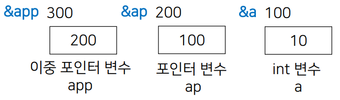
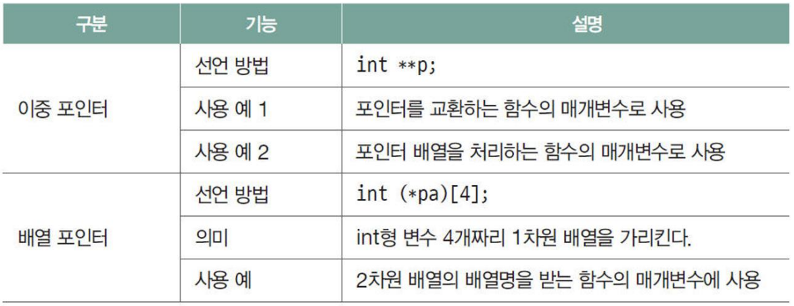
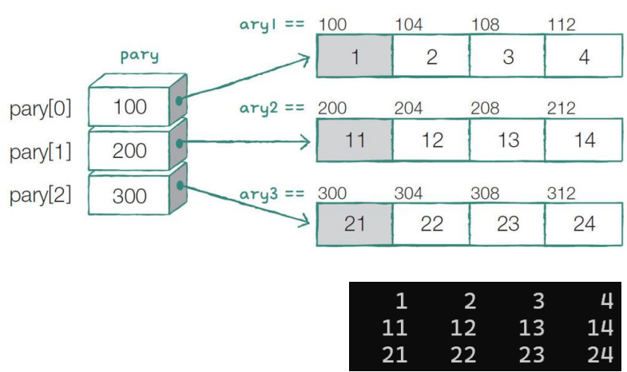
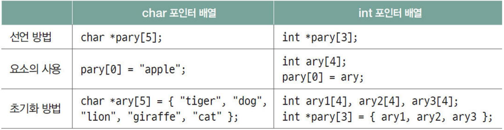

# C언어 day06

날짜: 2025년 12월 15일

## 2차원 배열 continue

- int a[3][4]일때 어느곳을 의미하는가
    
    ```c
    /*
    요소 값
    [[1, 2, 3, 4],
     [5, 6, 7, 8],
     [9, 10, 11, 12]]
    주소 값
    [[1000, 1004, 1008, 1012],
     [1016, 1020, 1024, 1028],
     [1032, 1036, 1040, 1044]]
    */
    
    a == 1000 // a는 배열 포인터, int가 4개인 배열을 가리키는 포인터, a+1 = 1016
    // int (*p)[4] = a;
    *a == 1000 // *a == a[0]
    a[0] == 1000 // a[0]은 int 포인터, a[0]+1 = 1004
    // int *p = a[0];
    &a // &a는 이차원배열 포인터,
    // int (*p)[3][4] = &a; p로 1024주소에 있는 int를 읽어내려면 p[0][1][2] = ***p
    // p[0]은 이차원배열이 되는것이다.
    *a[0] == a[0][0] == 1
    (*a)[0] == a[0][0] == 1
    *(*(a+1)+0) == *(a[1]+0) == a[1][0] == 5
    (*(a+1))[0] == a[1][0] == 5
    *(*(a+0)+2) == *(a[0]+2) == a[0][2] == 3
    (*a+2)[0] == (a[0]+2+0) == a[0][2] == 3
    (*(*a)+1) == (*a[0]+1) == a[0][0] + 1 == 2
    &(a+1)[2] == &(a+1+2) == &(a+3) == &a[3] == 1048
    *a+1 == a[0]+1 == 1004
    (a+1)[2] == a+1+2 == a[3] == 1048
    &(*a)[0] == &(a[0])[0] == &(a[0][0]) == 1000
    a[1]+2 == 1024
    &*(*(a+2)) == (*(a+2)) == a[2] == 1032
    ```
    
- 배열의 이해
    
    배열은 차원에 상관 없이 물리적으로 “연속된” 메모리를 사용한다.
    
- 포인터의 이해
    - 포인터 상수인지 변수인지 파악
    - 포인터는 가리키는 자료형의 정보를 파악해야함
    - 포인터가 가리키는 메모리 특성을 파악
        - read only의 경우 수정 불가
    - **포인터는 가리키는 자료형의 정보는 언제든 변경 가능하다**
        - 포인터가 아닌 경우 형 변환시 loss 중의, 포인터의 경우 형변환은 가리키는 자료형의 정보를 변경하는 것이 아니라 움직이는 단위를 변경하는 것이므로 상관 없다
        - void 포인터는 존재함. 일단은 포인터가 가리키는 종류가 무엇인지 모를 때 사용. 사용 시에는 반드시 형 정의를 해주어야 한다.
- 포인터 상수
    - 배열 이름과 문자열은 대표적인 포인터 상수
        - 배열의 이름은 배열 첫번째 요소를 가리키는 포인터 상수
    - 포인터는 & 연산자를 사용하여 구하며, 변수 및 포인터 상수를 대상으로 사용할 수 있다.
    - sizeof(포인터 상수)의 결과 상수(배열)이 사용하는 메모리 크기
    - sizeof(& 포인터 상수)의 결과 포인터가 사용하는 메모리 크기

## 정리

- 1차원 배열
    
    ```c
    int ary[5] = { 1,2,3,4,5 };
    
    printf("%p %p %p\n", &ary, ary, &ary[0]);
    printf("%zu %zu\n", sizeof(&ary), sizeof(ary));
    // 1000 1000 1000
    // 4 20
    
    char ary[10] = "rabbit";
    
    printf("%p %p %p\n", &ary, ary, &ary[0]);
    printf("%zu %zu\n", sizeof(&ary), sizeof(ary));
    printf("%zu %zu\n", sizeof(&"rabbit"), sizeof("rabbit"));
    // 1000 1000 1000
    // 4 10
    // 4 7
    ```
    
- 2차원 배열
    
    ```c
    int A[3][4] = { 0 };
    
    printf("%p %p %p %p %p\n", &A, A, &A[0], A[0], &A[0][0]);
    printf("%zu %zu %zu %zu %zu\n",
        sizeof(&A), sizeof(A), sizeof(&A[0]), sizeof(A[0]), sizeof(&A[0][0]));
    printf("%p %p %p %p %p\n", &A+1, A+1, &A[0]+1, A[0]+1, &A[0][0]+1);
    
    // 1000 1000 1000 1000 1000
    // 4 48 4 16 4
    // 1048 1016 1016 1004 1004
    ```
    
      
    
    ```c
    //2차원 배열을 출력하는 print_ary()함수를 작성하시오.
    
    int ary[3][4]={ 1,2,3,4,5,6,7,8,9,10,11,12 };
    
    for (int i = 0; i < 3; i++) {
        for (int j = 0; j < 4; j++) {
            printf("%5d", ary[i][j]);
        }
        printf("\n");
    }
    print_ary(ary, 3, 4);
    // 프로토 타입
    //print_ary(int (*p)[4], int i, int j);
    ```
    
- 배열명
    - 배열명 == 포인터 상수
    - 배열명은 `&` 와 `sizeof()`하면 배열자체로 사용됨
    - 배열 차원은 사용가능한 배열명의 종류와 같다
    - 배열명을 포인터로 사용하는 경우 (*, [], +, -, 대입 연산 등)이다.

## 다중 포인터

- 포인터의 포인터
    
    )
    
    ```c
    int a = 10;
    int* ap = &a;
    int ** app = &ap;
    printf("%d %d %d\n", a, *ap, ** app);
    // 10 100 200
    ```
    
- 다중 포인터의 Call By Reference
    
    ```c
    #define _CRT_SECURE_NO_WARNING
    #include <stdio.h>
    void exchange0(int* a, int* b) {
        int temp = *a;
        *a = *b;
        *b = temp;
    }
    
    // ap, bp 변수의 주소를 전달 받아 a, b값을 교환하는 함수
    void exchange1(int **a, int **b) {
        int temp = **a;
        **a = **b;
        **b = temp;
    }
    // app, bpp 변수의 주소를 전달 받아 a, b값을 교환하는 함수
    void exchange2(int ***a, int ***b) {
        int temp = ***a;
        ***a = ***b;
        ***b = temp;
    }
    // ap, bp 변수의 주소를 전달 받아 ap, bp값을 교환하는 함수
    void exchange3(int **a, int **b) {
        int *temp = *a;
        *a = *b;
        *b = temp;
    }
    // app, bpp 변수의 주소를 전달 받아 ap, bp값을 교환하는 함수
    void exchange4(int ***a, int *** b) {
        int *temp = **a;
        **a = **b;
        **b = temp;
    }
    // app, bpp 변수의 주소를 전달 받아 app, bpp값을 교환하는 함수
    void exchange5(int ***a, int ***b) {
        int **temp = *a;
        *a = *b;
        *b = temp;
    }
    
    int main(void) {
        int a = 10, b = 5;
        int* ap = &a, * bp = &b;
        int** app = &ap, ** bpp = &bp;
    
        printf("Before : a = %d b = %d\n", a, b);
        exchange0(&a, &b);
        printf("After exchange1 : a = %d b = %d\n", a, b);
    
        printf("Before : a = %d b = %d\n", a, b);
        exchange1(&ap, &bp);
        printf("After exchange1 : a = %d b = %d\n", a, b);
    
        printf("Before : a = %d b = %d\n", a, b);
        exchange2(&app, &bpp);
        printf("After exchange2 : a = %d b = %d\n", a, b);
    
        printf("Before : ap = %p bp = %p\n", ap, bp);
        exchange3(&ap, &bp);
        printf("After exchange3 : ap = %p bp = %p\n", ap, bp);
    
        printf("Before : ap = %p bp = %p\n", ap, bp);
        exchange4(&app, &bpp);
        printf("After exchange4 : ap = %p bp = %p\n", ap, bp);
    
        printf("Before : app = %p bpp = %p\n", app, bpp);
        exchange5(&app, &bpp);
        printf("After exchange5 : app = %p bpp = %p\n", app, bpp);
    
        return 0;
    }
    ```
    
- 2차원 배열의 배열 등가 포인터
    - 이중 포인터, 배열 포인터
        
        
        
        ```c
        int a[3][4];
        int (*pa)[4] = a;
        
        int *b[4];
        int **pb = b;
        
        int (*c[5])[4];
        int (**pc)[4] = c;
        ```
        
- 포인터 배열
    
    ```c
    int ary1[4] = { 1, 2, 3, 4 };
    int ary2[4] = { 11, 12, 13, 14 };
    int ary3[4] = { 21, 22, 23, 24 };
    int* pary[3] = { ary1, ary2, ary3 };
    
    for (int i = 0; i < 3; i++) {
        for (int j = 0; j < 4; j++) {
            printf("%5d", pary[i][j]);
        }
        printf("\n");
    }
    ```
    
    
    
- 정리
    - 포인터 배열의 선언과 초기화
    
    
    

## 함수 포인터

- 함수 포인터
    
    배열 이름은 함수 포인터이다.
    
    `(**********func)()` 이런식으로 사용해도 func() 작동 가능
    
    - 필요성
        - 같은 동작을 하는데 일부만 다를 때, 다른 부분만 함수로 만들어 사용함
        - 즉, 어떤 함수의 동작을 모두 구현하지 않고 일부는 비워둔 상태에서, 그 비워둔 일부 기능을 다른 사람이 정의하여 사용하도록 할 때 사용함
            
            ex) `qsort()`의 경우 `int(*func)(void*, void*);` 형태의 함수 포인터 변수에 사용할 함수를 작성하여 함수 이름을 대입해야 함.
            
- 함수 이름 == 함수 포인터
    
    ```c
    #define _CRT_SECURE_NO_WARNING
    #include <stdio.h>
    int sum(int x, int y) {
        return x + y;
    }
    int sub(int x, int y) {
        return x - y;
    }
    int mul(int x, int y) {
        return x * y;
    }
    int divi(int x, int y) {
        return x / y;
    }
    int mod(int x, int y) {
        return x % y;
    }
    
    int main(void) {
        int a = 10, b = 5;
    
        int (*my_func)(int, int) = sum;
    
        int (*func[5])(int, int) = { sum, sub, mul, divi, mod }; // 함수 포인터 배열
    
        printf("%d + %d = %d\n", a, b, my_func(a, b));
    
        for (int i = 0; i < 5; i++) {
            printf("%d\n",func[i](a, b));
        }
    
        return 0;
    }
    
    /*
    10 + 5 = 15
    15
    5
    50
    2
    0
    */
    ```
    
- 메뉴를 출력하고 사용자에게 input을 받는 코드
    
    ```c
    #define _CRT_SECURE_NO_WARNING
    #include <stdio.h>
    int sum(int x, int y) {
        return x + y;
    }
    int sub(int x, int y) {
        return x - y;
    }
    int mul(int x, int y) {
        return x * y;
    }
    int divi(int x, int y) {
        return x / y;
    }
    int mod(int x, int y) {
        return x % y;
    }
    
    int getChoiceNumber(char **menulist, int size) {
        int btn = 0;
        printf("-------------------------------\n");
        printf("-0. 종료                      -\n");
        for (int i = 1; i < size; i++) {
            printf("-%d. %s                    -\n", i, menulist[i]);	
        }
        printf("-------------------------------\n");
        (void)scanf("%d", &btn);
        return btn;
    }
    
    int main(void) {
        int a = 5, b = 2;
        char* menu[6] = { 0, "더하기", "빼기  ", "곱하기", "몫    ", "나머지" };
        int (*func[])(int, int) = { 0, sum, sub, mul, divi, mod }; // 함수 포인터 배열
    
        //prinf("-------------------------------\n");
        //prinf("-0. 종료                      -\n");
        //prinf("-1. 더하기                    -\n");
        //prinf("-2. 빼기                      -\n");
        //prinf("-3. 곱하기                    -\n");
        //prinf("-4. 나누기                    -\n");
        //prinf("-5. 나머지                    -\n");
        //prinf("-------------------------------\n");
        int btn = getChoiceNumber(menu, 6);
        
        if (0 < btn && btn < 6) {
            printf("%d\n", func[btn](a, b));
        }
        else if (btn == 0){
            printf("프로그램이 종료됩니다. 아무키나 눌러주세요.");
        }
        else {
            printf("입력이 잘못되었습니다. 다시 실행바랍니다.");
        }
        return 0;
    }
    
    /*
    -------------------------------
    -0. 종료                      -
    -1. 더하기                    -
    -2. 빼기                      -
    -3. 곱하기                    -
    -4. 몫                        -
    -5. 나머지                    -
    -------------------------------
    5
    1
    */
    ```
    
- 구조체 만들어서 풀이
    
    ```c
    #define _CRT_SECURE_NO_WARNINGS
    #include <stdio.h>
    #define SIZE(a) (sizeof(a) / sizeof((a)[0]))
    typedef struct _menu {
        char* name;
        int (*func)(int, int);
    }menu_t;
    
    int sum(int x, int y);
    int sub(int x, int y);
    int mul(int x, int y);
    int divi(int x, int y);
    int mod(int x, int y);
    
    int getChoiceNumber(menu_t* menu, int size) {
        int num;
        printf("+--------------------+\n");
        for (int i = 0; i < size; ++i) {
            printf("+ %d. %-15s +\n", i, menu[i].name);
        }
        printf("+--------------------+\n");
        (void)scanf("%d", &num);
    
        return num;
    }
    
    int main(void) {
        int a = 10;
        int b = 5;
        menu_t my_menu[6] = {
            {"종료"},
            { "더하기", sum },
            { "빼기", sub },
            { "곱하기", mul },
            { "몫", divi },
            { "나머지", mod },
        };
    
        //char* menu[] = { 0, "더하기", "빼기", "곱하기", "몫", "나머지" };
        //int (*func[])(int, int) = { 0, sum, sub, mul, divi, mod };
        int choice = getChoiceNumber(my_menu, SIZE(my_menu));
        if (choice > 0 && choice < 6) {
            printf("%d\n", my_menu[choice].func(a, b));
        }
        else if (choice == 0) {
            printf("프로그램이 종료됩니다. 아무키나 눌러주세요.");
        }
        else {
            printf("입력이 잘못되었습니다. 다시 실행바랍니다.");
        }
    
        return 0;
    }
    
    int sum(int x, int y) {
        return x + y;
    }
    int sub(int x, int y) {
        return x - y;
    }
    int mul(int x, int y) {
        return x * y;
    }
    int divi(int x, int y) {
        return x / y;
    }
    int mod(int x, int y) {
        return x % y;
    }
    ```
    
- 함수 포인터 활용
    
    ```c
    #define _CRT_SECURE_NO_WARNINGS
    #include <stdio.h>
    #define SIZE(a) (sizeof(a) / sizeof((a)[0]))
    
    void print_ary(int* ary, int size);
    void sort_ary(int* ary, int size, int(*func)(int*, int, int));
    int desc(int* ary, int i, int j);
    int asc(int* ary, int i, int j);
    
    int main(void) {
        int ary[] = { 8, 5, 2, 12, 7, 9, 4, 6, 10, 3 };
    
        print_ary(ary, SIZE(ary));
        sort_ary(ary, SIZE(ary), asc);
        print_ary(ary, SIZE(ary));
        sort_ary(ary, SIZE(ary), desc);
        print_ary(ary, SIZE(ary));
    }
    void print_ary(int* ary, int size) {
        for (int i = 0; i < size; i++) {
            printf("%d ", ary[i]);
        }
        printf("\n");
    }
    
    /*
    정렬 파트 함수화
    내림차순의 경우 -1 출력하여 내림차순 표시
    오름차순의 경우 1 출력하여 오름차순 표시
    */
    int desc(int* ary, int i, int j) {
        int temp;
        if (ary[i] < ary[j]) {
            temp = ary[i];
            ary[i] = ary[j];
            ary[j] = temp;
        }
        return -1;
    }
    int asc(int* ary, int i, int j) {
        int temp;
        if (ary[i] > ary[j]) {
            temp = ary[i];
            ary[i] = ary[j];
            ary[j] = temp;
        }
        return 1;
    }
    /* parameter로 함수 포인터 활용 int(*func)(int*,int,int) */
    void sort_ary(int* ary, int size, int(*func)(int*,int,int)) {
        printf("%d\n", func(ary, 0, 0));
        for (int i = 0; i < size - 1; i++) {
            for (int j = i + 1; j < size; j++) {
                func(ary, i, j);
            }
        }
    }
    
    /*
    8 5 2 12 7 9 4 6 10 3
    1
    2 3 4 5 6 7 8 9 10 12
    -1
    12 10 9 8 7 6 5 4 3 2
    */
    ```
    
- void * (void 포인터)
    - 가리키는 자료형에 대한 정보가 없는 포인터
    - 임의의 주소를 받는 함수의 매개변수에 사용
    - 간접 참조 연산과 주소에 대한 정수 연산이 불가능
    
    ```c
    int ia = 10, ib = 20;
    char ca = 'A', cb = 'B';
    double da = 3.14, db = 0.125;
    printf("%c %c %d %d %.3f %.3f\n", ca, cb, ia, ib, da, db);
    swap(&ca, &cb, sizeof(char));
    swap(&ia, &ib, sizeof(int));
    swap(&da, &db, sizeof(double));
    printf("%c %c %d %d %.3f %.3f\n", ca, cb, ia, ib, da, db);
    
    // A B 10 20 3.140 0.125
    // B A 20 10 0.125 3.140
    
    void swap(void* a, void* b, int size) {
        char temp;
        char* ta = (char*)a;
        char* tb = (char*)b;
        for (int i = 0; i < size; i++) {
            temp = ta[i];
            ta[i] = tb[i];
            tb[i] = temp;
        }
    }
    ```
    
    - qsort 사용
        
        `void qsort(void* base, size_t nel, size_t width, int (*compare)(const void*, const void*);`
        
        - base : 정렬하고자 하는 배열의 포인터
        - nel : 배열의 각 원소들의 총 수
        - width : 배열에서 원소 하나의 크기
        - compare : 비교를 수행할 함수 포인터
        - 마지막 전달인자가 될 함수 정의 시
            - 반환값 0 → 비교 대상의 정렬 순서가 동일한 경우
            - 반환값 1 → 두 번째 포인터가 가리키는 대상이 정렬 순서상 앞서는 경우
            - 반환값 -1 → 첫 번째 포인터가 가리키는 대상이 정렬 순서상 앞서는 경우
    - int, double, char, str compare qsort 실습
        
        ```c
        #if 1
        #define _CRT_SECURE_NO_WARNINGS
        #include <stdio.h>
        #include <string.h>
        
        typedef void (*printFunc)(const void*);
        void printArray(void* base, size_t num, size_t size, printFunc print);
        void printInt(const void* elem);
        void printDouble(const void* elem);
        void printChar(const void* elem);
        void printStr(const void* elem);
        /*
        &a[i], &a[j] 주소 두개를 가져감 -> void *로 가져감
        */
        int compInt(const void* a, const void* b) {
            if (*(int*)a > *(int*)b) {
                return 1;
            }
            else if (*(int*)a == *(int*)b) {
                return 0;
            }
            else {
                return -1;
            }
        }
        
        int compChar(const void* a, const void* b) {
            if (*(char*)a > *(char*)b) {
                return 1;
            }
            else if (*(char*)a == *(char*)b) {
                return 0;
            }
            else {
                return -1;
            }
        }
        
        int compDouble(const void* a, const void* b) {
            if (*(double*)a > *(double*)b) {
                return 1;
            }
            else if (*(double*)a == *(double*)b) {
                return 0;
            }
            else {
                return -1;
            }
        }
        
        /*
        str은 char*배열 이므로 가져오는 값이 char** (char 포인터의 주소값)이다.
        그러므로 return strcmp(*(char**)a, *(char**)b); 이렇게 확인해야함
        */
        int compStr(const void* a, const void* b) {
            return strcmp(*(char**)a, *(char**)b);
            
        }
        /*
        int compStr(char** a, char** b) {
            return strcmp(*a, *b);
        }
        */
        int main(void) {
            int ia[] = { 8, 7, 5, 2, 3 };
            printArray(ia, 5, sizeof(int), printInt);
            qsort(ia, 5, sizeof(int), compInt);
            printArray(ia, 5, sizeof(int), printInt);
        
            char ca[] = { 'A', 'Z', 'c', 'y', 'X' };
            printArray(ca, 5, sizeof(char), printChar);
            qsort(ca, 5, sizeof(char), compChar);
            printArray(ca, 5, sizeof(char), printChar);
        
            double da[] = { 1.23, 9.11, 5.46, 7.2, 10.5, 2.7 };
            printArray(da, 5, sizeof(double), printDouble);
            qsort(da, 5, sizeof(double), compDouble);
            printArray(da, 5, sizeof(double), printDouble);
        
            char* str[] = { "dog", "elephant", "cat", "tiger", "lion" };
            printArray(str, 5, sizeof(char*), printStr);
            qsort(str, 5, sizeof(char*), compStr);
            printArray(str, 5, sizeof(char*), printStr);
        
        }
        
        void printArray(void* base, size_t num, size_t size, printFunc print) {
            char* arr = (char*)base;
            for (size_t i = 0; i < num; i++) {
                print(arr + i * size);
            }
            printf("\n");
        }
        void printInt(const void* elem) {
            printf("%d ", *(const int*)elem);
        }
        
        void printDouble(const void* elem) {
            printf("%.2f ", *(const double*)elem);
        }
        
        void printChar(const void* elem) {
            printf("%c ", *(const char*)elem);
        }
        
        void printStr(const void* elem) {
            printf("%s ", *(const char**)elem);
        }
        
        #endif
        ```
        
    - void 예제
        
        ```c
        #define _CRT_SECURE_NO_WARNINGS
        #include <stdio.h>
        
        int sum(int a, int b) {
            return a + b;
        }
        int main(void) {
            void* f = sum;
            int x = 10;
            int y = 20;
            int (*p)(int, int) = (int (*) (int, int))f;
            int ans = p(x, y);
            printf("%d\n", ans);
        }
        ```