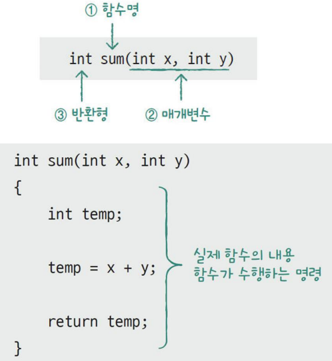
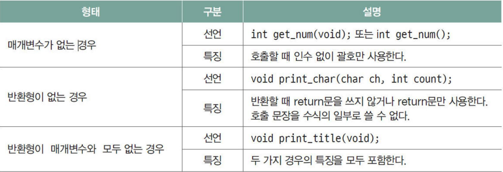
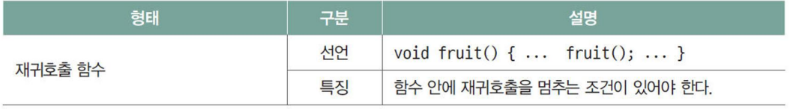
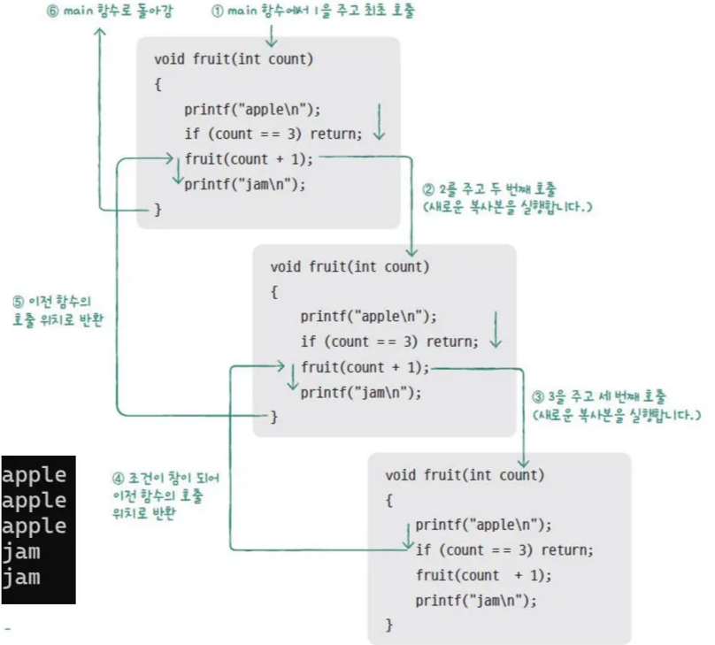
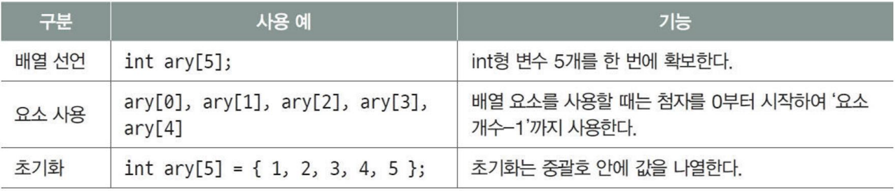
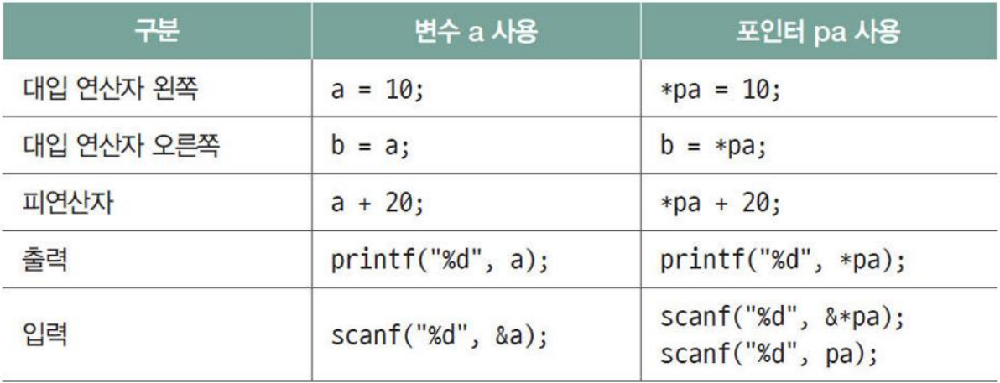
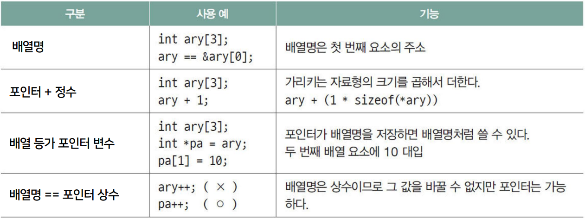

# C언어 day03

날짜: 2025년 12월 10일

## 함수

- 함수의 작성과 사용
    - 함수 선언은 원형에 ;를 붙여 하게됨, 매개변수명은 생략 가능
    - 호출 전에선언하며 컴파일러에 함수의 원형에 대한 정보 제공
    - 호출할 때 인수의 형태와 개수 검사
    - 호출한 곳에 반환 값의 형태에 맞는 임시 공간 확보

- 함수 정의
    - 반환형, 함수명, 반환형으로 함수의 원형 만든다.
    - `int sum(int x, int y)`
        
        
        
- 함수의 호출
    
    ```c
    int sum(int x, int y) {
        return x+y; // result 변수에 반환
    }
    
    int main(void) {
        ...
        result = sum(a, b); // 함수의 호출
        ...
    }
    ```
    
- 여러가지 함수 유형
    
    
    
    
    
- 재귀 함수 동작
    
    ```c
    void fruit(int count);
    
    int main(void) {
        fruit(1);
        return 0;
    }
    
    void fruit(int count) {
        printf("apple\n");
        if (count == 3) return;
        fruit(count + 1);
        printf("jam\n");
    }
    ```
    
    
    

## 배열

- 배열의 개념
    - 동일한 타입의 여러 개의 메모리를 연속적으로 할당하는 것
    - 하나의 이름과 인덱스를 가지고 각 요소의 메모리에 접근할 수 있음
    - **배열의 이름은 배열의 첫번째 요소의 주소를 가리키는 포인터**
        
        `arr = &arr[0]`
        
        - 포인터는 정수와 +/- 연산 가능
        - 포인터 → 가리키는 주소값, 가리키는 타입 두가지 기억해야 함.
    - 배열의 선언과 요소의 사용
        
        
        
- 배열 선언과 요소의 사용
    - 배열의 선언
        
        `int arr[5]` 자료형 + 배열명 + 요소 개수
        
    - 배열 요소의 사용
        - 배열명[index]로 접근하며, 배열 요소
- 배열의 첨자, 배열의 초기화
    - 배열의 첨자는 0부터 시작하여 최대 첨자는 요소의 수 -1이다.
        - 배열 사용 : `int arr[5];`
        - 배열 요소를 사용 : `arr[0] ~ arr[4]`
    - 배열 초기화
        - 중괄호 안에 초기값을 나열하면 앞에서부터 초기화
        - `int arr[5] = {1, 2, 3, 4, 5};`
        - `int arr[5] = {1, 2, 3};`  요소 수보다 초기화 값이 적으면 나머지는 0으로 초기화
        - `int arr[5] = {1, 2, 3, 4, 5, 6, 7};` → error 발생
        - `int arr[] = {1, 2, 3};` 요소 수 생략 가능
- 배열 프로그램 작성
    - 성적 처리 프로그램
        
        ```c
        #define _CRT_SECURE_NO_WARNING
        #include <stdio.h>
        #include <math.h>
        int main(void) {
            int score[5];
            int total = 0;
        
            int cnt = sizeof(score) / sizeof(score[0]); // sizeof(score) => 4byte * 5 = 20byte
        
            printf("%d %d %d", cnt, sizeof(score), sizeof(score[0]));
            for (int i = 0; i < cnt; i++) {
                scanf("%d", &score[i]);
                // scanf("%d", score+i); 로 작성해도 동일함
                total += score[i];
            }
            int avg = total / cnt;
        
            printf("%d", avg);
            return 0;
        }
        ```
        
- 배열에서의 포인터
    
    ```c
    int score[10] = {0};
    char* temp = score;
    double* temp2 = score;
    ```
    
    여기에서 temp로 배열을 불러오게 된다면 총 20개의 원소가 생길 수 있고
    
    여기에서 temp2로 불러온다면 5개의 원소를 불러올 수 있다.
    
    저장되어 있는 메모리는 변하지 않지만 내가 불러오는 형식에 따라서 몇 칸씩 이동할 수 있는지를 정할 수 있다 생각하면 된다.
    
    ```c
    #define _CRT_SECURE_NO_WARNING
    #include <stdio.h>
    
    int main(void) {
        int a[3][3] = { 1, 2, 3, 4, 5, 6, 7, 8, 9 };
        int (*p)[4] = a;
        int* x = a;
        //printf("a : %X %X\n", a, a + 1);
        //printf("p : %X %X\n", p, p + 1);
        printf("%d\n", a[0][0] + a[1][1] + a[2][2]);
        printf("%d\n", p[0][0] + p[1][0] + p[2][0]);
        // 다차원보다는 일차원 배열로 하는 것이 성능적으로는 좋다
        printf("%d\n", x[0] + x[4] + x[8]);
        return 0;
    }
    ```
    
- 문자를 저장하는 배열
    
    ```c
    #define _CRT_SECURE_NO_WARNING
    #include <stdio.h>
    
    int main(void) {
        char str[80] = "applejam";
        printf("%s %s\n", str, str + 5); // applejam jam 출력
        printf("%c\n", str); // error
        printf("%c\n", str[5]); // j 출력
        return 0;
    }
    ```
    
    str 포인터만 제공했는데 전부 출력할 수 있는 것은 null문자가 나올때까지 계속 출력하기 때문
    
    ```c
    #define _CRT_SECURE_NO_WARNING
    #include <stdio.h>
    
    int main(void) {
        char str1[80] = "tiger";
        char str2[80];
    
        // str1은 첫번째 index의 주소를 알려주는 포인터 상수
        strcpy(str1, "cat"); // tiger에서 tige까지만 덮어써진다 -> cat\0r 로 남게 됨.
        strcpy(str2, str1);
        scanf("%s", str1);
        printf("%s\n", str1);
    
        gets(str1); // 공백 활용 가능
        puts(str1);
        return 0;
    }
    ```
    

## 포인터

- 포인터의 기본 개념
    - 메모리 주소
        - 주소는 변수가 할당된 메모리의 시작 주소
        - 변수의 공간 (l-value)이나 값(r-value)은 이름으로 사용
        - 주소를 알면 주소로도 변수의 공간이나 값을 사용 가능
        
        `int a = 5;`
        
        → a의 주소는 0x1000이고 값은 5인 경우
        
        `int * p = &a;`
        
        → p의 주소는 ex.0x2222가 되고 값은 a의 주소인 0x1000이 된다.
        
        p를 출력하면 0x1000
        
        *p 출력하면 5가 나온다
        
    - 주소 연산자 : &
    - 포인터 변수 : * → `int *p;`
    - 포인터 변수에 주소 저장 → `int *p = &a`
    - 간접 참조 연산자 : * → `*p = 10` : a 변수에 10 대입
    - 포인터 변수는 가리키는 자료형과 상관 없이 항상 변수의 시작 주소만 저장
        - 포인터 변수가 사용하는 메모리 크기는 가리키는 자료형에 상관 없이 동일
    
    ```c
    #define _CRT_SECURE_NO_WARNING
    #include <stdio.h>
    
    int main(void) {
        int a = 10;
        unsigned int b = &a; // b에는 a의 주소가 들어 있다
        *(int*) b = 20; // b는 a의 주소가 int로 들어가 있다. 포인터 변수가 아니기 때문에 포인터로 사용 불가
        // (int*) b 로 하면 b가 int 포인터 변수로 형변환됨
        // *(int*) b = 20; 이것을 int *p = &a; *p = 20;으로 작성한것과 동일하다.
        
        printf("%d\n", a);
        return 0;
    }
    ```
    
- SWAP 함수 - 포인터를 사용한 두 변수의 값 교환
    
    ```c
    #define _CRT_SECURE_NO_WARNING
    #include <stdio.h>
    void swap(int* pa, int* pb);
    
    int main(void) {
        int a = 10, b = 20;
        printf("a: %d, b: %d\n", a, b);
        swap(&a, &b);
        printf("a: %d, b: %d\n", a, b);
        return 0;
    }
    void swap(int* pa, int* pb) {
        int temp;
        temp = *pa; // temp에 pa가 가리키는 변수의 값을 저장
        *pa = *pb; // pa가 가리키는 변수에 pb가 가리키는 값을 저장
        *pb = temp; // pb가 가리키는 변수에 temp 값을 저장
    }
    ```
    
- 정리
    
    
    

## 변수

- 변수의 구성
    
    `static const unsigned int * a = 100;`
    
    - static : storage class specifies ( static, extern, auto, register )
    - const : type qualifier
        
        (const : 변수의 상수화, volatile : 변수 최적화 금지 )
        
    - unsigned int : type specifies // 반드시 하나가 사용됨, 메모리 크기와 성격 지시
    - * : modifier
        - * : 주소화
        - [] : 집합화, 배열
        - () : 함수화
        - 변수 선언에 사용되는 modifier 우선 순위 : ( ),  [ ] > *
    - a : identifier
    - 100 : initializer // global의 경우는 상수만 초기값으로 사용 가능
    - ** 이중 포인터
        
        ```c
        #define _CRT_SECURE_NO_WARNING
        #include <stdio.h>
        int main(void) {
            int a = 10;
            int* pa = &a;
            int** p = &pa;
            printf("%p %p", p, p[0]); // 둘의 값이 다르게 나온다.
        }
        ```
        
- `int *(*a[5])(int *);`
    - a는 배열 → 요소 5개 → 요소 타입은 포인터(함수를 가리키는) → a의 메모리는 4X5 = 20 byte → 함수 포인터 배열
- 예시 코드
    
    ```c
    #define _CRT_SECURE_NO_WARNING
    #include <stdio.h>
    int sum(int, int);
    int main(void) {
        // 이차원 배열을 선언하면 포인터가 총 4개가 생긴다, arr, arr[0], arr[1], arr[2]
        // arr의 요소는 3개 -> 여기서 요소는 배열의 이름으로 접근할 수 있는 것
        int arr[3][4] = { 0 }; 
        
        // arr 주소, arr[0] 주소, arr[0][0] 주소 = *((*arr + 0) + 0)
        printf("%p %p %d\n", arr, *arr, **arr);
        
        // arr주소 + 16, arr주소 + 4, 1 출력됨
        printf("%p %p %d\n", arr + 1, *arr + 1, **arr + 1);
        
        // error 발생 X, 함수 이름 = 함수 포인터 상수, 몇번을 * 붙여도 변하는 것 없음
        printf("%p %p %d\n", sum, *sum, **sum);
    
        return 0;
    }
    
    int sum(int x, int y) {
        return x + y;
    }
    ```
    
- left-right / right-left 적용
    
    `int(*(*ap)(void))(void);`
    
    ap → 리턴 타입이  리턴 타입이 int이고, parametet 없는 함수 포인터, parameter 없는 함수 포인터
    
    `char *(*(*var)(void))[10]`
    
    var → 요소가 char 포인터 10개인 배열 포인터를 반환하는 함수 포인터
    

## 배열과 포인터

- 포인터 연산
    - 포인터 + 정수 : 포인터 + (정수 * 포인터가 가리키는 타입의 크기)
    - 포인터 - 포인터 : 주소 값의 차 / 포인터가 가리키는 타입의 크기
- 배열명은 배열의 첫 번째 요소를 가리키는 포인터 상수이다. → `arr = &arr[0]`
- 배열명에 정수를 더하고 연산으로 모든 배열 요소를 사용한다,
    
    ```c
    *(arr + 0) -> arr[0]
    *(arr + 1) -> arr[1]
    *(arr + 2) -> arr[2]
    ```
    
    배열명[index] = *(배열명 + index)
    
- 배열 등가 포인터
    
    ```c
    int arr[3] = {0};
    int *p = arr;
    
    *p = 10; // arr[0] = 10
    *(p+1) = 30; // arr[1] = 30
    p[2] = p[1] + p[0]; // arr[2] = 40
    ```
    
    이렇게 작성하면 p를 배열명으로 사용 가능하다.
    
- 배열명은 “포인터 상수”, 배열 등가 포인터는 “포인터 변수”
    
    ```c
    // 절대 불가능
    arr = arr + 1;
    arr ++ 
    
    //이건 가능
    p = p + 1;
    p++;
    ```
    
- `sizeof(배열명)` 의 경우 배열명을 포인터 상수로 보는 것이 아닌 배열 그 자체로 본다.
- `&배열명` 의 경우도 배열명을 배열 그 자체로 본다.
- 배열명과 배열 등가 포인터
    
    
    
- 배열을 함수에 넘길 때 “배열 등가 포인터” 활용
    
    ```c
    static void print_ary(int* pa, int size) {
        for (int i = 0; i < size; i++) {
            printf("%d ", pa[i]);
        }
    }
    #define size_ary(x) (sizeof(x) / sizeof(x[0]))
    int main(void) {
        int ary[5] = { 10, 20, 30, 40, 50 };
        print_ary(ary, size_ary(ary));
        return 0;
    }
    ```
    
- 코드 실습
    
    ```c
    /*헤더파일 - basic_op.h*/
    #ifndef __BASIC_OP_H__
    #define __BASIC_OP_H__
    #define _CRT_SECURE_NO_WARNING
    #include <stdio.h>
    
    int scanf_ary(int* arr, int size);
    
    int print_ary(int* arr, int size);
    
    int findmax_ary(int* arr, int size);
    
    int findmin_ary(int* arr, int size);
    
    int sum_ary(int* arr, int size);
    
    int avg_ary(int* arr, int size);
    
    int avg_ary1(int* arr, int size);
    
    #endif
    
    /*소스 파일 - basic_op.c*/
    #include "basic_op.h"
    // arr배열에 5개 정수 값을 입력 받는 함수 생성
    int scanf_ary(int* arr, int size) {
        for (int i = 0; i < size; ++i) {
            (void)scanf("%d", arr + i);
        }
        return 1;
    }
    
    // arr배열에 있는 값을 출력
    int print_ary(int* arr, int size) {
        for (int i = 0; i < size; ++i) {
            (void)printf("%d\t", arr[i]);
        }
        printf("\n");
        return 1;
    }
    
    // arr배열 최댓값 리턴
    int findmax_ary(int* arr, int size) {
        int max = -2147483646;
        for (int i = 0; i < size; ++i) {
            if (arr[i] > max) {
                max = arr[i];
            }
        }
        /*printf("%d\n", max);*/
        return max;
    }
    
    // arr배열 최솟값 리턴
    int findmin_ary(int* arr, int size) {
        int min = 2147483646;
        for (int i = 0; i < size; ++i) {
            if (arr[i] < min) {
                min = arr[i];
            }
        }
        /*printf("%d\n", min);*/
        return min;
    }
    
    // arr배열 모든 요소 합 리턴
    int sum_ary(int* arr, int size) {
        int total = 0;
        for (int i = 0; i < size; ++i) {
            total += arr[i];
        }
        /*printf("%d", total);*/
        return total;
    }
    
    // arr배열 평균값 리턴 (sum_ary함수 활용 ver.)
    int avg_ary(int* arr, int size) {
        int avg;
        int total = sum_ary(arr, size);
        avg = total / size;
        return avg;
    }
    
    // arr배열 평균값 리턴 (모든 요소 합 직접 구하기 ver.)
    int avg_ary1(int* arr, int size) {
        int avg;
        int total = 0;
        for (int i = 0; i < size; ++i) {
            total += arr[i];
        }
        avg = total / size;
        /*printf("%d", avg);*/
        return avg;
    }
    
    /*소스 파일 day03.c 파일*/
    #define _CRT_SECURE_NO_WARNING
    #include <stdio.h>
    #include "basic_op.h"
    
    int main(void) {
        int arr[5] = { 0 };
        scanf_ary(arr, 5);
        print_ary(arr, 5);
        printf("max: %d\n", findmax_ary(arr, 5));
        printf("min: %d\n", findmin_ary(arr, 5));
        printf("sum: %d\n", sum_ary(arr, 5));
        printf("avg: %d\n", avg_ary(arr, 5));
        printf("avg: %d\n", avg_ary1(arr, 5));
        
        return 0;
    }
    ```