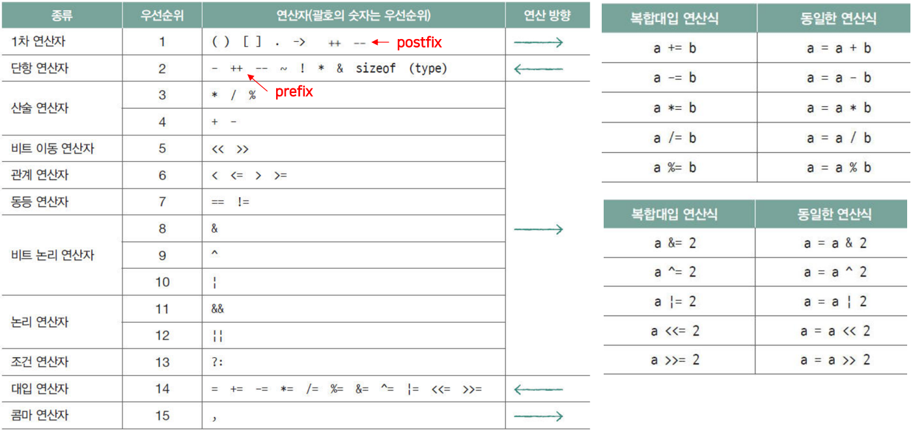
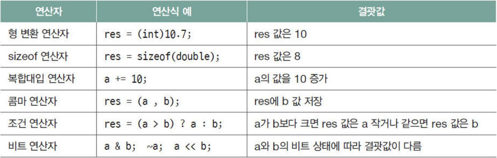
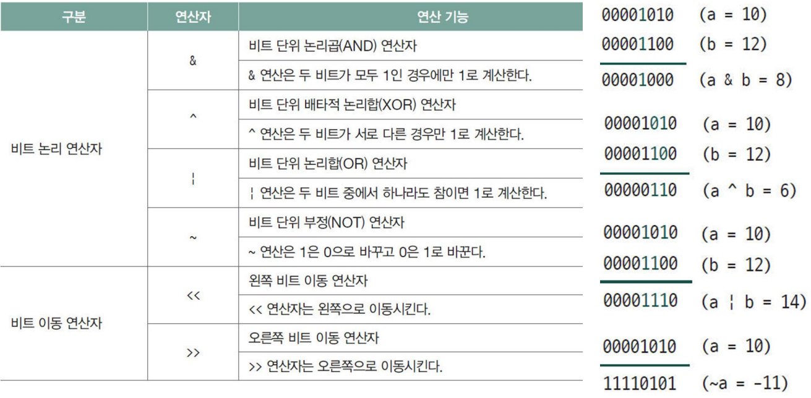
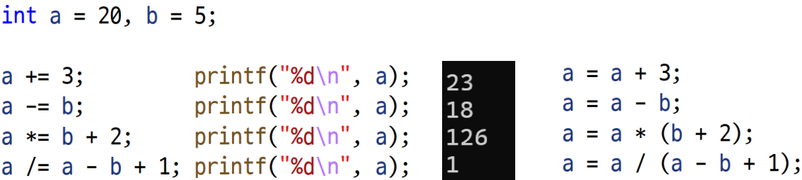
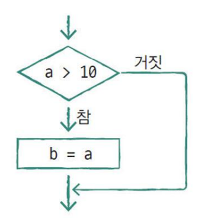
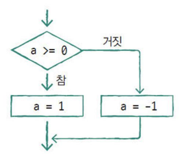
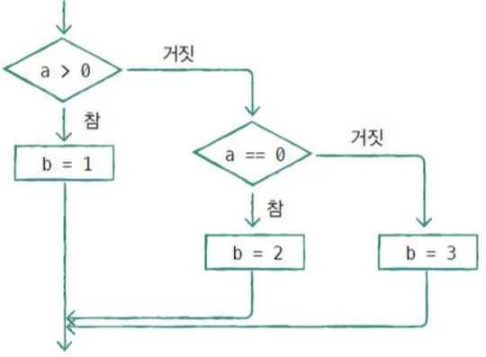
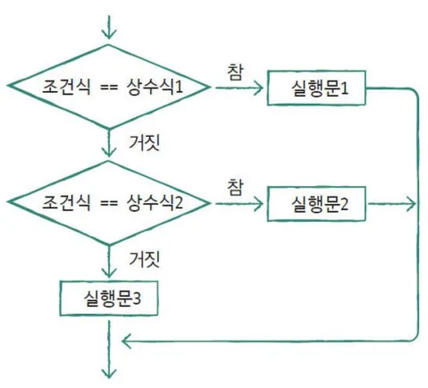
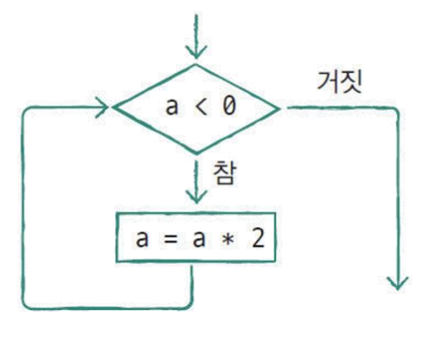
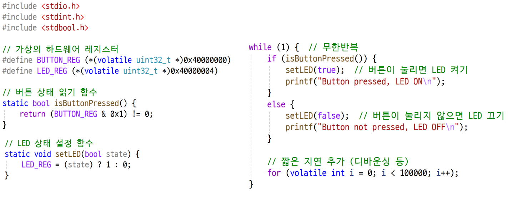

# C언어 day2

날짜: 2025년 12월 9일

## 연산자

- 연산자의 종류와 우선순위
    
    
    
    - 1차 연산자
        - () → func(…) 이런식으로 함수에서 호출하는 방식으로 활용
        - [] → arr[index] 에서 활용
        - 구조체 . 멤버 → 구조체 멤버 참조 연산자
        - 구조체 포인터-> 멤버 → 구조체 포인터 참조 연산자
        - a++ →
        - a— →
- 연산의 예
    
    
    
- 연산 시 주의사항
    - overflow, underflow에 주의
    - 동일한 타입의 데이터끼리 연산 수행, 필요시 명시적 형변환 사용
    - 나머지 연산은 피연산자를 모두 양의 정수만 사용
    
    ```c
    (double) 10; // 10.0
    (int) 10.7; // 10
    ---
    int a = 10;
    float b = 5.5;
    int result_i = a+b; // 15 (15.5 float이 int로 형변환되면서 소수점 아래 삭제)
    float result_f = a+b; // 15.5
    ```
    
- 연산 시 주의사항
    - 정수와 정수 연산 → 정수
    - 실수와 정수 연산  → 실수
    - 정수 승격 규칙 : int, unsigned int연산시 unsigned int로 변환
    
    ```c
    int a = 5;
    int b = 2;
    int result_i = a / b; // 2
    float result_f = (float)a / b; // 2.5
    ---
    int a = -1;
    unsigned int b = 1;
    if (a<b) {
        printf("a is less than b\n")
    }
    else {
        printf("a is not less than b\n")
    }
    // a is not less than b
    ```
    
- 증가 감소 연산
    
    ```c
    int a = 10, b = 10;
    ++a; // 11
    --b; // 9
    
    ---
    
    int a = 5, b = 5;
    int pre, post;
    
    pre = (++a) * 3; // 18 -> a는 1 증가하고 3 곱함
    post = (b++) * 3; // 15 -> b는 3 곱하고 1 증가함
    
    ---
    
    int i = 5;
    i = i++ + ++i;
    printf("i = %d\n", i); // i = 13
    
    ---
    
    int i = 5;
    printf("i++ = %d, ++i = %d\n", i++, ++i); // i++ = 6, ++i = 7
    ```
    
- 조건 연산자
    
    `res = (a > b) ? a : b(함수호출도 가능)`
    
    조건이 참이면 a, 조건이 거짓이면 b
    
- 비트 연산자
    
    
    
    - & 사용하는 목적 → 특정 비트를 추출하거나 리셋할 때
    - ^ 사용하는 목적 → 특정 비트가 같은지 다른지 비교할 때
    - |  사용하는 목적 → 1값을 만들어 줄 때 사용
    - <<1 → 2를 곱해주는 것과 동일한 역할을 해줌 (속도가 빠름)
    - >>1 → 2를 나누어주는 것과 동일한 역할을 해줌
    - shift의 경우 논리, 산술 다름
        - 논리 shift의 경우 없어지는 부분을 0으로 채워진다
        - 산술 shift의 경우 left로 나가는 경우 0으로 채워지지만 right로 나가는 경우 부호 비트로 채워짐
    - 비트 연산자 활용 문제
        
        ```c
        #define _CRT_SECURE_NO_WARNING
        #include <stdio.h>
        // 특정 비트를 설정 -> 특정 비트를 1로 하고 OR 사용
        unsigned int setBit(unsigned int num, int bitPosition) {
            return num | 1<<bitPosition;
        }
        // 특정 비트를 해제 -> 특정 비트를 1로 한 후 반전시키고 AND
        unsigned int clearBit(unsigned int num, int bitPosition) {
            unsigned int maskBit = ~(1 << bitPosition);
            return num & maskBit;
        }
        // 특정 비트를 반전 -> 특정 비트만 1로 하고 XOR 사용
        unsigned int toggleBit(unsigned int num, int bitPosition) {
            unsigned int toggle = (1 << bitPosition);
            return num ^ toggle;
        }
        int main(void) {
            unsigned int num = 0b1010;
            printf("Initial value: %X\n", num);
        
            num = setBit(num, 2);
            printf("After setting bit 2: %X\n", num);
        
            num = clearBit(num, 1);
            printf("After clearing bit 1: %X\n", num);
        
            num = toggleBit(num, 3);
            printf("After toggling bit 3: %X\n", num);
        
            return 0;
        }
        
        --------
        
        #define _CRT_SECURE_NO_WARNING
        #include <stdio.h>
        // 특정 비트를 설정 -> start부터 start + count 까지 1(1<<count - 1)로 하고 OR 사용
        unsigned int setBit(unsigned int num, int start, int count) {
            unsigned int set = ((1 << count) - 1) << start;
            return num | set;
        }
        // 특정 비트를 해제 -> start부터 start + count 까지 1(1<<count - 1)로 한 후 반전시키고 AND
        unsigned int clearBit(unsigned int num, int start, int count) {
            unsigned int maskBit = ~(((1 << count)-1)<<start);
            return num & maskBit;
        }
        // 특정 비트를 반전 -> start부터 start + count 까지 1(1<<count - 1)로 하고 XOR 사용
        unsigned int toggleBit(unsigned int num, int start, int count) {
            unsigned int toggle = ((1 << count)-1)<<start;
            return num ^ toggle;
        }
        int main(void) {
            unsigned int num = 0b10101010;
            printf("Initial value: %X\n", num);
        
            num = setBit(num, 2, 3);
            printf("After setting bit 2: %X\n", num);
        
            num = clearBit(num, 4, 2);
            printf("After clearing bit 1: %X\n", num);
        
            num = toggleBit(num, 1, 5);
            printf("After toggling bit 3: %X\n", num);
        
            return 0;
        }
        
        -------
        //비트 체크
        static unsigned int isBitSet(unsigned int num, int bitPosition) {
            unsigned int maskBit = (1 << bitPosition);
            unsigned int check = num & maskBit;
            return check >> bitPosition;
        }
        
        static unsigned int isBitSet(unsigned int num, int bitPosition) {
            return (num >> bitPosition) & 1;
        }
        ```
        

## 데이터 타입

- 변수 선언 및 연산
    
    
    
    x = 01111111
    
    printf에서 x+1은 int로 계산하므로 128이 된다
    
    y = 100000000
    
    printf하는 경우 char y가 4byte로 옮겨짐
    
    y = 11111111 1111111 1111111 100000000
    
    → 음수로 인식한 후 2의 보수를 취해서 출력
    
- 복합 대입 연산자
    
    
    

- Bit 연산자
    
    A변수의 0, 5, 21, 22번 비트를 1로 만드는 코드
    
    ```c
    int a = 0x33CC33CC;
    a |= (1 << 0) | (1 << 5) | (3 << 21);
    ```
    

## 자동형 변환

- 자동형 변환
    
    step 1. 연산 대상체가 int 자료형보다 작은 크기를 갖는 data → int 자료형 크기로 변환되어 연산됨(signed int)
    
    step 2. 같은 크기의 자료형 : signed → unsigned로 변환
    
- 정수의 승격
    - int보다 작은 크기의 데이터를 가지고 연산을 하는 경우 데이터를 int형으로 변환 후 진행
        
        연산 후 다시 형 변환 가능
        
    - unsigned char에서 signed int, unsigned int로 변환시 모자라는 상위비트 채우기는 “0”으로 이루어짐
    - signed char에서 unsigned int 또는 signed int로의 변환시 모자라는 상위비트 채우기는 “sign bit”로 이루어진다

## Control statement

- if 문
    
    ```c
    if (조건식 A) {
        실행문 A;
    }
    ```
    
    
    
    ```c
    if (조건문 A) {
        실행문 1;
    }
    else {
        실행문 2;
    }
    ```
    
    
    
    ```c
    if (조건문 A) {
        실행식 1;
    }
    else if (조건문 B) {
        실행식 2;
    }
    else {
        실행식 3;
    }
    ```
    
    
    
- switch 문
    
    ```c
    switch (조건식)
    {
    case 상수식 1:
        실행문1;
        break;
    
    case 상수식 2:
        실행문2;
        break;
        
    default :
        실행문3;
        break;
    }
    ```
    
    
    
- while 문
    
    ```c
    whlie(조건식) {
        실행문1;
        실행문2;
    }
    ```
    
    
    
- for 문
    
    ```c
    for (초기식; 조건식; 증감식) {
        실행문;
    }
    ```
    
- 무한반복
    
    `while(1)` 과 `for(;;)` 의 차이
    
    while의 경우 1이라는 조건이 존재하는 것이고 계속해서 조건을 확인하는 과정이 존재함
    
    for의 경우는 작성된 그대로 조건이 없다는 의미이므로 확인 과정이 필요 없이 반복 진행함
    
    (사실 현대 컴파일러에서는 딱히 차이가 발생하지는 않음.)
    
    visual studio 환경에서 확인해보니 어셈블에서 while은 4줄 for은 1줄로 차이가 발생함
    
- 임베디드에서 무한 반복 활용
    
    