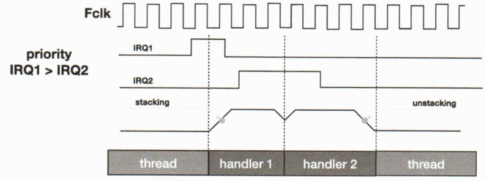
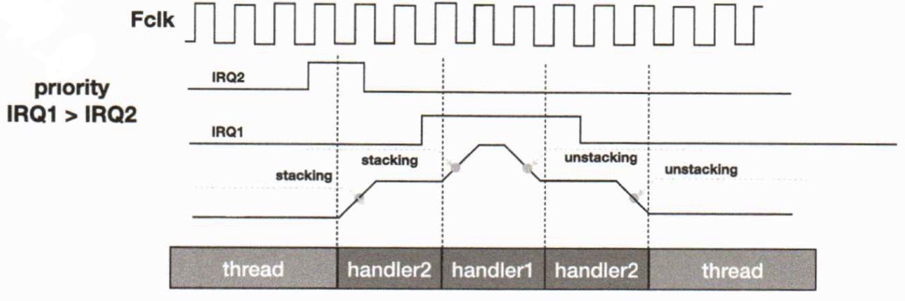
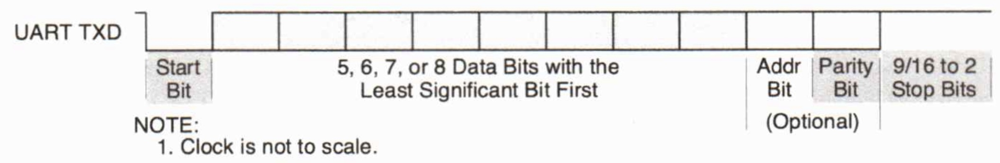
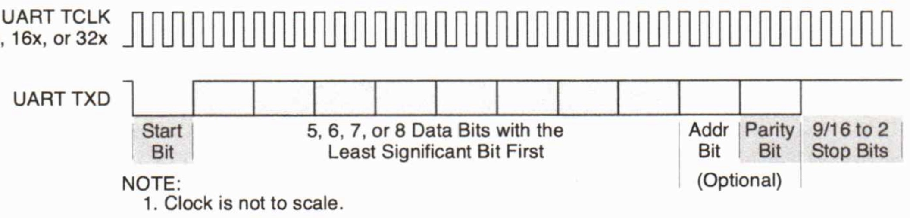
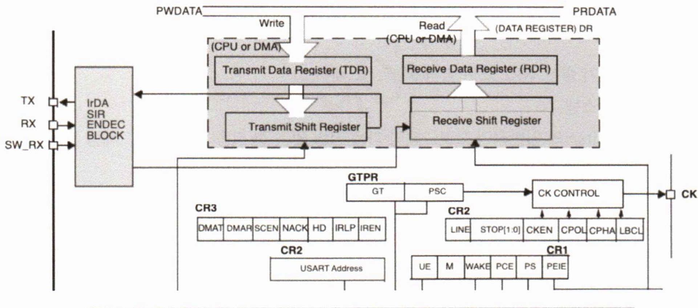
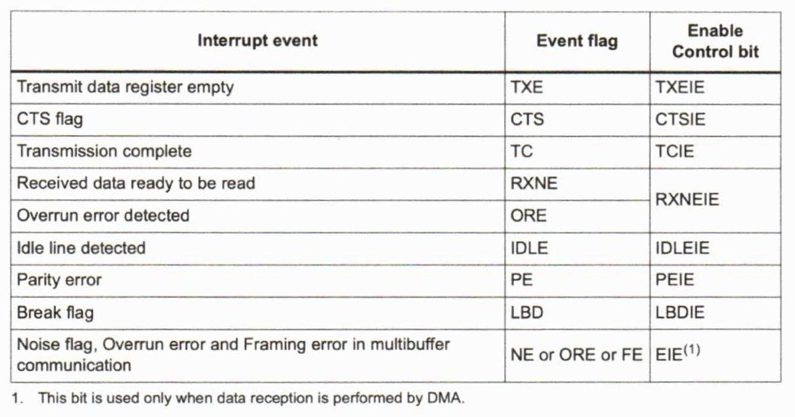

# 프로세서 구조 및 디바이스 프로그래밍 day04

날짜: 2026년 2월 2일

### 익셉션의 유형 → 인터럽트보다 포괄적임

- RESET  → -3
    - 리셋은 콜드부트 or 웜부트에 의해 발생
    - 리셋이 발생하면 잠재적으로 명령의 어느 지점이나 프로세서의 작동 중지
    - 리셋 해제되면 벡터 테이블의 리셋 항목에서 제공 한 주소에서 실행 시작
    - 스레드 모드에서 특권 실행으로 다시 시작
- NMI
    - NonMaskable Inbterrupt는 주변 장치나 소프트웨어에 의해 트리거
    - 리셋 이외의 가장 높은 우선 순위 예외
    - 영구 사용 가능, 고정 순위 → -2
    - 다른 익셉션으로 인해 마스킹 되거나 활성화 되지 않음
    - 리셋 이외의 익셉션에 의해 선점되지 않음
- Hard Fault
    - 익셉션 처리 중 오류 발생으로 인해 (+ 비정상적인 상태에서) 발생하는 익셉션
    - 하드 오류 우선 순위 → -1
- Memory Management Fault
    - 메모리 보호 관련 폴트에 의해 발생하는 익셉션
- Bus Fault
    - 명령어 혹은 데이터 메모리 트랜잭션시의 메모리 관련 폴트 → 메모리 시스템 버스에서 에러 감지된 경우 발생
- Usage Fault
    - 정의되지 않은 명령어, 정렬되지 않은 불법 엑세스, 명령 실행이 잘못된 상태, 예외 반환에 의해 발생
- SVCall
    - SVC 명령어에 의해 트리거 되는 예외 → SW에 의해 발생하는 인터럽트
    - OS에서 필수적으로 필요
- PendSV
    - 시스템 레벨 서비스에 대한 인터럽트 기반 요청
- SysTick
    - systick 예외는 시스템 타이머가 0에 도달할 때 생성하는 예외
    - OS에서 시간을 관리하는 데 필요

## 예외처리 마스킹

### Fault Mask 레지스터

- RESET, NMI를 제외한 모든 예외의 활성화 방지
- 32비트 중 0번 비트만 사용함

### PRIMASK 레지스터

- 리셋, NMI, Fault Mask를 제외한 모든 예외의 활성화 방지

### BASEPRI 레지스터

- 특정 우선 순위 또는 그 이하의 우선 순위를 가지는 인터럽트를 비활성화 시키는 레지스터

## System Control Block

### System Control Block

- 시스템 제어 블록은 시스템 내부 정보 확인 및 시스템 제어 제공
- 시스템 예외의 구성, 제어 및 보고 포함

### SCB:ACTLR

- 기본 메모리 맴에 대한 엑세스를 위한 쓰기 버퍼 사용
- LDM, STM은 한 CLK 만에 처리 불가능 함으로 인터럽트가 명령어를 기다릴지 아닐지 등을 직접 설정 가능 → 다중 사이클 명령 중단

### SCB:CPUID

- 프로세서 부품 번호, 버전 및 구현 정보 포함

### SCB:ICSR

- 익셉션 디버깅을 위해 소프트웨어적으로 발생시키는 수당 제공
- NMI 예외에 대한 PEND 설정
- 비트 PendSV 및 SysTick 예외에 대한 PEND 설정 및 취소
- 선점된 활성 예외가 있는지 여부
- 처리 중인 예외 번호 확인
- 가장 높은 우선순위의 예외 번호 확인
- PEND 중인 인터럽트가 있는지 확인

### SCB:VTOR

- 메모리 주소 0x0에서 벡터 테이블 기본 주소의 오프셋을 나타냄
- 웜 리셋할 때 SRAM에서 시작하게 하는 등의 작업 수행 가능

### SCB:AIRCR

- 예외 모델에 대한 우선 순위 그룹화 제어, 데이터 액세스에 개한 엔디안 상태 및 시스템의 리셋 제어 제공

### SCB:SCR

- CPU의 저전력 상태 진입 및 탈출 기능 제어

### SCB:CCR

- 스레드 모드 진입을 제어하고 다음을 활성화
    - Fault Mask가 BusFault를 무시하기 위해 에스컬레이션한 NMI, 하드 오류 및 오류 처리기
    - 0으로 나누기 및 정렬되지 않은 액세스 트래핑
    - 권한 없는 소프트웨어에 의한 STIR 액세스

### SCB:SHPRI1~3

- 구성 가능한 우선 순위가 있는 예외 처리기의 우선 순위 수준을 0에서 255로 설정
- 바이트 액세스 가능
- CMSIS를 사용하여 시스템 예외 우선 순위 수준에 액세스하려면 다음 CMSIS 기능 사용

### SCB:SHCSR → Fault 발생을 분석할 때 사용

- 시스템 핸들러를 활성화 하고 다음을 나타냄
- BusFault, MemManage 오류 및 SVC 예외의 보류 상태
- 시스템 핸들러의 활성 상태

### SCB:CFSR

- MemManage 오류, BusFault 또는 UsageFault의 원인을 나타냄

### SCB:MMFSR

- 플래그는 메모리 액세스 오류의 원인을 나타냄

### SCB:BFSR

- 플래그는 버스 액세스 오류의 원인을 나타냄

### SCB:UFSR

- UsageFault의 원인을 나타냄

### SCB:HFSR

- HardFault 핸들러를 활성화하는 이벤트에 대한 정보를 제공

### SCB:MMFAR

- MemManage 오류를 생성한 위치의 주소가 포함

### SCB:BFAR

- BusFault를 생성한 위치의 주소 포함

### SCB:AFSR

- 추가 시스템 오류 정보 포함

## 테일 체이닝(Tail-Chaining)

### 테일 체이닝

- 이 메커니즘은 익셉션 서비스의 속도를 높힘
- 익셉션 처리기 완료 시 펜드 중인 익셉션이 있는 경우 스텍 팝(unstacking)을 건너 뛰고 제어가 새 익셉션 처리기로 전송
    
    
    

## 지연 도착

### 지연도착

- IRQ1의 스택킹 동작 중에 IRQ2 이벤트가 발생한 경우, IRQ2이 IRQ1보다 나중에 발생한 익셉션이지만 우선순위가 높으면 먼저 처리
- 이전 익셉션에 대한 상태 저장(stacking) 중에 더 높은 우선순위 익셉션이 발생하면 프로세서는 더 높은 우선순위 익셉션을 처리하도록 전환하고 해당 익셉션에 대한 벡터 페치를 시작
- 스택 푸시가 이미 시작되었으므로 인터럽트 대기시간은 특정 프로세서 및 시스템의 표준 인터럽트 대시시간보다 짧을 수 있음
- 프로세서는 선행 익셉션 핸들러의 첫 번째 명령이 실행 단계에 들어가기 직전까지는 늦게 도착한 익셉션을 받아들일 수 있다.
- 늦게 도착한 예외 처리가 종료되면 이후부터는 테일 체임 규칙에 따라 동작

## 인터럽트 선점

### 인터럽트 선점 형태

1. 실행 중인 프로그램은 인터럽트에 ;의해 실행중단
2. 익셉션 처리를 실행하는 중에 또 다른 익셉션이 발생 한 경우 나중에 발생한 익셉션의 우선순위가 더 높을 경우 새 익셉션이 현재 익셉션 처리를 선점함

## 인터럽트 중첩

### 인터럽트 중첩 경우

## CH6. USART

## USART

### c.f ) UART vs USART / 비동기 vs 동기

- 비동기
    
    단점 : 속도 변경 어려움
    
    
    
- 동기 → 주요 차이는 CLK이 존재한다
    
    
    
- UART
    - 비동기 송수신기
- USART
    - 비동기 / 동기 송수신기

## USART

- CPU에 시리얼 인터페이스 하는 이중 범용 비동기 / 동기 송수신기
- 각 통신 채널은 전송 속도 생성기 또는 외부 클럭 입력에서 독립적으로 선택된 작동 주파수를 사용하는 전이중 비동기 / 동기 송수신기를 제공한다
- 송신기
    - CPU에서 병렬 데이터를 받아 시리얼 비트 스트림으로 변환
    - 적절한 START, STOP 및 선택적 패리티 비트를 삽입
    - 채널 송신기 시리얼 데이터 출력 (Tx)에 데이터 스트림 출력
- 수신기
    - 채널 수신기 직렬 데이터 입력 (Rx)에서 직렬 데이터 수신
    - 이를 병렬 형식으로 변환
    - 시작 비트, 중지비트, 패리티 또는 중단 조건 확인
    - 조립된 문자를 CPU로 전송

### UART & 시리얼 설명

- 시리얼
    - 데이터 송수신하는 데 데이터 라인이 하나만 사용되므로 정보를 비트 단위로 송수신해야 한다는 사실에서 유래
    - 한 번에 8개의 데이터라인을 사용하여 바이트를 구성하는 8비트를 전송하는 대신 한번에 하나씩 8비트를 전송하는 데 하나의 데이터 라인 사용
- 시리얼 포트
    - 임베디드 시스템과 다른 장치와의 통신을 위한 효율적인 방법
    - 하나의 수신기와 함께 연결된 한 쌍의 시프트 레지스터를 이용 → 송신기에 연결되어 통신 포트로서의 기능 수행
- UART
    - 일반적으로 장치 간에 저속 데이터를 전송하는데 사용
    - 송신기와 수신기가 비동기적으로 작동하기 때문에 송수신 클럭이 필요 없음
    - 수신기는 들어오는 데이터 스트림을 오버샘플링하고 이런한 샘플을 사용하여 비트 값 결정
    - 데이터가 전송되지 않으면 1의 연속 스트림
    - 시작 비트가 항상 0이기 때문에 수신기는 실제 데이터가 다시 한 번 라인에 있을 때 이를 감지

### STM32 USART 특징

- 산업 표준 NRZ 비동기 직렬 데이터 형식이 필요한 외부 장비와의 유연한 전이중 데이터 교환 주단 제공
- 전이중, 비동기 통신, NRZ 표준(마크 / 스페이스)
- baudrate 시스템
- 최대 4.5MBit/s의 일반적인 프로그래밍 가능 전송 및 수신 전송 속도
- 프로그래밍 가능한 데이터 워드 길이(8 또는 9 비트)
- IrDA(적외선) SIR 인코더 및 디코더
- DMA (직접 메모리 액세스)를 사용하여 구성 가능한 멀티 버퍼 통신
- 패리티 제어, 4개의 오류 감지 플래그

### USART Block Diagram

### USART 구조

- 시프트 레지스터는 일반적으로 8비트 너비
- 송수신기가 비워지면 프로세서에 바이트가 전송되었는지 알 수 있는 인터럽트를 생성하도록 만들 수 있음
- 수신기는 완전한 바이트가 수신될 때 읽을 준비가 되었음을 나타내기 위해 인터럽트를 생성 할 수 있음
- 대부분의 시리얼 포트는 데이터가 손실되지 않도록 FIFO 버퍼 사용
- FIFO 버퍼의 크기는 프로세서 오버헤드를 줄이는 게 중요
- 각 송신기와 수신기의 쉬프트 레지스터를 클럭하는 데 사용되는 단일 클럭 신호기를 사용

### 시리얼 통신 프로토콜

- 전송 속도를 올바른 주파수에서 클럭 신호를 생성하는 전송 속도 생성기 (baudrate generator)라고 하고 외부 타이머/ 카운터에 의해 제공
- 데이터 설정 구성 + 개별 비트가 올바르게 해석되도록 올바른 전송 속도 설정 지정하는 것 중요
- 결과적으로, 프로세서와 통신하는 주변 장치는 올바른 통신을 보장하기 위해 동일한 전송 속도와 시작, 중지, 데이터 및 패리티 비트의 동일한 조합을 사용
- 다른 조합의 경우 데이터가 잘못 해석됨
- 터미널 UART가 반이중 모드로 구성된 경우 전송된 문자를 화면에서 볼 수 있도록 에코한다.

### 보레이트 생성기(Baurate Generator Logic)

- 클럭 전송 속도 생성기 및 기타 내부 회로에 대한 기본 타이밍 참조 역할
- 수신기 및 송신기의 전송 속도는 모두 USARTDIV 값에 의해 결정

### USART 송수신 포맷

- 비트 패턴은 시작 비트수, 데이터를 나타내는 비트수, 오류 검사를 위한 패리티 비트 및 정지 비트 수를 포함할 수 있다
- 미리 결정된 속도 또는 전송 속도로 직렬 라인으로 전송
- Tx핀은 시작 비트 동안 로우, 정지는 하이
- 시작 비트는 전송 중인 데이터가 문자의 시작임을 나타내는 데 사용
- 정지 비트는 문자가 종료되었음을 나타냄
- 비활성화 할 수 있는 패리티 비트 존재
- 비트는 전송된 총 비트 수가 홀수 또는 짝수임을 나타내도록 설정
    
    → 수신 중 단일 비트 오류 감지 가능
    
- 데이터는 로컬 클록 참조

### USART 수신 오류

- Break character
- Overrun error
- Frame error

### USART 인터럽트 종류

