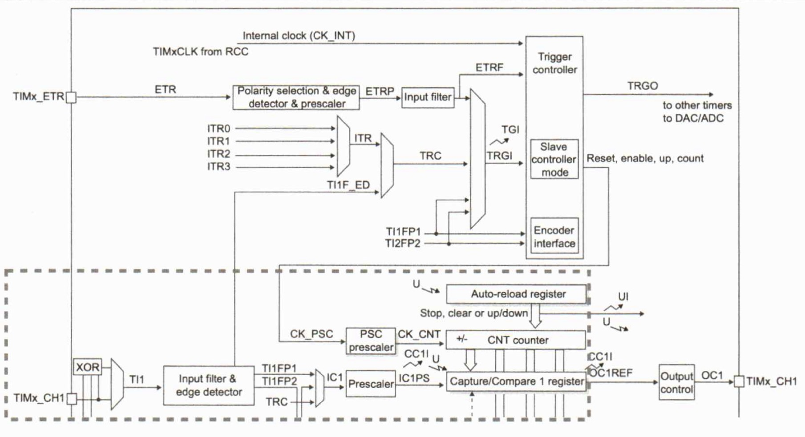
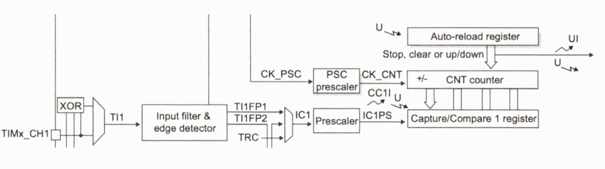
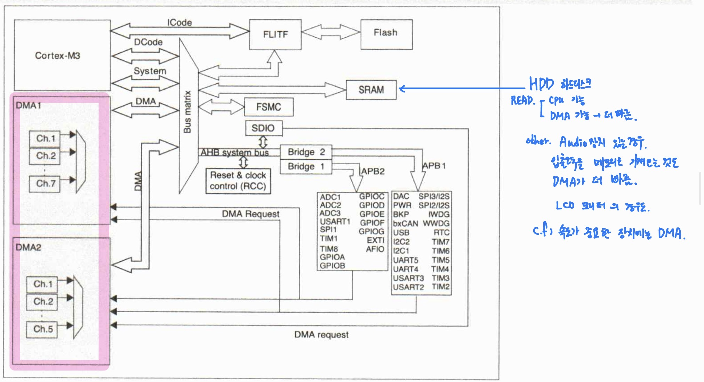
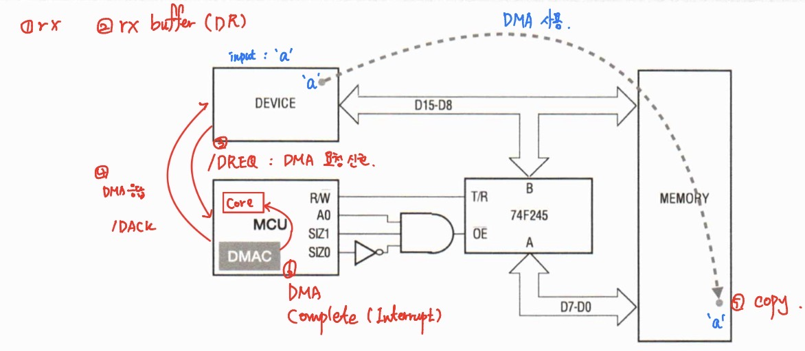

# 프로세서 구조 및 디바이스 프로그래밍 day06

날짜: 2026년 2월 4일

## CH9. Input Capture TIMER

## Input Capture

### Input Capture

- 다양한 입력 이벤트가 발생하는 시간을 기록하는 기능을 제공
- 이벤트 그룹을 캡쳐하여 신호의 펄스폭 또는 주기를 측정할 수 있다.
- 입력 파형의 주기는 동일한 극성의 두 개의 연속 에지, 동일한 신호의 두 개의 상승 에지 또는 하강 에지를 캡쳐하여 측정

- 두 이벤트의 시간 차이는 TCNT 레지스터의 카운트로 측정된 시간이다
- 펄스의 폭은 반대 극성의 두 에지 시간을 캡쳐하여 측정
- 듀 이벤트 시간 차이는 TCNT 레지스터에서 카운트로 측정된 펄스 폭이다.

### TIMER1 블럭 다이어그램

### IC(input capture) 타이머 블럭 다이어 그램

### 입력 캡쳐 모드

- 입력 캡쳐모드에서 캡쳐 레지스터(TIMx_CCRx)는 해당 ICx 신호에 의해 감지된 전환 후 카운터 캆을 래치하는 데 사용된다.
- 캡쳐가 발생하면 해당 CCxIF 플래그(TIMx_SR 레지스터)가 설정되고 인터럽트 또는 DMA요청이 활성화 된 경우 전송 될 수 있다.
- CCxIF 플래그가 이미 높은 상태에서 캡쳐가 발생하면 오버 캡쳐 플래그 CCxOF (TIMx_SR 레지스터)가 설정된다.
- CCxIF는 0에 쓰거나 TIMx_CCRx 레지스터에 저장된 캡처된 에이터를 읽어 SW로 지울 수 있다
- CCxOF는 0을 쓰면 지워진다.

### 입력 캡처 모드 프로그래밍 시퀀스

- 활성 입력 선택
- TIMx_CCR1은 TI1 입력에 연결되어야 하므로 TIMx_CCMR1 레지스터의 CC1S 비트를 01로 프로그램한다
- CC1S가 00과 달라지면 채널은 입력으로 구성되고 TIMx_CCR1 레지스터는 읽기 전용이 된다
- 타이머에 연결된 신호와 관련하여 필요한 입력 필터 기간을 프로그래밍한다,
- TIMx_CCER 레지스터(상승 에지) 에서 CC1P 비트를 0으로 기록하여 TI1 채널에서 활성 전환 에지를 선택
- 입력 프리스케일러를 프로그래밍한다.
- 현재 예제에서는 각 유효한 전환에서 캡쳐가 수행되기 원하므로 프리스케일러 비활성황(TIMx_CCMR1 레지스터에서 IC1PS 비트를 00으로 기록)
- TIMx_CCER 레지스터에서 CC1E 비트를 설정하여 카운터에서 캡처 레지스터로 캡처를 활성화 함
- 필요한 경우 TIMx_DIER 레지스터에서 CC1IE비트를 설정하여 관련 인터럽트 요청을 활성화하거나 TIMx_DIER 레지스터에서 CC1DE 비트를 설정하여 DMA 요청 활성화
- 입력 캡처가 발생하는 경우
    - TIMx_CCR1 레지스터는 활성 전환에서 카운터 값을 가져온다
    - CC1IF 플래그가 설정된다 (인터럽트 플래그)
    - CC1IE 비트에 따라 인터럽트가 발생한다
    - CC1DE 비트에 따라 DMA 요청 생성
- IC 인터럽트 및 DMA 요청은 SW 에서 다음을 설정하여 생성할 수 있다 (TIMx_EGR 레지스터의 해당 CCxG 비트)

## CH10. DMA

## DMA

### DMA 동작 개념도

### DMA 설명

1. 데이터 량이 크거나
2. 데이터 량이 작지만 반복 수행할 경우 CPU 대신 DMA를 사용하는 것이 효율적
- 직접 메모리 엑세스 → 최소한의 프로세서 개입으로 시스템 메모리 내에 데이터를 빠르게 이동하여 전체 시스템 성능을 크게 향상 시키는 방법
- DMA 컨트롤러는 주변 장치에서 메모리로 데이터를 전송하는 효율적인 방법
- DMA가 없는 시스템에서 프로세서를 사용하여 서비스가 필요한지 여부를 확인하기  위해 주변 기기를 정기적으로 폴링하거나 인터럽트가 수행될 때까지 기다리는 것 → 효율 X
    - 저전력 시스템에서 불필요한 작업 처리 및 전력 소비를 용인 할 수 없음
    - 폴링 방식에 비해 인터럽트가 훨씬 나은 솔루션
    - CPU가 작업을 수행하면 DMA에 비해 비 효율적이다
- DMA ㅅ컨트롤러는 I/O 장치와 메모리, 두 메모리 영역 사이의 버스 액세스를 시작하고 제어할 수 있는 장치
- 저수준 버퍼 채우기 또는 비우기 인터럽트 루틴의 하드웨어 구현으로 작동

### DMA 컨드롤러의 구성

- 내부
    - 주소 생성기
        - 기본 주소 레지스터와 모든 전송 후에 주소를 증가시키는 자동 증가 카운터 구성
        - 생성된 주소는 메모리 및 주변 장치에 액세스 하기 위해 실제 버스 전송 내에서 사용
        - 미리 정의된 수의 바이트가 전송되면 기본 주소가 다시 로드되고 작업을 반복할 수 있도록 카운트가 0으로 지워짐
    - 주소 버스
        - 주소 생성기에 의해 생성된 주소는 특정 메모리 위피 또는 주변 장치를 액세스하는 데 사용
    - 데이터 버스
        - DMA 컨트롤러에서 타겟 위치로 데이터를 전송하는 데 사용되는 데이터 버스
    - 버스 요청자
        - 메인 CPU로부터 버스를 요청할 떄 사용
        - 프로세서 클럭이 확장되거나 지연되어 DMA 컨트롤러가 사용할 프로세서의 메모리 사이클 훔침
    - 로컬 주변 기기 제어
        - 이를 통해 DMA 컨트롤러는 주변 장치를 선택하고 DMA 컨트롤러의 설계에 따라 주변 장치가 데이터를 직업 수락 또는 제공하도록 하거나 주변 장치가 데이터 전송을 요청할 수 있음

### c.f ) DMA는 마스터, 슬레이브 두가지 특정

디폴트는 슬레이브

→ MCU가 DMA에 명령

DMA의 스타트 비트가 변경되는 순간 마스터로 변경

→ MCU와 DMA가 동시에 버스를 사용하면 충돌

→ MCU는 그때부터 버스를 사용하지 않음 (Bus를 Hi-Z(0도 1도 아닌 상태) 상태로 놓음)

### DMA 동작원리

- 컨트롤러 프로그래밍
    - DMA 컨트롤러를 사용하기 전에 데이터를 전송하는 데 사용할 기본 주소 및 바이트 수와 같은 정보를 구성해야함
    - 인터럽트 사용 유무 포함
    - 주변 기기 통신에는 주변 기기에서 사용되는 DMA 요청 핀과 둘 이상의 주변 기기에서 DMA에 대한 동시 요청을 조정하는 데 사용되는 중개 매커니즘 정의 포함
    - 데이터 블록 전송하는 법 정의
- 전송 시작
    - DMA 전송은 일반적으로 전송을 시작하라는 주변 장치 요청에 대한 응답으로 시작
    - DMA 컨트롤러에서 주변 기기 인터럽트 신호는 직접 전송을 시작하는 데 사용 가능
- 버스 요청
    - 프로세서에서 버스를 요청하는 것
    - 버스 중재를 직접 지원하는 대부분의 최신 프로세서에서 DMA 컨트롤러는 버스 요청 신호를 보내 버스 해제하고 DMA 컨트롤러가 계속 진행할 수 있음
- 주소 생성
    - 컨트롤러에 버스 사용권이 있다면 버스를 발행하여 타겟 메모리 위치 활성화
    - 버스와 함께 사용할 수 있는 읽기 / 쓰기 및 스트로브 신호와 같은 기타 신호를 제공함
- 데이터 전송
    - DMA 컨트롤러 내의 홀딩 버퍼에서 또는 주변 기기에서 직접전송

### DMA 어드레스 모드 - 단일 주소

- 주소 생성기 업데이트
    - 데이터 전송 완료되면 주소 생성기는 완료를 사용하여 다음 전송을 위한 주소를 계산하고 바이트 / 전송 카운터를 업데이트
- 업데이트 프로세서
    - DMA 컨트롤러가 프로그래밍된 방식에 따라 주소 오류 또는 데이터 또는 블록 전송 완료와 같은 전송 프로세스 내 이벤트의 인터럽트를 사용하여 프로세서에 알릴 수 있음

### DMA 어드레스 모드

- DMA 컨트롤러는 단순 주소 지정 모드에서 복잡한 주소 지정 모드와 단일 및 이중 데이터 전송에 이르기 까지 다양한 모드 또는 모델 지원 가능
- 단일 주소 모델
    - DMA 컨트롤러는 주소 버스를 사용하여 버스 메모리 주기에 참여할 메모리 위치를 지정
    - 컨트롤러는 주변 장치 버스를 사용하여 단일 선택 및 읽기 / 쓰기 핀을 사용하여 주변 장치를 선택하여 데이터 버스 활성화
    - 이러한 방식으로 데이터가 DMA 컨트롤러를 통해 전송되어 두 사이클이 걸리지 않고 필요에 따라 메모리와 주변 장치 간에 데이터를 전송할 수 있음
    - 이 경우 두 번째 주소가 암시적이며 직접 제공되지 않기 때문에 암시적 주소라 함(소스 주소가 제공 X)
- 이중 주소 모델
    - 이중 주소 모드는 주변 장치 또는 메모리와 다른 메모리 위치 간에 데이터를 전송하기 위해 두 개의 주소와 두 개의 액세스를 사용한다
    - 2개의 버스 사이클을 소비하고 DMA 컨트롤러 내의 버퍼를 사용하여 데이터를 일시적으로 보유한다

### DMA 컨트롤러

- DMA는 주변 장치와 메모리, 메모리와 메모리 간에 고속 데이터 전송을 제공하기 위해 사용
- CPU 동작 없이 DMA로 데이터를 빠르게 이동
    
    → 다른 작업을 위한 CPU 리소스 확보
    
- DMA 컨트롤러는 복잡한 버스 매트릭스 아키텍처를 기반으로 시스템의 대역폭 최적화를 위해 듀얼 AHB 마스터 버스 아키텍처와 독립 FIFO 결합
- 2개의 DMA 컨트롤러에는 총 16개의 스트림
    
    스트림은 하나 이상의 주변 기기로부터의 메모리 액세스 요청 관리 전용
    
- 각 스트림은 총 8개의 채널(요청)을 가질 수 있다. DMA 요청 간의 우선 순위를 처리하기 위한 중재자 존재
- 각 채널에는 3가지 신호 존재
    - 독립적 요청 (request)
    - 승인 (acknowledge)
    - 완료 (complete)
- DMA 컨드롤러는 Core 와 시스템 버스를 공유하여 직접 메모리 전송 수행 But, 두 채널이 동시 버스 소유 X
- DMA 요청 사이의 우선 순위를 처리하기 위한 중재자 존재
- 버스 매트릭스는 라운드 로빈 스케줄링을 구현하므로 CPU에 대한 시스템 버스 대역폭 절반 이상을 보장
    
    DMA에 할당된 버스 대역폭의 양을 프로그래밍 가능
    
- DMA 채널은 버스트 모드와 주기 모드의 두 가지 외부 요청 모드 지원
- DMA 컨트롤러는 단일 및 이중 주소 전송 지원
- DMAC는 단일 주소 전송 중 주소 및 제어 신호 제공

### STM32 DMA 컨트롤러 특징

- 이줄 AHB 마스터 버스 아키텍쳐, 하나는 메모리 액세스 전용, 다른 하나는 주변 장치 액세스 전용
- 각 DMA 컨트롤러에 대해 8개의 스트림, 스트림 당 최대 8개 채널(요청)
- FIFO 모드 또는 직접 모드에서 사용 가능한 스트림당 4워드 깊이 32개의 FIFO
    - FIFO 모드 : FIFO 크기의 1/4, 1/2 또는 3/4 사이에서 선택 가능한 임계값 레벨 소프트웨어 사용
    - 직접 모드 : 각 DMA 요청은 즉시 메모리에서 메모리로의 전송 시작
- 각 스트림은 메모리 대 메모리 전송을 위한 소프트웨어 트리거 지원
- 4, 8, 16비트의 증분 버스트 전송 지원
- 각 스트림은 순환 버퍼 관리 지원

### DMA 처리 시퀀스

1. 채널 초기화 단계에서 DMA 채널 레지스터는 제어 정보, 주소 포인터, 바이트 전송 힛수 등 프로그래밍
2. 주변 장치는 DMA 컨트롤러에 요청 신호 보냄
    
    DREQ의 발생은 DMA 프로세스의 시작
    
3. DMA 컨트롤러는 채널 우선 순위에 따라 피연산자 전송 요청 수락하고 전송을 위한 주소 지정, 버스 제어 제공
4. DMA 컨트롤러가 주변 장치에 승인 전송(DACK)
5. 주변장치는 DMA 컨트롤러로 부터 승인을 받는 즉시 요청 해제
6. 요청이 주변 장치에 의해 어설션(Assertion : 활성 신호) 해제되면 DMA 컨트롤러는 승인 해제
7. 채널 상태 레지스터는 DMA 작업 완료 이후의 상태를 나타냄
8. 각 채널은 고정 주소와 메모리 주소에 있는 주변 에지스터 사이의 DMA 전송 처리
9. 전송할 데이터량은 프로그래밍 가능
10. 전송할 데이터 항목의 량을 포함하는 레지스터는 각 트랜잭션 후 감소
11. 다음 순서에 따라 DMA 채널 x를 구성
    1. DMA_CPARx 레지스터에 주변 레지스터 주소 설정
        - 데이터는 주변 장치 이벤트 후 메모리에서 이 주소로 메모리 이동
    2. DMA_CMARx 레지스터에 메모리 주소 설정
        - 데이터는 주변 장치 이벤트 이후 이 메모리에 쓰거나 읽힌다
    3. DMA_CNDTRx 레지스터에 전송할 총 데이터 수 구성
    4. DMA_CCRx 레지스터의 PL [1 : 0] 비트를 사용하여 채널 우선 순위 구성
    5. DMA_CCRx 레지스터에서 데이터 전송 방향, 순환모드, 주변 기기 및 메모리 증가 모드, 주변 기기 및 메모리 데이터 크기, 절반 및 전체 전송 후 인터럽트 구성
    6. DMA_CCRx 레지스터에서 ENABLE 비트를 설정하여 채널 활성화
12. 채널이 활성화 되면 채널에 연결된 주변 기기의 DMA 요청을 처리할 수 있음

### DMA Interrupt

- 인터럽트는 각 DMA 채널에 대해 Half-transfer, Transfer Complete 또는 Transfer Error에서 생성될 수 있다.
- 유연성을 위해 별도의 인터럽트 활성화 비트를 사용할 수 있음
- 바이트의 절반이 전송되면 HTIF (half-transfer flag)가 설정되고 HTIE(Half-Transfer Interrupt Enable bit)가 설정된 경우 인터럽트 생성
- 전송이 끝나면 전송 완료 플래그 (TCIF)가 설정되고 전송 완료 인터럽트 활성화 비트(TCIE)가 설정된 경우 인터럽트 생성

### DMA Circular mode

- 순환모드는 순환 버퍼 및 연속 데이터 흐름을 처리하는 데 사용할 수 있다
    - ex. ADC 스캔 모드
- DMA_CCRx 레지스터의 CRIC 비트를 활용하여 활성화
- 순환 모드가 활성화 되면 전송할 데이터 수가 채널 구성 단계에서 프로그래밍된 초기값으로 자동으로 다시 로드되고 DMA 요청은 계속 제공

### Memory-to-memory mode

- DMA 채널은 주변 장치 요청에 의해 트리거 되지 않고 작동 가능
    
    → 이 모드를 메모리 대 메모리 모드라 함
    
- DMA_CCRx 레지스터의 MEM2MEM 비트가 설정된 경우 채널은 DMA_CCRx에서 활성화 비트(EN)를 설정하여 소프트웨어에 의해 활성화되는 즉시 전송 시작 → 소프트웨어 트리거

### DMA request mapping

- 주변기기의 8개의 요청은 각 채널에 독립적으로 연결되며 제품 구현에 따라 연결이 달라짐
- 주변기기 DMA 요청은 해당 주변 기기의 레지스터에 DMA 제어 비트를 프로그래밍하여 독립적으로 활성화 / 비활성화 가능

### Arbiter

- 중재자는 2개의 AHB 마스터 포트 (메모리 및 주변 장치 포트) 각각에 대한 우선 순위 따라 8개의 DMA 스트림 요청을 관리하고 주변 장치 / 메모리 액세스 시퀀스를 시작함
- 우선 순위 두 단계로 관리
    1. 소프트웨어 : 각 스트림 우선 순위는 DMA_SxCR 레지스터에서 구성 가능, 4가지 수준 존재
    2. 하드웨어 : 두 요청의 소프트웨어 우선 순위가 동일한 경우 번호가 낮은 스트림이 번호가 높은 스트림보다 우선함

### Peripheral-to-memory mode

- 이 모드 활성화시 스트림은 FIFO를 완전히 채우기 위해 소스에서 즉시 전송 시작
- 주변 장치 요청이 발생할 때마다 FIFO의 내용이 배출되어 대상에 저장
    
    FIFO의 수준이 미리 정의된 임계값 수준 보다 낮거나 같을 때 FIFO는 메모리의 데이터로 완전히 다시 로드된다
    
- DMA_SxNDTR 레지스터가 0에 도달 or 주변 기기가 전송 종료 요청하면 .EN비트가 소프트웨어에 의해 지워지며 전송 중지
- 직접모드에서 FIFO의 임계값 레벨은 사용되지 않음

### Memory-to-peripheral mode

- 이 모드 활성화시 스트림은 FIFO를 완전히 채우기 위해 소스에서 즉시 전송 시작
- 주변 장치 요청이 발생할 때마다 FIFO의 내용이 배출되어 대상에 저장
    
    FIFO의 수준이 미리 정의된 임계값 수준 보다 낮거나 같을 때 FIFO는 메모리의 데이터로 완전히 다시 로드된다
    
- DMA_SxNDTR 레지스터가 0에 도달 or 주변 기기가 전송 종료 요청하면 .EN비트가 소프트웨어에 의해 지워지며 전송 중지
- 직접모드에서 FIFO의 임계값 레벨은 사용되지 않음

### Single and burst transfers

- DMA 컨트롤러 는 4, 8 또는 16비트의 단일 전송 또는 증분 버스트 전송을 생성할 수 있다. 버스트 크기는 DMA_SxCR 레지스터의 MBURST [1 : 0] 및 PBURST [1 : 0] 비트를 사용하여 2개의 AHB 포트에 대해 독립적으로 소프트웨어에 의해 구성
- 버스트 크기는 전송된 바이트 수가 아니라 버스트의 비트 수를 나타냄
- 데이터의일관성을 보장하기 위해 버스트를 형성하는 각 전송 그룹은 분할 할 수 없다.
    
    AHB 전송은 잠기고 AHB 버스 매트릭스의 중재자는 버스트 전송 시퀀스 동안 DMA 마스터의 성능을 저하시키지 않음  
    

### c.f ) DMA 전송 크기 계산식

전송하려는 데이터의 바이트 수 = 전송 단위 X BRUST X BEAT

예제

1. 전송하려는 데이터 = 48byte, 전송 단위 1byte, BRUST 모드 X (1) → BEAT = 48
    
    전송 단위가 1 바이트로 48 단위 전송
    
2. 전송하려는 데이터 = 64byte, 전송 단위 4 byte, BRUST 모드 X (1) → BEAT = 16
    
    전송 단위가 4바이트로 16 단위 전송
    
3. 전송하려는 데이터 = 64byte, 전송 단위 4 byte, BRUST 4 → BEAT = 4
    
    전송 단위가 16(전송 단위 X BRUST)바이트로 4단위 전송
    

### DMA 에러 유형

- 전송 오류
    - DMA 읽기 또는 쓰기 액세스 중 버스 오류 발생
    - 전송 오류 인터럽트 플래그 (TEIFx) 발생
- FIFO 오류
    - 언더런, 오버런, 인계값 레벨이 메모리 버스트의 크기와 호환되지 않음
    - FIFO 오류 인터럽트 플래그 (FEIFx) 발생
- 직접 모드 오류
    - 이전 데이터가 아직 메모리로 완전히 전송되지 않은 상태에서 DMA 요청이 발생할 때 설정

### DMA 인터럽트

- 절반 전송 도달
- 전송 완료
- 전송 오류
- FIFO 오류
- 직접 모드 오류

## CH11. ADC

### 아날로그 신호  → 디지털 신호 변환

아날로그 신호 → 샘플링 → 양자화 → 부호화 (+Vref)

### ADC 설명

- 아날로그 입력을 마이크로프로세서로 가져오는 일반적인 방법은 ADC를 활용하는 것
- ADC는 아날로그 입력, 전압 또는 전류를 받아 마이크로프로세서가 읽을 수 있는 디지털 워드로 변환해줌
- A/D 변환기의 중요한 매개변수는 결과의 비트 수로 정의되는 분해능. 숫자를 나타내는 데 더 많은 비트가 사용되면 표현의 정확도가 높아짐
- 아날로그 -> 디지털
    - 장점 : 영구 보관 가능함, 활용성 상승
    - 단점 : 양자화 과정에서 오차 발생
- 여러 개의 아날로그 신호를 동시에 받을 수 있더라도 처리하는 것은 한개 뿐이다.

### Vref 레퍼런스 전압

- 기준 전압은 ADC가 변환할 수 있는 최대값, 예시로 8비트 ADCV는 값을 0V에서 기준 전압으로 변환할 수 있다. 이 전압 범위는 256개의 값 또는 단계로 나뉜다.
- 이것은 변환기의 단계(step) 크기이며, 변환기의 분해능을 정의한다.