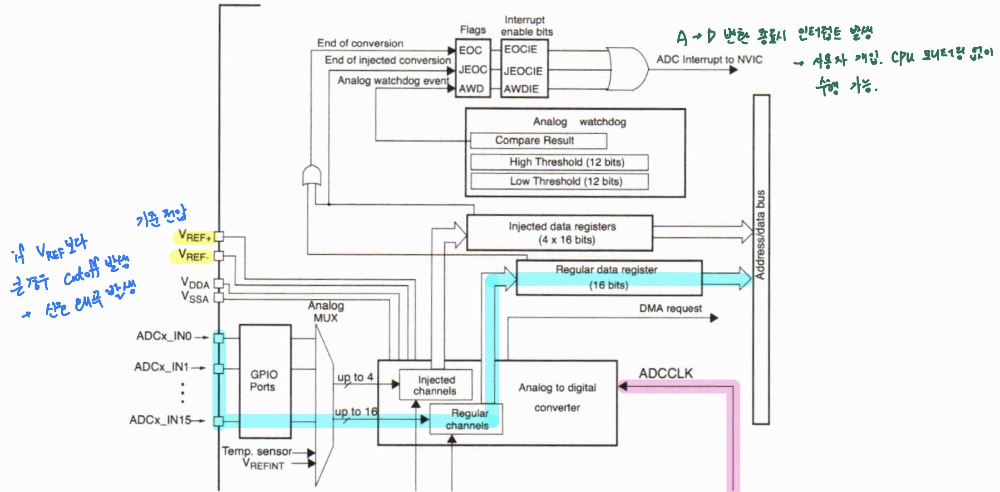
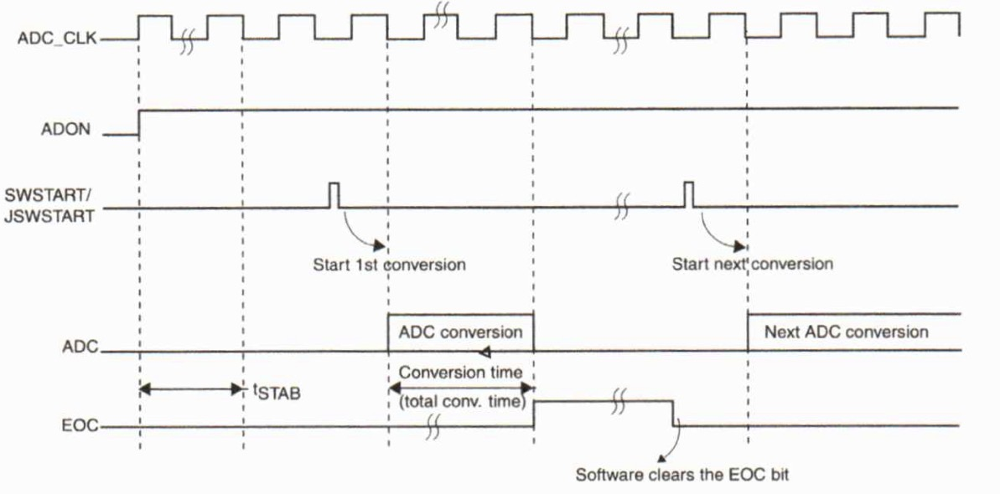
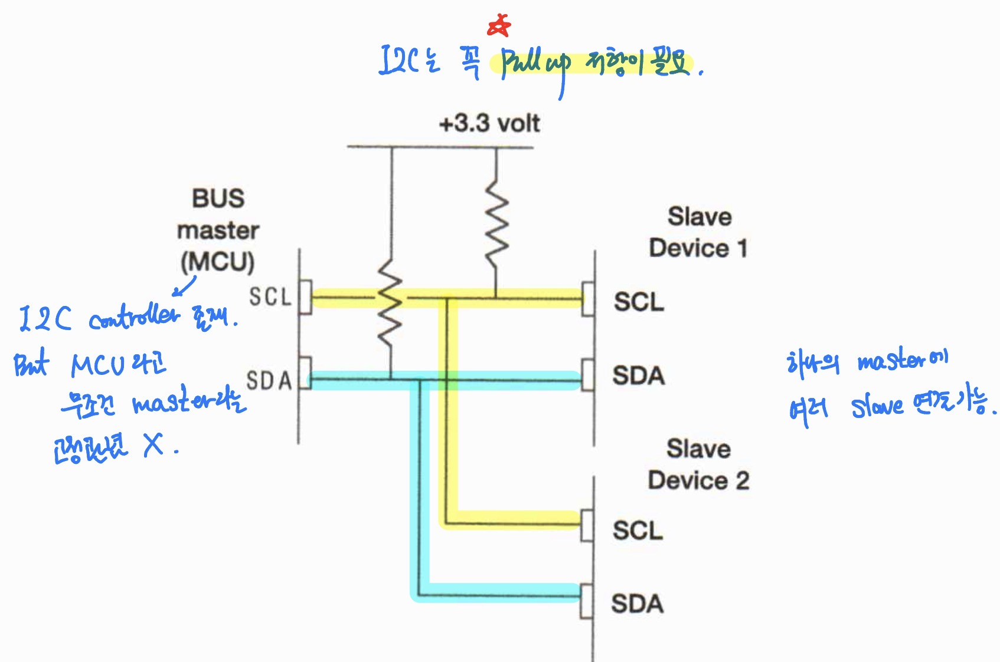
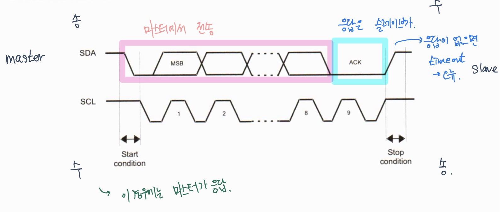
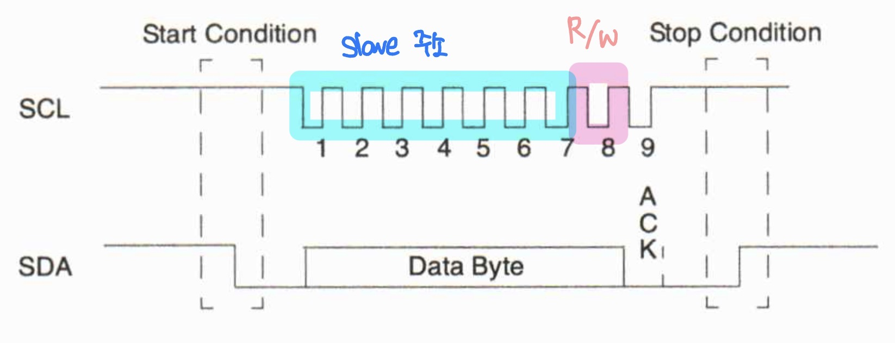
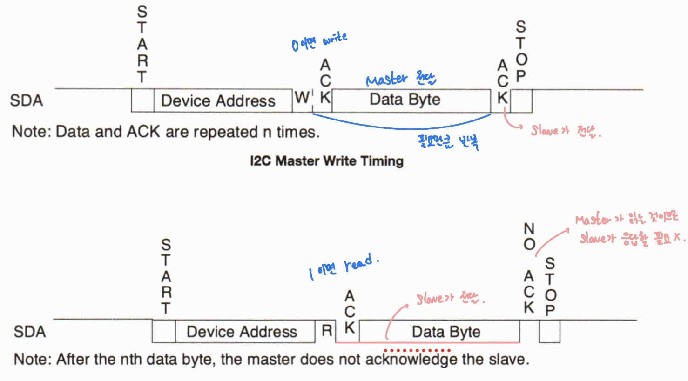
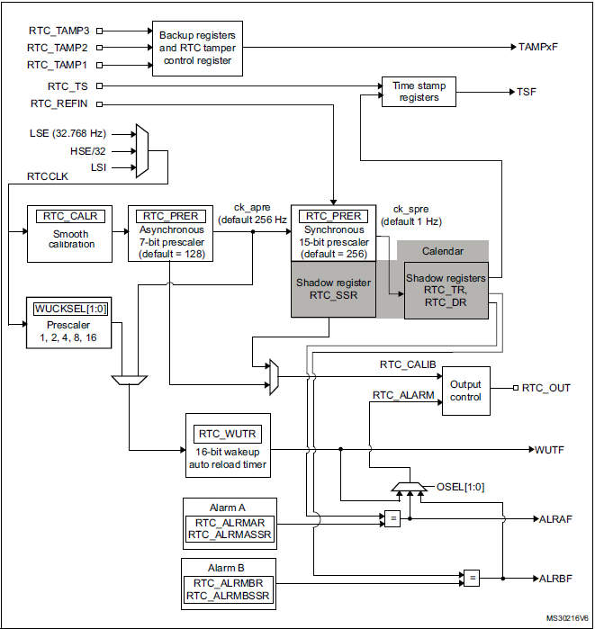

# 프로세서 구조 및 디바이스 프로그래밍 day07

날짜: 2026년 2월 5일

### 온도 센서

- 온도가 내려갈 수록 저항값이 올라가는 특성으로 측정

### STM32 ADC

- 센서 입력을 여러 개 받을 수 있다. (다 채널)
- 실시간으로는 하나의 센서만 처리할 수 있다

### ADC Block Diagram

### STM 32 ADC 특징

- ADC는 연속적인 근사 12비트 변환기, 12, 10, 8, 6 bit설정 가능 해상도
- 최대 19개의 멀티 플렉스 채널 존재, 16개의 외부 소스와 2개의 내부소스, 1개의 Vbat channel에서 신호를 측정 가능
- 다양한 채널의 A/D 변환은 단일(한 채널 사용자 명령에만), 연속(한 채널 자동으로 진행), 스캔(여러 채널을 순회하면서 변환) 또는 불연속 모드에서 수행
- ADC 결과는 왼쪽 정렬, 오른쪽 정렬 16 비트 데이터 레지스터 저장
- 부가 기능 : 입력 전압이 사용자가 정의한 상한 또는 하한 임계값을 벗어나는지 감지 가능

### ADC 특징

- 채널별 프로그래밍 가능한 샘플링 시간

### ADC on-pff control

- ADC는 ADC_CR2 레지스터에서 ADON 비트를 설정해서 전원을 킬 수 있음
- SWSTART 또는 JSWSTART 비트가 설정되면 변환 시작
- ADON 비트를 지우면 변환 중지 ADC 전원 차단 모드로 전환 → 이 모드에서는 거의 전력 소비 X

### ADC Clock

- 아날로그 회로용 클록 : ADCCLK, 모든 ADC에 공통 이 클럭은 프로그래밍 가능한 프리스케일러로 나눈 APB2 클럭에서 생성
- 디지털 인터페이스용 클록 : APB2 클럭과 동일한 클럭

### Channel selection

- 16개의 다중 채널 존재
- 변환은 일반 및 주입 두 그룹으로 구성
- 임의 순서로 수행 할 수 있는 일련의 변환으로 구성됨

### single conversion mode

- 단일 변환 모드에서 ADC는 하나의 변환을 수행한다. 이 모드는 다음 중 하나에 의해 0에서 CONT 비트로 시작
    - ADC_CR2 레지스터의 SWSTART 비트 설정 (일반 채널만 해당)
    - JSWSTART 비트 설정 (주입 채널의 경우)
    - 외부 트리거 (일반 또는 주입 채널용)
- 선택한 채널의 변환 완료
    - 일반 채널이 변환된 경우
        - 변환된 데이터는 16비트 ADC_DR 레지스터에 저장
        - EOC(변환 끝) 플래그가 설정됨
        - EOCIE 비트가 설정되면 인터럽트 발생
    - 주입된 채널이 변환된 경우
        - 변환된 데이터는 16비트 ADC_JDR1 레지스터에 저장된다
        - JEOC(변환 종료 주입) 플래그 설정
        - JEOCIE 비트가 설정되면 인터럽트가 생성된다.

### Continuous conversion mode

- 연속 변환 모드에서 ADC는 변환이 완료되는 즉시 새 변환 시작
- 이 모드는 외부 트리거에 의해 또는 ADC_CR2 레지스터에서 SWSTART 비트를 설정하여 (일반 채널만 해당) CONT 비트가 1로 시작된더
- 변환 이후
    - 일반 채널이 변환된 경우
        - 마지막으로 변환된 데이터 16비트 ADC_DR 레지스터에 저장
        - EOC 플래그가 설정된더
        - EOCIE 비트가 설정되면 인터럽트 생성
    - 삽입 채널은 연속으로 변환 X

### Timing Diagram

- ADC는 정확하게 변환을 시작하기 전에 tSTAB의 안정화시간이 필요
- ADC 변환이 시작된 후 15 클럭 사잌믈 후에 EOC 플래그가 설정되고 16비트 ADC 데이터 레지스터에 변환 결과가 저장된다
    
    
    

### Channel-by-channel programmable sample time

- ADC는 ADC_SMPR1 및 ADC_SMPR2 레지스터의 SMP [2 : 0] 비트를 사용하여 수정할 수 있는 여러ㅗ ADC_CLK 사이클에 대한 입력 전압을 샘플링한다
- 각 채널은 다른 샘플 시간으로 샘플링 될 수 있다
- 총 전환 시간 계산
    - Tconv = 샘플링 시간 + 12 사이클
    - ex ) ADCCLK = 30MHz 및 3 사이클의 샘플링 시간
        
        Tconv = 3 + 12 = 15사이클 = 0.5us with APB2 at 60 MHz
        

### Analog watchdog

- AWD 아날로그 워치독 상태 비트는 ADC에 의해 변환된 아날로그 전압이 임계값 밖의 값을 갖는 경우 설정
- 임계값은 ADC_HTR 및 ADC_LTR 16비트 레지스터 12개 최하위 비트에 프로그래밍
- ADC_CR1 레지스터의 AWDIE 비트를 사용하여 인터럽트를 활성화

### Scan mode

- 아날로그 채널 그룹 스캔
- ADC_CR1 레지스터의 SCAN 비트를 설정하여 선택 → 모든 채널 스캔
- 그룹의 각 채널에 대해 단일 변환이 수행, 변환이 끝날 때마다그룹의 다음 채널이 자동 변화
- CONT 비트가 설정되면 일반 채널 변환은 그룹에서 마지막으로 선택된 채널에서 멈추지 않고 처음 선택된 채널에서 다시 계속된다.

### ADC 인터럽트

- 변환이 끝날 때 인터럽트 생성
- ADC_SR 레지스터에는 두 개의 다른 플래그가 있지만, 이와 관련된 인터럽트는 없다
    - JSTART : 삽입된 그룹 채널에 대한 변환 시작
    - START : 일반 그룹 채널에 대한 변환 시작

## CH 12. I2C

### I2C

- IIC 버스 또는 I2C버스
- 하드웨어 및 소프트웨어 프로토콜을 결합하여 많은 주변 장치와 통신할 수 있고 여러 버스 마스터를 지원할 수도 있는 버스 인터페이스 제공
- 직렬 버스 구현을 위해 SDA (데이터)와 SCL (클럭 → 마스터에서 발생)이라는 두 개의 핀만 사용 (선 두가닥)
- 이 버스는 근거리에서 많은 장치 사이에 가끔 통신이 필요한 애플리케이션에 적합
- 여러 장치가 동시에 버스를 제어하려고 시도하는 경우 데이터 손상 방지를 위해 중재 및 충돌 감지 사용

c.f ) UART와 비교

차이점

- UART는 비동기 통신 - I2C는 동기 방식 (클럭 존재)
- UART는 Tx, Rx 선 두 개 존재 - I2C는 한 개의 선으로 Tx, Rx, 다른 한 가닥은 클럭
- UART는 1:1 통신 방식 - I2C는 1:多 통신
- UART는 물건과 물건 사이 연결 (PC to PC, PC to Board) - I2C는 온보드 통신 (한 개의 Board 위에서 chip간 통신)

### I2C 개념도

### I2C 버스 설명

- I2C 규정 준수를 위해 이 두 신호에 연결된 모든 장치는 오픈 드레인 또는 오픈 콜렉터 출력 장치여야함
- 외부 풀업 저항 필수
- 풀업 저항 없는 경우 라인이 플로팅되어 불확실한 값 발생하여 오류 발생
- 마스터 슬레이브 장치의 조합에 필수적인 하드웨어 핸드셰이크 기능 제공
- START 신호는 마스터에 의해 수행
- 데이터는 하나 이상의 바이트를 포함하는 패킷으로 전송
- 각 바이트 내에서 최상위 비트가 먼저 전송

### I2C 프로토콜

1. START 신호
2. 슬레이브 주소 전송
3. 데이터 전송
4. STOP 신호

### I2C 버스 설명

- 패킷 전송 내에서 슬레이브는 ACK신호 사용하여 각 바이트 승인
- ACK 대기 단계는 9번쨰 비트에 위치
- 모든 데이터가 바이트로 전송되면 이 추가 1비트는 주변 장치에서 슬레이브가 바이트 전송을 승인해야 한다는 표시로 해석
- 마스커가 데이터와 클럭 라인을 해제한 후 슬레이브가 SDA 라인을 LOW로 당겨서 수행
- ACK 명령 발행되면 전송 완료를 나타냄

### I2C 주소

- I2C 버스는 여러 슬레이브 장치 지원
- 슬레이브 선택은 데이터 패킷 내 첫번째 바이트를 주소 바이트로 사용
- 주소 바이트 전송되고 각 슬레이브 장치는 주소를 자신의 값과 비교

### STM I2C 컨트롤러

- I2C 버스 인터페이스는 마이크로컨트롤러와 직렬 I2C 버스 간의 인터페이스 역할
- 특정 기기 구현에 따라 DMA 기능을 사용하여 CPU 과부하 줄임

### I2C 특징

- 병렬 버스 / I2C 프로토콜 컨버터
- 멀티 마스터 기능
- I2C 마스터
    - 클럭 생성
    - START / STOP 신호 생성
- I2C 슬레이브
    - 프로그래밍 가능한 I2C 주소 감지
    - 2개의 슬레이브 주소를 인식하는 이중 주소 지정 기능
    - 정지 비트 감지
- 7비트 / 10비트 주소 지정 및 일반 호출 생성 및 감지
- 다양한 통신 속도
    - 표준 - 최대 100kHz
    - 빠름 - 최대 400kHz
- 아날로그 노이즈 필터
- 상태 플래그
    - 송신기 / 수신기 모드 플래그
    - 바이트 끝 전송 플래그
    - I2C 통신 중 플래그
- 오류 플래그
    - 마스터 모드에 대한 중재 상실 조건
    - 주소 / 데이터 전송 후 확인 실패
    - 잘못된 시작 또는 중지 조건 감지
    - 클럭 스트레칭 비활성화 된 경우 오버런 / 언더런
- 2개의 인터럽트 벡터
    - 성공적인 주소 / 데이터 통신을 위한 1 인터럽트
    - 오류 조건에 대해 1 인터럽트

### Master mode

- 마스터 모드에서 IC 인터페이스는 데이터 전송을 시작하고 클럭 신호 생성
- 직렬 데이터 전송은 항상 시작 조건으로 시작, 중지 조건으로 끝
- 시작 비트가 있는 버스에서 시작 조건 생성되는 즉시 마스터 모드 선택
- 마스터 모드 선택 필요 순서
    - 정확한 타이밍 생성을 위한 I2C_CR2 레지스터 주변 장치 입력 클럭을 프로그래밍
    - 클럭 제어 레지스터
    - 상승 식단 레지스터
    - I2C_CR1 레지스터를 프로그래밍하여 주변 장치를 활성화

### SCL master Clock generator

- CCR 비트는 각각 상승 및 하강 에지 생성부터 시작하여 SCL 클럭의 하이 및 로우 레벨을 생성하는데 사용

### Start condition

- START 비트를 설정하면 인터페이스가 시작 조건을 생성하고 BUSY 비트가 지워지면 마스터 모드로 전환
- 시작 조건 전송되면
    
    → SB 비트는 하드웨어에 의해 설정, ITEVFEN 비트가 설정되면 인터럽트가 생성
    
    → 마스터는 SR1 레지스터를 읽고 DR 레지스터에 쓰기를 기다린다.
    

### Master reciever

- 주소 전송 후 ADDR을 지우면 I2C 인터페이스가 마스터 수신기 모드로 들어감
- 이 모드에서 인터페이스는 내부 시프트 레지스터를 통해 SDA 라인에서 DR 레지스터로 바이트 수신
1. ACK 비트가 설정된 경우 승인 펄스
2. ITEVFEN 및 ITBUFEN 비트가 설정된 경우 RxNE 비트가 설정되고 인터럽트 생성
3. DR 데이터가 마지막 데이터 수신이 끝나기 전에 읽히지 않으면 BTF 비트는 하드웨어에 의해 설정되고 인터페이스는 BTF가 SR1 레지스터의 읽기에 의해 지워질 때까지 대기. DR 레지스터를 읽고 SCL을 낮게 늘림

## CH 13. IWDG

### WDG 설명

- 감시 타이머는 런어웨이 코드에서 소프트웨어를 복구하는데 사용되는 16 / 32 비트 다이머
- 워치독 타이머에는 언더플로에서 리셋을 생성하는 자유 실행 카운터 존재
- 리셋을 방지하기 위해 소프트웨어는 감시 장치를 서비스하여 주기적으로 카운트 다운을 다시 시작
- 타이머가 활성된 경우 시간 초과 전 0x5555를 기록한 다음 0xAAAA를 레지스터에 쓰면 리셋 방지
- 타임 아웃의 경우 리셋 컨트롤러 모듈에 신호를 보냄

### STM IWDG 설명

- 소프트웨어 오류로 인한 오작동 감지 및 해결하고 카운터가 주어진 시간 초과 값에 도달하면 시스템 리셋 또는 인터럽트를 트리거함
- IWDG는 자체 전용 LSI에 의해 클럭되므로 주 클럭이 실패하더라도 활성상태 유지
- IWDG는 워치독이 메인 애플리케이션 외부에 완전히 독립적인 프로세스로 싱행되어야 하지만 타이밍 정확도 제약이 낮은 애플리케이션에 가장 적합

### IWDG 특징

- 자유 다운 카운터
- 독립적인 RC 발진기에서 클럭됨 (대기 및 정지 모드에서 작동 가능)
- 카운터 값 0에 도달하면 리셋 (워치독이 활성화된 경우)

## CH 14. RTC

### RTC

- 주요 기능 3가지로 요약
    1. human watch
    2. calendar
    3. alarm
    4. wakeup (+ 알파) → CPU가 저전력 모드에 들어 갔을 때 일정 시간 이후 인터럽트로 깨우는 용도
- 현재 시간 및 날짜 정보를 제공할 수 있는 실시간 시계로 알려진 특별한 범주의 타이머
- 32kHz 수정 발진자로 구동되며 프리스케일러는 RTC의 모든 블록에서 사용되는 1Hz 클럭을 생성한다
- TOD 클럭은 초, 분, 시 및 요일 카운터로 구성
- 활성화된 경우 TOD. 알람은 프로그래밍된 알람 설정이 TOD 카운터와 일치할 때 RTC 인터럽트 생성
- 내부 및 외부에서 RTC에 의해 생성된 인터럽트는 실시간 인터럽트 활성화 레지스터에서 개벽적으로 활성화 또는 비활성화 할 수 있음.

### RTC와 저전력 모드

- sleep
    - RTC 인터럽트로 인해 장치가 절전 모드에서 종료되는 효과 없음
- stop
    - RTC 웨이크업으로 인해 장치가 중지 모드를 종료한다
- standby
    - RTC 웨이크업으로 인해 장치가 대기모드에서 종료된다

### RTC Block Diagram

