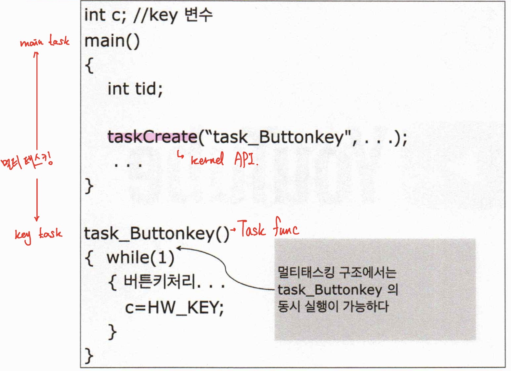
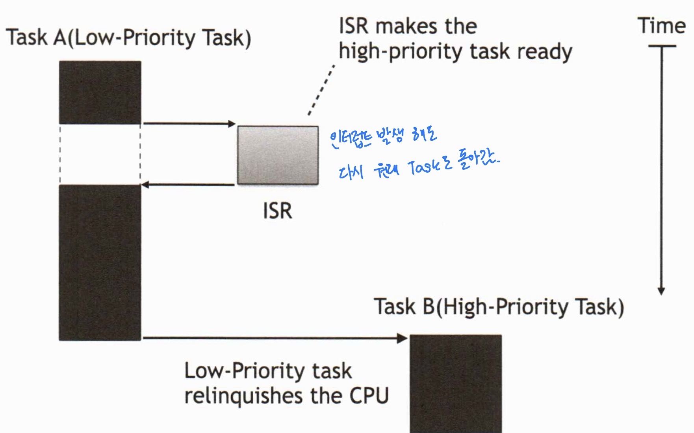
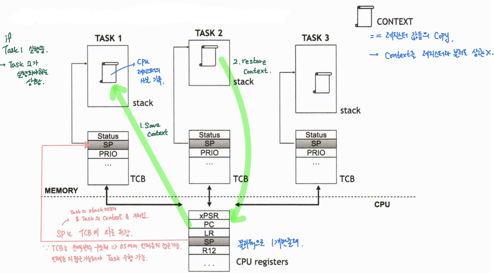
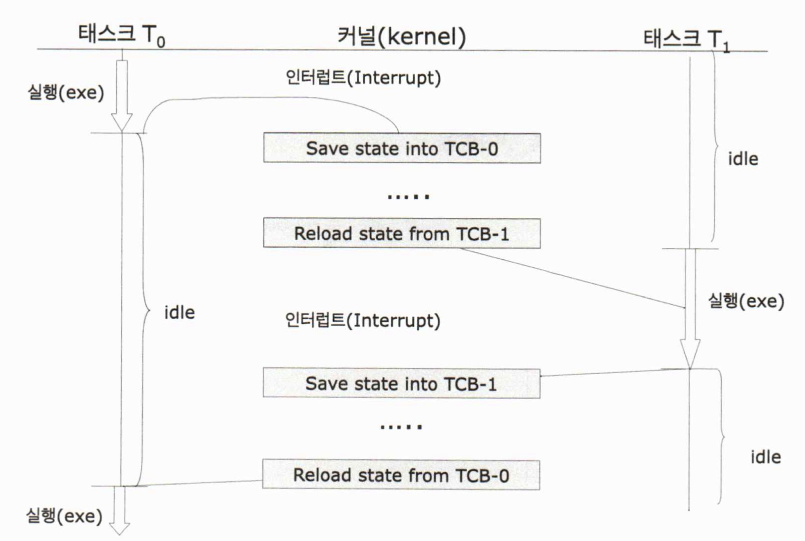
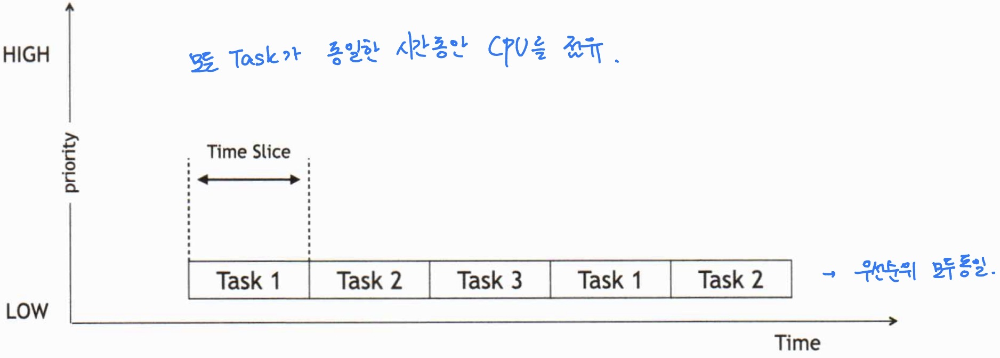
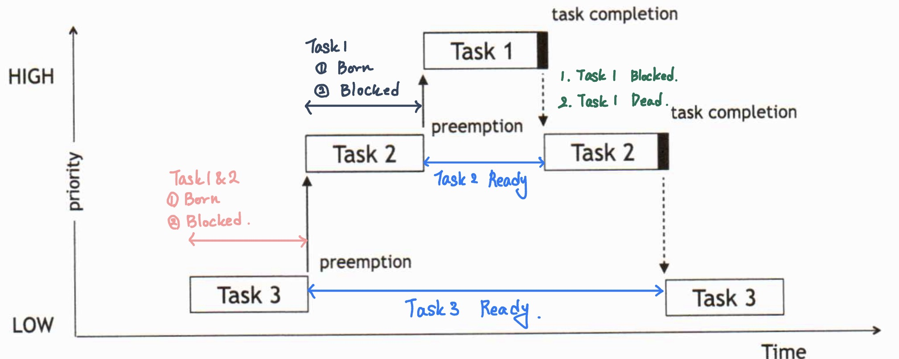
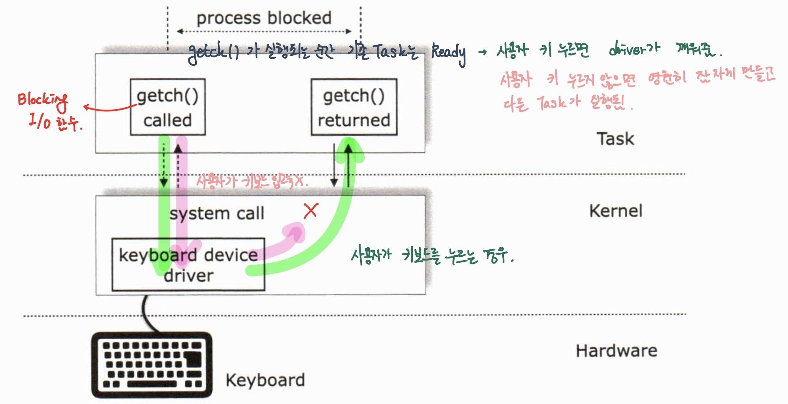
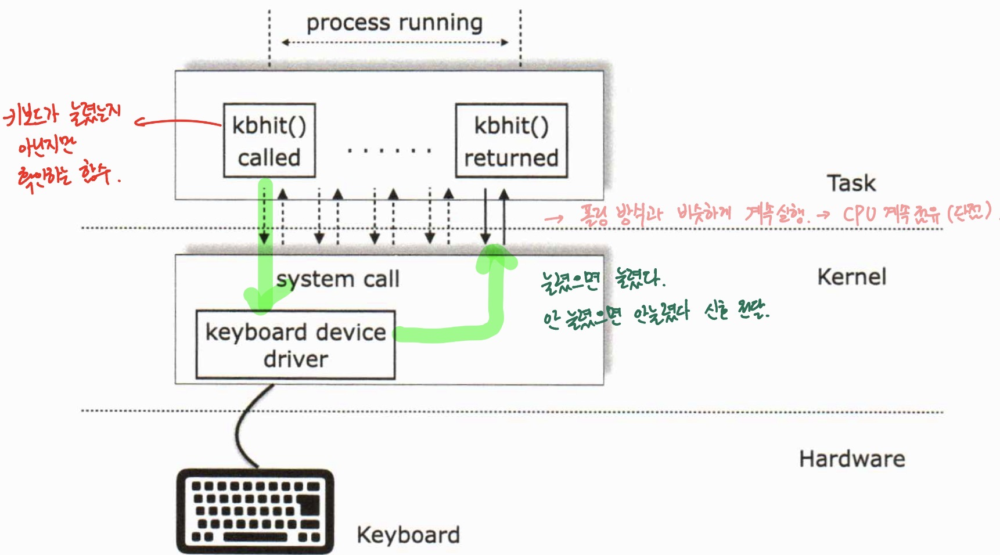
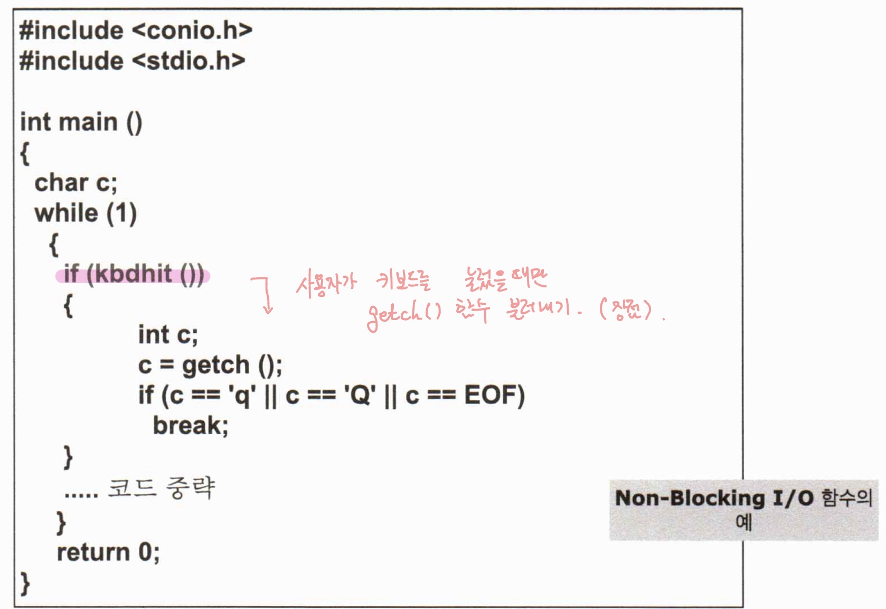
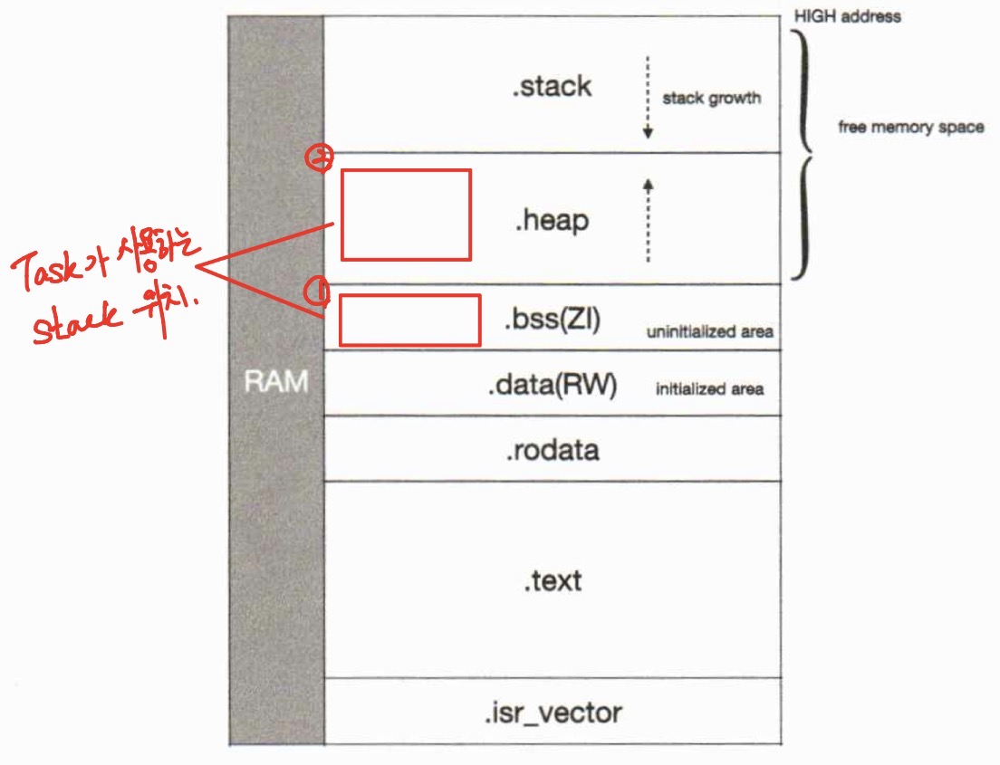

# 실시간 운영체제 구조 및 활용 day01

날짜: 2026년 2월 10일

## FreeRTOS 프로그래밍

### 과정 목표

- RTOS 기반의 임베디드 시스템 프로그래밍 방법을 이해하여 실무에서 바로 적용 가능하도록 한다
    - 실시간 운영 체제의 특징 이해
    - 테스크 관리 방법 이해
    - 공유 자원 보호 기법의 이해
    - 포팅 기법의 이해

## CH 1. 실시간 시스템 개론

## 멀티태스킹이란

- OS 기반의 멀티태스킹
    
    
    

### TASK

- 물리적인 CPU는 하나
- Task == Virtual CPU
- 태스크는 가상의 CPU를 각자 가지고 있는 것처럼 동작
- 가상의 CPU라고 특정 지을 수 있는 특징
    - 레지스터가 존재 → 실질적인 레지스터는 1개이지만, 이 또한 가상화 시킴
    - stack 메모리 존재

### Task 간의 통신 (IPC)

- 태스크 A와 태크스 B는 커널 서비스인 Inter Process Communication 방법을 이용하여 통신
- 운영체제 위에서 가능

### 태스크 상태도 (Task State Diagram) : Task’s life cycle

- 멀티 태스킹 환경에서 커널은 실행 중 상태를 계속 변경
- 태스크 상태
    - Running - VCPU를 Task가 사용하고 있는 상태
    - Ready - VCPU 사용 대기중
    - Blocked(waiting, sleep, Pend) - Task가 잠자고 있는 중
    - Born -  Task가 만들어지지 않은 상태
    - Dead - Task가 사라진 상태
    
    c.f ) Blocked과 Ready의 정확한 차이가 뭐지?
    
    → 맛집, 사람으로 비유
    
    Running → 먹고 있는 사람
    
    Ready → 줄 서 있는 사람
    
    Blocked → 아무 상관이 없는 사람
    

## 스케줄링

### c.f ) 커널

- 컴퓨터 운영체제의 핵심이 되는 컴퓨터 프로그래밍
    
    → 운영체제 : 사용자 하드웨어, 시스템 리소스 제어, 프로그램에 대한 일반적인 서비스를 지원하는 시스템 프로그램
    

### 선점형 커널 (Preemptive Kernel)


- 선점형 커널은 어떤 한 task가 수행하고 있는 도중에도 kernel이 그 task의 수행을 중지 시키고 다른 task (중지된 task보다 우선 순위 높음)를 수행 시킬 수 있는 능력을 소유
- 가장 높은 우선 순위의 task가 CPU를 점유하여 수행될 수 있음
- 시스템 응답성이 중요한 경우 사용됨
- 실시간 운영체제에서 사용하는 구조

### 비선점형 커널 (Non-Preemptive Kernel)



- 비선점형 커널은 어떤 한 Task가 수행하고 있을 때 Kernel이 그 task의 수행을 강제로 중지시키고 다른 Task를 수행시킬 수 있는 능력이 없음
- 실시간 시스템에서는 사용될 수 없는 구조

### TCB (Task Control Block) → OS의 경우 무조건 필요

- 태스크마다 각각 가지고 있는 멀티태스킹 자료구조
    
    
    
    TCB는 Task가 생성될 때 같이 생성된다. → Task의 Profile이라 생각하면 된다.
    

### 문맥 전환(Context Switch)

- 하나의 Task가 실행하다 일시정지되고 다른 Task가 실행하는 것
- 문맥 전환  == 실행 중이였던 Task의 레지스터를 Save Context + 실행할 Task의 Context를 Restore Context 하는 것
    
    
    

### Round-Robin 스케쥴링 → 우선순위 상관 X

- 모든 태스크들이 시간 자원(CPU)을 공평히 나누어 사용하는 개념
- 각 태스크들이 점유하는 시간을 ‘타임퀀텀’이라고 한다
- 타임 퀀텀의 크기는 특별히 정해지지 않으나 대략 1ms ~ 20ms 을 많이 사용함 ← 타임 퀀텀이 너무 짧으면 문맥 전환을 위한 시간 자원 낭비가 심함
- But, 어플리게이션이 단순한 비 선점형 스케줄링 만을 필요호 할 경우 최적



### Priority 스케쥴링 → 우선순위 높은 경우 먼저 처리(HPT)

- Task를 중요도에 의해 가중치를 두어 우선적으로 실행할 수 있도록 하겠다는 개념
- 실시간 운영체제(RTOS)에서 필수적으로 지원하는 스케쥴링 방법
- 선점형 스케줄링의 특성을 부여받음



if Task1이 종료되지도 sleep하지도 않는 경우

→ Task2 & 3는 Starvation 상태

CPU는 Ready 상태에 있는 Task 중에서 가장 높은 Task가 점유

**→ HPT (Highest Priority Task)**

## 인터럽트

### 인터럽트

- 비동기적 이벤트 발생 처리하는 메커니즘
- 인터럽트 발생시 문맥 저장 ISR로 점프
- 활성, 비황성화 가능
- 지연시간 → 비활성화 최대시간 + ISR 최소 명령시간
    
    비활성화 최대시간이란, Pend list에 저장되어 있기 때문에 언젠가는 실행됨,
    
    이때 활성화 될 때까지의 시간
    

### Blocking I/O

- 블로킹 I/O 동작은 태스크가 시스템 콜을 호출 했으나 점유하고자 하는 데이터가 즉시 가용하지 않을 경우, 그 동작이 완료될 때까지 **suspending** 상태로 유지되는 것
    
    
    
    함수가 HW와 연계되어 있는 경우 Blocking I/O 함수일 가능성이 높음
    
    함수가 HW와 연계되어 있지 않은 경우 Non Blocking I/O 함수
    

### Non-Blocking I/O





## 커널의 시계 (Tick)

### Tick

- 정기적 (Preiodic)으로 발생하는 인터럽트
- 태스크 지연 (delay), 타임아웃 (timeout)을 제공
- 태스크 지연의 분해능 (clock resolution)은 클럭 틱 하나의 오차 존재
- 클럭 틱 단위 정확도로 지연 가능한 것은 아니다. → 선점형 커널에서 가능
- 커널에서는 이를 시계 용도로 활용함

## RTOS → 적어도 수백개의 종류 존재

가장 유명한 RTOS → VxWorks (신뢰성 높음)

### 특징

- Hard Real Time
    - Hard Real Time Vs. Soft Real Time
        - 같은 실시간 OS이더라도 마감을 지키지 못했을 때
            
            → 치명적이면 Hard Real Time
            
            → 치명적이지 않으면 Soft Real Time
            
- Scalability
    - Extensibility → scale up에 초점
    - Scalability → scale up/down 둘 다 가능
        - HW 성능이 되면 되는대로, 성능이 부족하면 부족한대로 사용할 수 있다.
        - 수십 KB 메모리에서도 돌아갈 수 있다.
- Preemptive
    - Hard real time에서는 선점이 가능해야 한다
- Multitasking
    - OS를 쓰는 본질
- Deterministic
    - 예측한 대로 돌아가야 한다.
    - ex ) 예측 가능하지 않은 OS = Windows → 구글 크롬창을 20개 띄우게 되면 어느 순간 느려짐
- Portability
    - RTOS가 다양한 MCU에서 작동할 수 있도록 제작
    - C언어로 만들게 되면 인식성이 좋아진다.
- Robustness
    - 견고한 OS

### 실시간 시스템의 개념

- 리얼타임 시스템 - 정해진 시간 내에 임무를 수행하는 시스템
- 리얼타임 시스템의 분류
    - 소프트
        
        가능한 빨리 임무를 수행하지만 반드시 정해진 시간 내에 수행할 필요는 없다
        
        (timeout 이어도 계속 수행)
        
    - 하드
        
        어떤 사건이 발생했을 때 정확히 동작하는 것은 물론이고 반드시 정해진 시간 내에 임무를 마쳐야 함
        
        (timeout이면 Failure)
        

## FreeRTOS

### FreeRTOS 시작하기

- 35개 이상의 마이크로 컨트롤러에 이식됨
- 용도 : 각종 장비 개발 가능
- 공식 사이트 [www.freertos.org](http://www.freertos.org) (소스 다운로드 가능)

### FreeRTOS를 이용한 RTOS

- SafeRTOS
    - 의료기기, 철도, 비행기 등 안전-결정적 시스템에 바로 적용 가능한 안정적이고 효율적임
- OpenRTOS
    - 소스코드 및 기능이 FreeRTOS와 동일하지만, 비용을 지불하고 사용하는 상용버전
    - 정식 기술 지원 받을 수 있음

### FreeRTOS 특징

- Portable
- ROMable
    - 해당 C 컴파일러, 어셈블러, 링커 로더가 필요, 설정이나 응용프로그램에 따라 메모리의 크기를 자유롭게 결정 가능
- 커널 바이너리 이미지는 4K에서 9K 바이트 영역
- Preemptive Scheduling
    - 우선순위 높은 작업 먼저 실행
- Round Robin Support
- Real Time
    - 빠른 응답성
- Multitasking
    - 독자적 우선순위를 가지는 무제한으로 생성 가능한 태스크
- 임베디드 운영체제로서 대표적인 공개형 소스코드 기반 커널
- 신뢰성, 안전성 높음
    - 작은 사이즈 - 많은 시스템에 적용 가능
        - 작은 임베디드 시스템에 탑재 가능하며 임베디드 시스템 중에서도 강력한 네트워크가 필요한 곳과 높은 성능 시스템에 사용하는 것이 적합
- 프로젝트에 따른 소스코드의 절약 가능
- 스택오버플로우체크, 처리시간 체크, 후크(HOOK), Queue, Semaphore, 5가지 Heap memory 등의 시스템 서비스 제공
- 저전력 애플리케이션을 위한 틱리스 (tickless) 모드 지원
- 효율적인 소프트웨어 타이머
- 인터럽트 관리
    - 태스크의 수행을 일시 중지하거나 재개 가능
    - 인터럽트 중첩
- 강력한 실행 추척 기능
- 스택 오버플로 감지 옵션
- 단점
    - 디바이스 드라이버 부재 → RTOS는 원래 없음…(VxWorks 같은 경우는 존재)
    - 멀티코어 지원 X → 지금은 가능함

## CH 2. 태스크 운용

## 태스크

### 태스크 형태

`void YourTask(void *pvParameters)`  리턴은 void, 파라미터는 void pointer

유형

1. 무한 루프 함수
2. 실행 후 스스로 삭제하는 함수
    - ex. 우주 발사체에서 지구 공간에서만 필요한 함수의 경우

### 태스크와 우선순위

- 우선순위 개수는 사실상 무제한
- 큰 숫자가 높은 우선순위를 나타냄
    - 0 < 1 < 2 < 3 << 100 < 101 < 102 …
- But, 우선순위의 사용 범위 제한 가능
    - `#define configMAX_PRIORITIEs        100`
- 동일한 우선순위도 사용 가능 (ROUND ROBIN 지원)
- 새로 생성된 태스크가 우선순위가 높다면 생성과 동시에 CPU 제어권을 할당 받아 실행
- FreeRTOS에서는 `vTaskStartScheduler()` 함수를 호출해서 멀티태스킹 시작
- **우선순위와 CPU 점유는 비례 관계 성립 X**
    
    → 우선순위보다 CPU의 점유 시간은 휴면 시간(Delay) 에 따라 정해진다
    
    → 휴면 시간이 짧을 수록 CPU 점유 시간이 길어진다
    

### Task 생성

```c
BaseType_t xTaskCreate( 
        TaskFunction_t pxTaskCode,
        const char * const pcName,
        const configSTACK_DEPTH_TYPE usStackDepth,
        void * const pvParameters,
        UBaseType_t uxPriority,
        TaskHandle_t * const pxCreatedTask )
```

- `pxTaskCode` : 태스크 함수
- `*pcName` : 태스크 함수의 이름
- `usStackDepth` : 스택 항목의 개수
    - stack entry 수를 작성해야 함 → word(4byte) 단위로만 가능하기 때문
    - 1024byte의 경우 256으로 작성해야 함
- `*pvParameter` : 태스크 전달 파라메터
    - Task 생성 시 넘겨주고 싶은 Parameter가 존재하면 활용
- `uxPriority` : 태스크 우선순위
- `*pxCreatedTask` : 태스크 핸들
    - C언어에서 `fopen()` 이런 식으로 file description 하는 것 처럼 사용

### c.f ) Task가 사용하는 Stack 메모리는 어디 생길까?



1 순위는 .bss (ucHeap) → 동적 메모리 풀

2순위는 .heap

### Task와 스택(Stack) 메모리

- 태스크 스택 메모리는 정적, 동적 할당(default) 사용 가능
- `#define configSUPPORT_DYNAMIC_ALLOCATION`
- 동적 메모리 사용은 메모리 단편화(Memory Fragmentation) 현상이 발생하지 않도록 응용 프로그램이 일단 한번 생성한 태스크는 프로그램 종료까지 삭제하지 않고 유지하는 경우에만 사용하는 것이 바람직
- 메모리 단편화 (Memory Fragmentation)
    - 기억 장치의 빈 공간 또는 자료가 여러 개의 조각으로 나뉘는 현상
    - 요청한 메모리 크기 < 가용한 메모리 크기
        
        But, 메모리 할당이 실패할 수 있는 문제 가능성 큼
        
- 태스크 스택의 크기는 응용프로그램마다 상이
- 태스크 스택의 크기를 결정하는 요소
    - 태스크에서 호출하는 함수들의 중복 호출 횟수
    - 해당 함수에서 사용되는 모든 지역변수의 개수
- 동적 메모리를 이용한 태스크 스택 생성
    
    ```c
    #define configSUPPORT_DYNAMIC_ALLOCATION        1
    
    TaskHandle_t xTaskCreate(TaskFunction_t pxTaskCode, ... ) // 함수를 이용해 Task 생성
    ```
    
- 정적 메모리를 이용한 태스크 스택의 생성과 그 실행
    
    ```c
    #define configSUPPORT_STATIC_ALLOCATION        1
    
    BaseType_t xTaskCreateStatic(TaskFunction_t pxTaskCode, ... )
    // 함수를 이용하여 태스크 생성
    ```