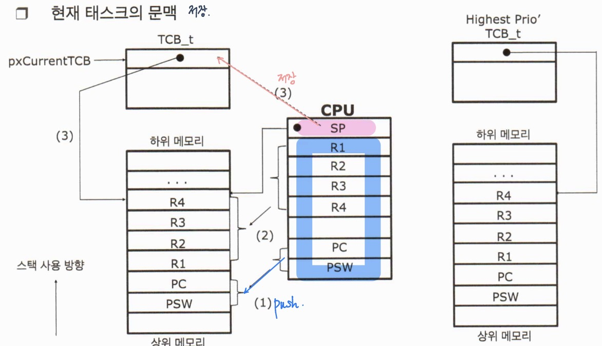
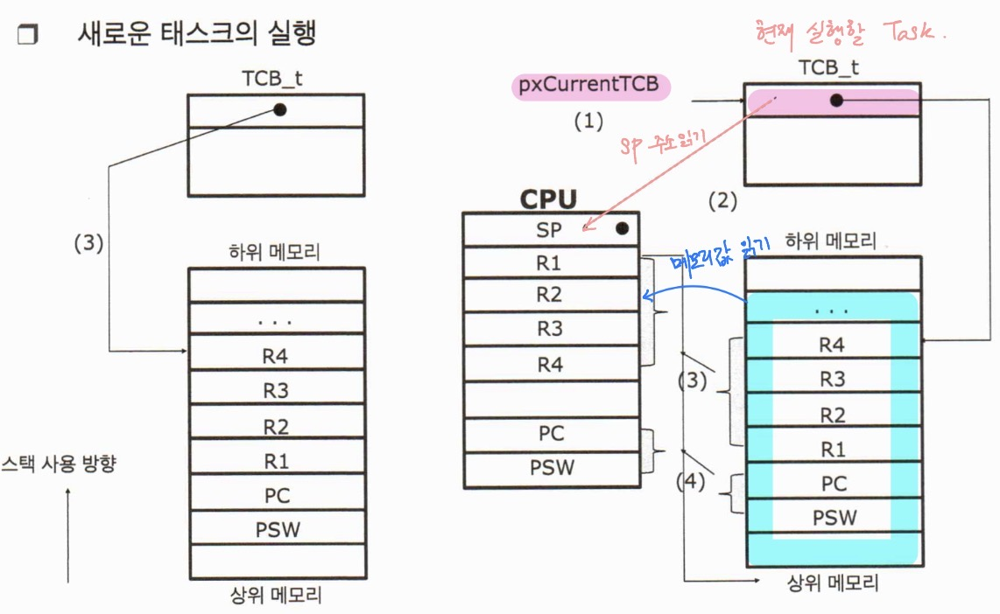
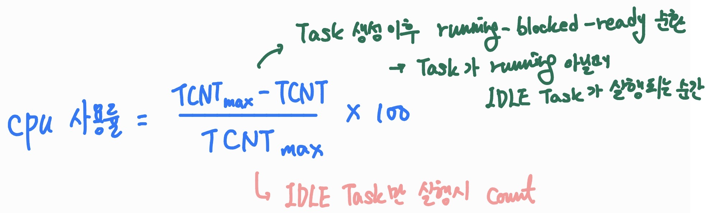
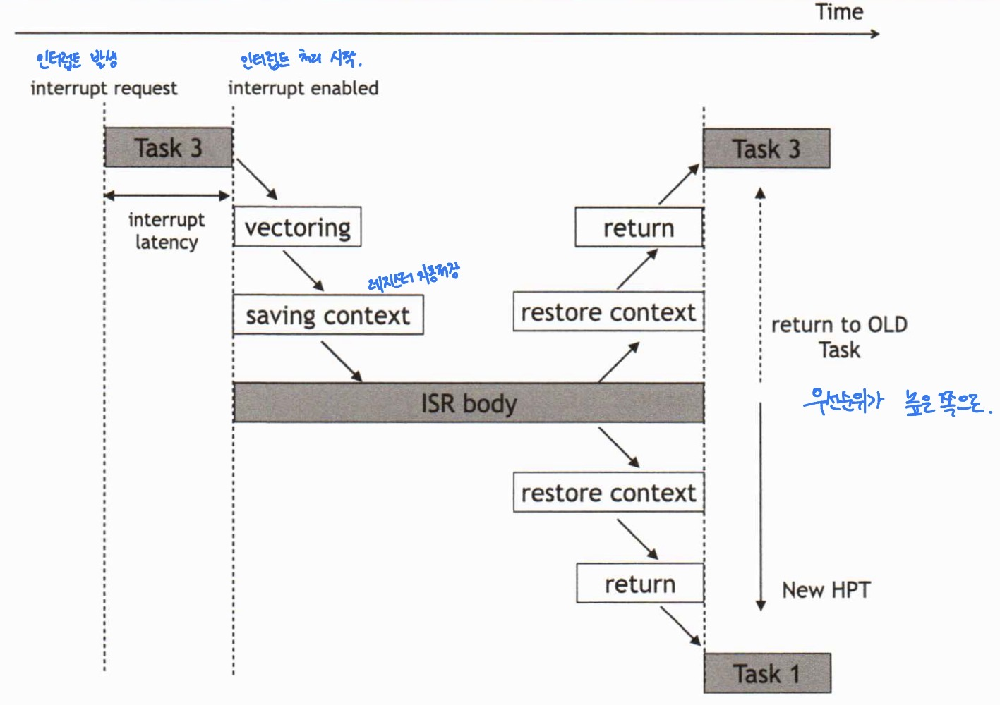
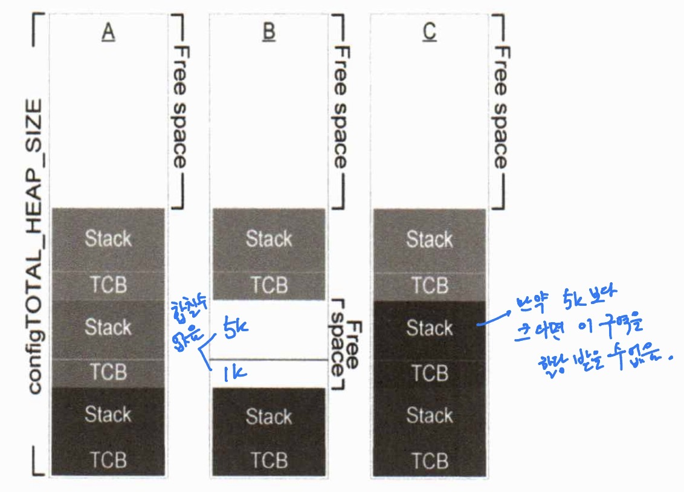
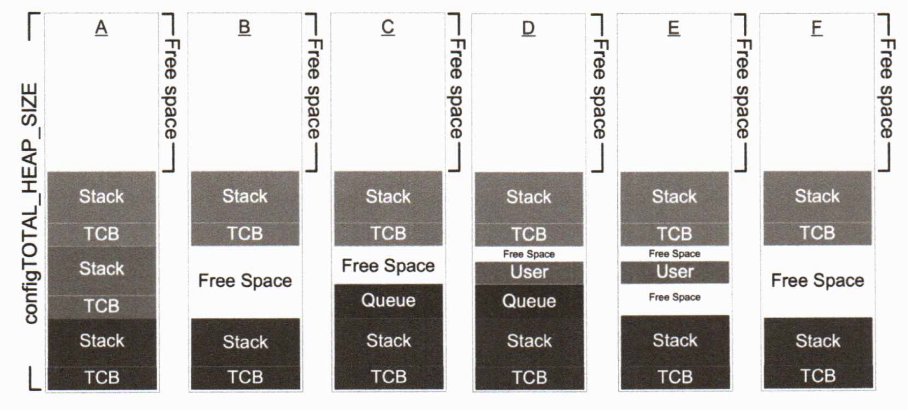
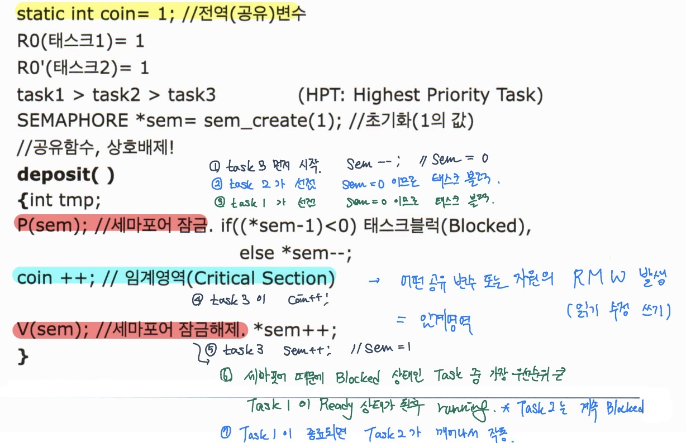
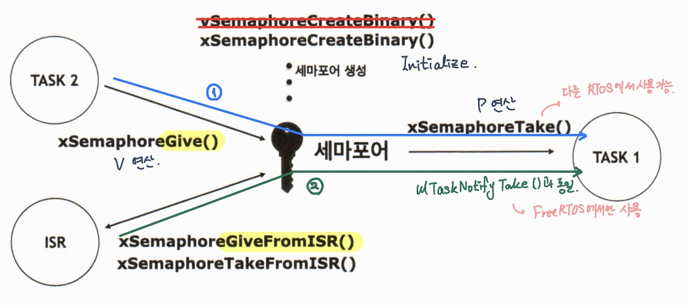

# 실시간 운영체제 구조 및 활용 day03

날짜: 2026년 2월 11일

## 문맥 전환

### TCB (Tack Control Blocks)

- 태스크 당 각 1개의 TCB(TCB_t)를 갖는다.
- 태스크가 다시 SPU 사용권을 받을 때 TCB에 저장했던 데이터를 이용해서 마지막으로 실행했던 부분부터 코드를 정확히 재개한다 → CONTEXT SWITCH
- TCB_t의 내부 구성
    - pxTopOfStack : 현재 태스크가 마지막으로 사용한 스택의 위치
    - uxPriority : 태스크 우선 순위
    - pxStack : 태스크 스택의 시작 주소
        
        → `xTaskCreateStatic()` 에서 스택의 시작 주소를 받음
        
    - pcTaskName : 태스크 제목
    - pxEndOfStack : 태스크 스택의 마지막 주소
        
        → 스택의 시작 주소와 사이즈를 통해 구할 수 있음
        
    - uxTCBNumber : TCB 구조체 일련 번호
    - uxTaskNumber : 사용자 정의형 태스크 번호
    - uxBasePriority : Mutex’s PIP(Priority Inheritance Priority)

### TCB 메모리 최적화 → 메모리가 작은 시스템에서는 중요

- TCB_t 구조체에서 어떤 필드는 조건부 컴파일로 싸여 있다 → RTOS의 Scalability 특징
    
    → 이 것을 이용하면 사용하지 않는 기능의 필드를 조건부 컴파일로 제거하여 메모리 크기 절약 가능
    

### 태스크 문맥 전환 (CONTEXT SWITCH)

- 문맥 : 모든 CPU의 레지스터를 말함
- 문맥 전환 : 선점된 태스크의 모든 레지스터 값을 스택에 저장한 뒤, 전에 저장했던 레지스터 값을 CPU로 복구하여 새로운 태스크를 실행하는 것
- `vPortYieldProcessor()` 을 이용하여 문맥 전환 수행





## IDLE 태스크

### 활용성

- IDLE 태스크가 실행된다 → ready 상태의 task가 없다
    
    → CPU가 놀고 있는 시기
    
    → CPU를 저전력 모드로 구현하는 코드를 IDLE 태스크에서 구현
    
- CPU 사용률 측정 시 IDLE 태스크 활용
    
    
    

## 인터럽트와 클럭 틱

### 인터럽트 처리



c.f ) systick은 시간으로도 사용하지만 인터럽트 처리 주기로도 사용할 수 있다.

### 클럭 틱(Clock Tick)

- 클럭 틱은 초당 10~1000회 정도
- 틱 발생 주기가 짧으면 시스템의 오버헤드도 함께 증가
- xTickCount 전역 변수가 TICK 변수로 사용

## 시스템 성능 최적화

### 인터럽트 성능 최적화

→ 여러 종류의 인터럽트가 동시에 발생하는 경우 해결해야 한다.

인터럽트가 많이 발생하지 않는 시간대에 실시간성이 중요하지 않은 인터럽트를 처리하는 방향으로 진행

c.f ) 인터럽트는 반드시 빨리 처리해야하는 것이 아니다!!! → 인터럽트는 보통 발생하면 바로 실행되는 것 뿐

- 우선순위가 낮고 무거운 인터럽트를 태스크로 만들고 우선순위를 낮게 주는 방식으로 ISR을 최대한 가볍고 짧게 작동하고록 만듦 → 세미인터럽트로 처리

### 지연된 인터럽트 (Deferred Interrupt Processing)

- 실행 시간이 많이 소요되는 인터럽트 서비스 루틴의 실행을 지연하여 실행 하는 것
- 처리 가능한 ISR의 실행 시간을 짧게 유지하는 것이 중요
- 태스크의 우선 순위가 아무리 높더라도 실행하고 있는 ISR보다 먼저 실행될 수 없기 때문
- 즉, 태스크는 인터럽트 서비스 루틴이 실행하고 있지 않을 때만 실행 가능

### 시스템 성능 최적화 기법

- 전역 변수 선언량, 이를 사용하는 태스크 수, 그 참조 횟수 모두 줄인다
- 시간 소요가 많은 인터럽트 루틴은 가급적 IPC를 활용하여 태스크에서 그 일을 수행하도록 구현한다
- 간단한 코드의 임계 영역 보호시 에는 세마포어보다는 가급적 taskENTER_CRITIAL 활용
- 자주 호출되는 함수를 인라인 어셈블리 등을 이용하여 속도 최적화
- 기능 구현 이후 프로세서의 클럭 속도를 가감하여 최적의 속도를 결정
    
    → IDLE 태스크의 CPU점유율 판단
    
- TICK 시간이 절대적으로 지켜지는지 감시 → 로직스코프 활용

### 우선 순위 배정

- 마감 시간
    - 제품이라고 예를 들면 사용자가 동작은 했을 때 이상을 느끼거나 불만이 생기는 마지노선 시간
    - 마감 시간은 반드시 존재 → 정확한 통계적 수치에 따름
    - 통계적 수치가 없는 경우 길다 짧다 정도라도 판단해야 한다.
- 각 태스크 단위의 기능으로 우선순위의 경중을 따지면 X
- 단위 일의 마감 시간(혹은 응답 시간)을 철저하게 준수하는 개념으로 접근

→ 해당 기능의 구현 단계부터 그 일의 마감 시간을 항시 염두헤 두어 진행되어야 한다.

→ 개발할 때 지향 점은 결국 모든 기능이 마감 시간 안에 Timeout 되기 전에만 처리할 수 있게 하면 된다.

앞으로 배워야 하는 것은 마감 시간을 timeout 했는지 안했는지 확인하는 능력

## 메모리 관리

### FreeRTOS의 동적 메모리

- 동적 메모리 사용의문제점
    - 메모리 할당 및 해제 시 메모리 단편화 현상 발생
    - malloc(), free() 함수의 복잡한 알고리즘에 기인한 수행 시간 예측 어려움
- FreeRTOS 메모리 관리는 동적 메모리 할당 해제 시 메모리 단편화 현상에 대한 대안
    - `heap_1.c`
    - `heap_2.c`
    - `heap_3.c`
    - `heap_4.c`
    
    → 2번, 4번을 주로 사용
    
    → 메모리 단편화 현상 없음, 고정 동일 크기의 메모리 블럭 구조
    
    → 수행 시간 일정
    
- pvPortMalloc(), vPortFree() 사용

### `heap_1.c`

- 응용프로그램이 할당한 메모리는 할당된 채로 계속 남아있음 → 한번 할당하면 해제 불가
- 이 할당 방식은 더 복잡한 메모리 관리 기법을 모두 배제한 방법 제공
- 태스크나 커널에서 할당한 메모리를 삭제하지 않고 사용해도 된다면, 이 경우 `heap_1.c` 사용
- 힙의크기는 `configTOTAL_HEAP_SIZE`에 의해 결정

### `heap_2.c`

- 할당한 메모리를 언제든지 필요할 때 해제 할 수 있음
- 요청한 메모리 사이즈에 맞는 블럭 할당
- 사용 후 해제된 빈 블럭은 다음 요청 시 재 사용 가능
- 인접 자유 블록을 하나의 큰 블록으로 결합하지 않음



### `heap_3.c`

- malloc(), free() 함수를 사용하므로 힙의 크기는 링커 구성 표준에 의해 라이브러리 정의되며, 힙 크기 설정은 영향을 주지 않음
- 일시적으로 FreeRTOS를 정지시킴으로 malloc()과 free()를 thread-safe로 만든다

### `heap_4.c`

- 메모리 요청 크기 적합 알고리즘을 사용하여 메모리 할당 → `heap_2.c`와 같은 점
- 메모리의 인접한 블록을 하나의 큰 블록으로 결합하여 메모리 조각화의 위험을 제거
    
    → `heap_2.c`와 다른점
    



## CH3. 태스크간 통신 (IPC)

## 세마포어

### 세마포어를 활용한 상호 배제



c.f ) 세마포어 연산은 +, - 만 가능 / sem은 절대 음수가 될 수 없음

### 세마포어를 활용한 IPC

생산자 프로세스

```c
do {
    ...
    아이템 생산
    ...
    아이템을 버퍼에 추가
    ...
    // 버퍼에 아이템이 있다고 알려준다.
    sem_signal(sem); // V 연산
} while (1);
```

소비자 프로세스

```c
do {
    // 버퍼에 아이템이 생길 때까지 대기
    sem_wait(sem); // P 연산
    ...
    버퍼고 부터 아이템을 가져온다
    ...
    아이템 소비
    ...
} while (1);
```

### 세마포어 개념도

- 동기화, 이벤트 전달 (IPC), 공유 자원 보호 용도 (상호 배제)로 사용

