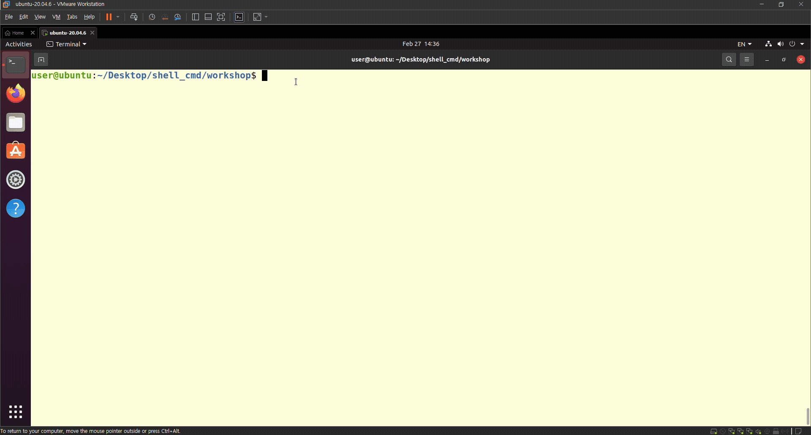
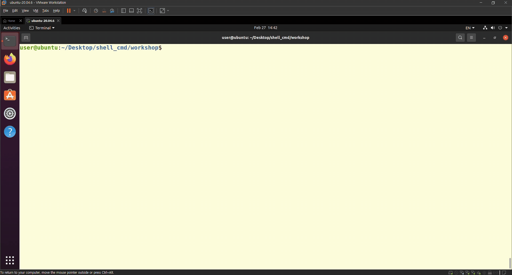
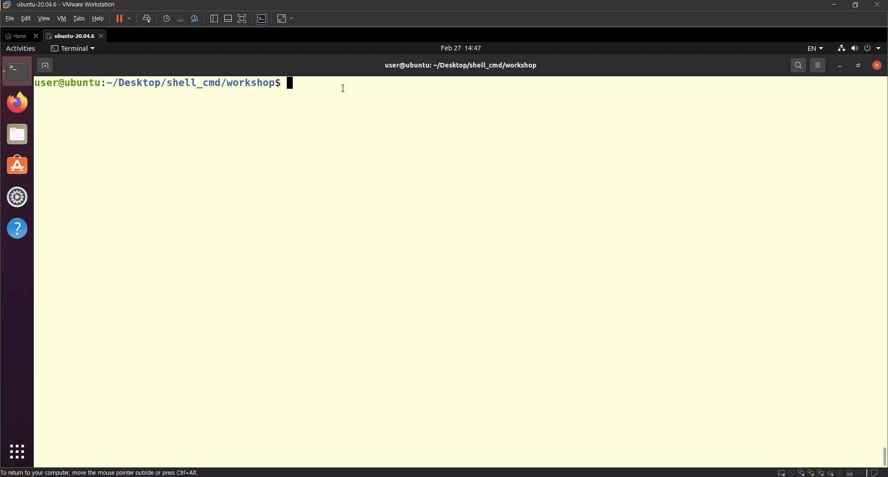

# 임베디드 리눅스 개발자를 위한 리눅스 기본 day04

날짜: 2026년 2월 26일

## 환경

- 가상 환경 : VMware Workstation
- OS : Linux
- 실습 디렉토리: `workshop/`
- 실습 파일: `ws1.sh`, `ws2.sh`, `ws3.sh`

---

## ws1.sh — 비밀번호 입력 및 출력

### 실행 방법

```bash
./ws1.sh
```

### 동작

1. 비밀번호를 작성하라는 문구 출력
2. 비밀번호 입력 시 `*`로 마스킹 표시
3. 엔터 입력 시 입력한 비밀번호를 출력하며 확인 문구 표시

### 코드

```bash
#!/bin/bash
echo "Please enter your password"
password=""
while IFS= read -r -s -n1 char;do
        if [[ $char == $'\0' || $char == $'\n' ]]; then
            break
        elif [[ $char == $'\177' ]]; then
                if [[ ${#password} -gt 0 ]]; then
                        password="${password%?}"
                        echo -ne "\b \b"
                fi
        else
                password+="$char"
                echo -n "*"
        fi
done

echo
echo "Is this password correct? $password"

```

### 핵심 개념

| 옵션/문법 | 설명 |
|---|---|
| `read -r` | 입력값을 그대로 받기위해 사용 |
| `read -s` | 입력을 화면에 표시하지 않음 (silent) |
| `read -n1` | 한 글자씩 읽음 |
| `$'\177'` | 백스페이스 키의 ASCII 코드 |
| `\b \b` | 커서 뒤로 → 공백으로 지우기 → 다시 뒤로 |
| `${#password}` | 문자열 길이 |
| `${password%?}` | 마지막 문자 제거 |

### 실행 결과



---

## ws2.sh — 파일에서 점수 추출 및 합계 계산

### 실행 방법

```bash
./ws2.sh <파일 경로>
# 예시
./ws2.sh ../text/math_grades.txt
```

### 입력 파일 형식

```
Alice 85
Bob 92
Charlie 78
```

### 동작

1. 파일을 한 줄씩 읽어 점수만 추출
2. 점수를 한 줄씩 출력
3. 마지막에 합계(total) 출력

### 코드

```bash
#!/bin/bash
  
file=$1

while read -r name score; do
        echo "$score"
        sum=$((sum + score))
done < "$file"

echo "--------------"
echo "total $sum"
```

### 핵심 개념

| 문법 | 설명 |
|---|---|
| `$1` | 첫 번째 인자 (파일 경로) |
| `read -r name score` | 한 줄을 공백 기준으로 나눠 각 변수에 저장 |
| `done < "$file"` | 파일을 입력으로 리다이렉션 |
| `$(( ))` | 정수 산술 연산 |

### 실행 결과



---

## ws3.sh — 디렉토리 파일 순회 및 삭제

### 실행 방법

```bash
./ws3.sh
```

### 동작

1. 현재 디렉토리의 모든 파일을 순회
2. 각 파일마다 삭제 여부를 묻는 문구 출력 (엔터 없이 한 글자 입력)
3. `y` 입력 시 파일 삭제
4. `n` 입력 시 skip
5. `y`, `n` 이외의 입력 시 y, n만 입력해달라 요청

### 코드

```bash
#!/bin/bash
  
for file in *; do
        read -s -n1 -p "Are you going to erase \"$file\"? (y/n)" op
        echo

        if [[ $op = "y" ]]; then
                echo "delete $file"
                rm -r "$file"

        elif [[ $op = "n" ]]; then
                echo "skip $file"

        else
                echo "Please enter only y or n"

        fi
done
```

### 핵심 개념

| 문법 | 설명 |
|---|---|
| `for file in *` | 현재 디렉토리의 모든 파일 순회 |
| `read -s` | 입력을 화면에 표시하지 않음 |
| `read -n1` | 엔터 없이 한 글자 입력 즉시 처리 |
| `rm -r` | 파일 및 폴더 재귀적으로 삭제 |

### 실행 결과



---

## 공통 개념 정리

### 실행 권한 부여

```bash
chmod +x ./ws1.sh
```

새로 만든 파일은 기본적으로 실행 권한이 없어서 `Permission denied` 오류가 발생한다.

### 변수 대입 주의사항

```bash
var="hello"   # O
var = "hello" # X — 공백 있으면 오류
```

### 조건 비교

```bash
[[ $a == "y" ]]  # 문자열 비교 — [[ ]] 사용
(( a > 0 ))      # 숫자 산술 비교 — (( )) 사용
```