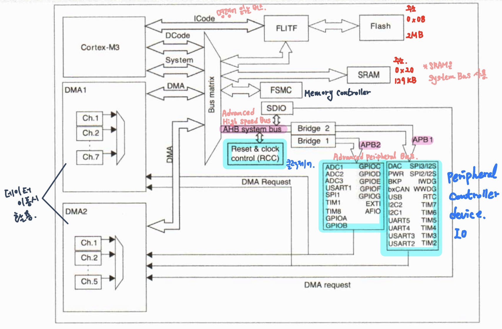
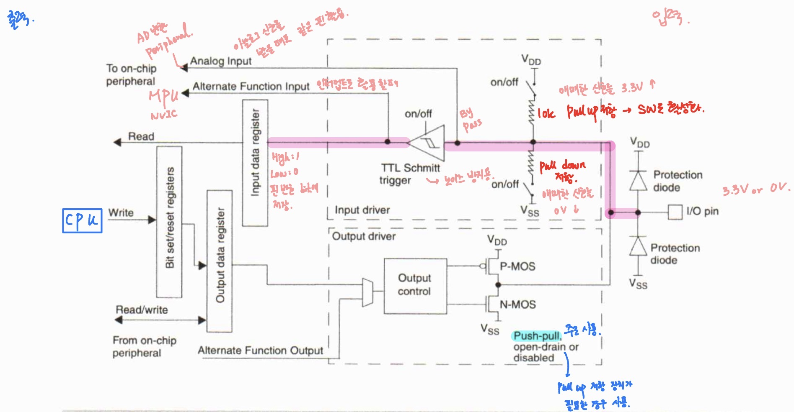
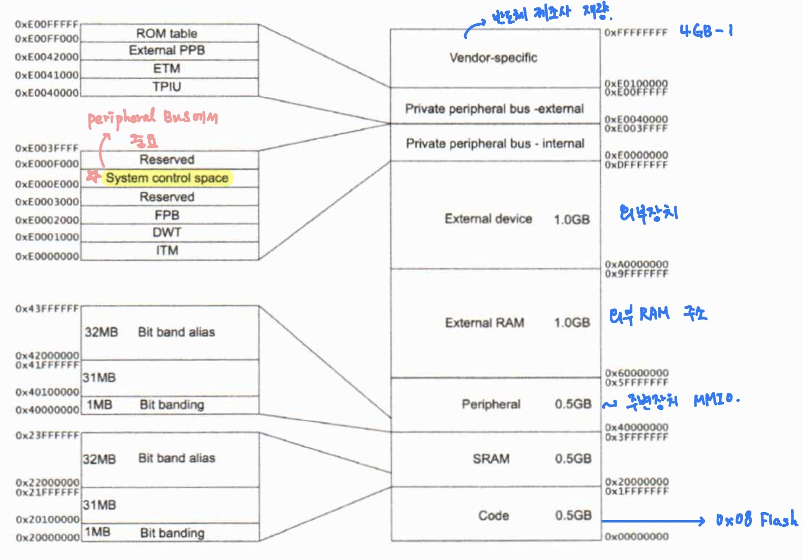
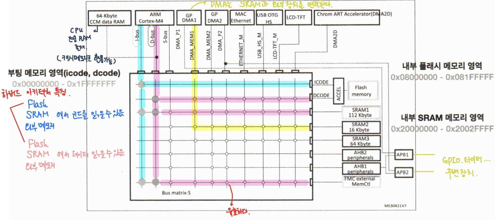
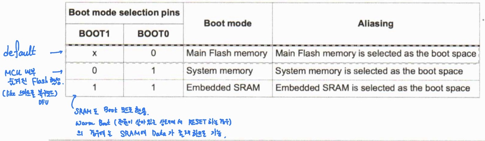
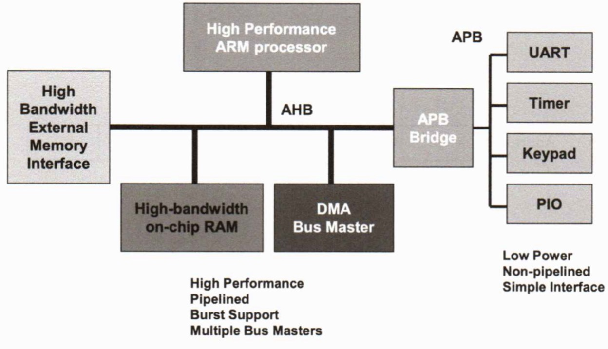
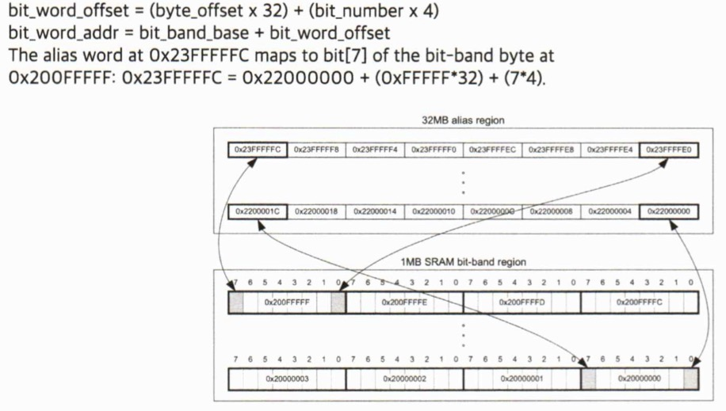

# 프로세서 구조 및 디바이스 프로그래밍 day02

날짜: 2026년 1월 29일

## CH2. GPIO

## GPIO

### GPIO의 정의 및 기능

- General Purpose I/O, 일반적인 목적의 입출력 기능 수행
- 다양한 기기와 펌웨어에서 사용, 프로그램에서 직접 가능
- 다양한 기기와 시스템 제어와 통신에 사용

### 핀의 개념 및 종류

- 전자기기와 장치에 있는 접점
- GPIO는 이 핀들을 이용하여 데이터나 전기 신호를 입력하거나 출력 가능
- 라즈페리파이에는 40개의 GPIO 핀 존재, 이 중 몇 개는 특수 목적(Alternate Function)
- 일반적으로 저항, 콘덴서, 모터 등 다양한 부품과 함께 사용

### Input / Output 모드

- 입력 모드
    - GPIO 입력 모드는 외부에서 디지털 신호를 받아 들이는 모드
    - 입력 핀을 구성할 때 신호가 1 or 0로 감지되는 장식 설정
- 출력 모드
    - GPIO에서 생성된 디지털 신호를 외부에 전달하는 모드
    - 출력 모드에서는 1 or 0을 직접 설정 가능

### STM32  GPIO

### 전반적인 구성

### GPIO block diagram

Registet는 모두 32bit

### GPIO 레지스터

- I/O포트 레지스터는 32비트 워드로만 액세스해야함
- 리셋과 리셋 직후에는 ALTERNATE 기능이 활성화 되지 않고 I/O 포트가 입력 플로팅 모드로 구성된다
- 입력 데이터 레지스터는 모든 APB2 클럭 사이클에서 I/O 핀에 있는데이터 캡쳐 → 매 클럭마다 확인

### Output configuration

- 출력 버퍼 활성화
    - 오픈 드레인 모드
    - 푸시-풀 모드
- 슈미트 트리거 입력 활성화
- 풀업 및 풀다운 저항 비활성화
- I/O 힌에 있는 데이터를 APB2 클럭 사이클마다 입력 데이터 레지스터로 샘플링
- 입력 데이터 레지스터에 대한 읽기 엑세스는 오픈 드레인 모드에서 I/O 상태 얻음
- 출력 데이터 레지스터에 대한 읽기 엑세스는 푸쉬-풀 모드에서 마지막으로 기록된 값을 가져옴

### Input configuration

- 출력 버퍼 비활성화
- 슈미트 트리거 입력 활성화
- 풀업 및 풀다운 저항 입력 구성에 따라 활성화
- I/O 인에 있는 데이터는 APB2 클럭 사이클마다 입력 데이터 레지스터로 샘플링
- 입력 데이터 레지스터에 대한 읽기 엑세스는 I/O 상태 얻음

### Alternate Function

- 기본 대체 기능을 사용하기 전에 포트 비트 구성 레지스터를 프로그래밍
- 대체 기능 입력의 경우 포트는 입력 모드로 구성되어야하며 입력 핀은 외부에서 구동
- 포트 비트가 대체 기능 출력으로 구성된 경우 출력 레지스터 연결을 끊고 핀을 온칩 주변 장치의 출력 신호에 연결
- Pin MUX → 입출력, AF 신호를 하나의 핀으로 수행

## CMSIS, HAL, LL

### CMSIS

- ARM에서 제공하는 소프트웨어 인터페이스 표준
- 이식성 높힘, 개발 및 유지 보수 과정 간소화
- 구성 요소
    - CMSIS-CORE
    - CMSIS-DSP
    - CMSIS-RTOS
    - CMSIS-DRIVER

### HAL

- Hardware Abstraction Layer 인터페이스 → STM32 시리즈 마이크로컨트롤러를 위한 라이브러리
- 많은 API 세트 제공, 애플리케이션 상위 계층과 쉽게 상호 작용
- 가장 큰 장점 → STM32 시리즈 간의 이식성

### LL

- Low Layer드라이버는 하드웨어 추상화 라이브러리
- 낮은 수준의 인터페이스 제공
- LL 드라이버는 필요에 따라 HAL 라이브러리와 같이 사용 가능
- 개발자는 성능과 코드 최적화 중요 부분에서는 LL 드라이버 사용 +  높은 하드웨어 추상화가 필요한 부분에서는 HAL 라이브러리 사용
- 복잡한 상위 수준 스택이 필요한 주변 장치에는 LL API 제공 X
- LL로 작성된 코드는 HAL 만큼 이식성은 없음

## CH3. Memory and Bus Architecture

## STM 32F4x 프로세서의 메모리

### Memory oragnization

### STM32F42x 프로세서의 구조

- I-Bus
    - 코어에서 명령어를 가져오는 버스 / (내부 플래시 메모리, SRAM)과 연결
- D-Bus
    - 데이터 버스 / (내부 플래시 메모리, SRAM)과 연결
- S-Bus
    - 주변 장치 또는 SRAM에 있는 데이터에 액세스 하는데 사용
    - 주변 장치에서 데이터 읽어오는 버스
- PPB-Bus
    - 데이터나 디버그 액세스에 사용됨

### Embadded SRAM

- STM32F429ZI 장치는 192KB
- 읽기 쓰기 작업은 대기 상태가 0인 CPU 속도로 수행된다 = 속도 빠르다

### 플래시 메모리

- CPU AHB I-코드 및 D-코드 액세스 관리
- 읽기 및 쓰기 보호 메커니즘 구현
- 명령어 프리패치 및 캐시 라인 (캐시 메모리X, like 캐시 메모리) 시스템으로 코드 실행 가속
- 구성
    - 섹터로 분할된 주 메모리 블록
    - 시스템 메모리 부팅 모드에서 장치가 부팅되는 시스템 메모리
    - 512 OTP 바이트 → 원래 플래시 메모리의 경우 Runtime에서 쓰기만 가능, but 쓰기 가능한 부분 (부가 기능)
    - 플래시 메모리 읽기 / 쓰기 보호, BOR 레벨, 워치독 리셋 등의 정보를 담고 있는 옵션 바이트
- BOOT[1:0] 핀을 통한 3가지 부팅 모드
    
    
    

## AMBA와 메모리맵

## MMIO

### MMIO란

- MMIO는 I/O 장치의 주소 공간이 메모리와 같은 주소 공간을 사용하는 특징
- 하드웨어 구조가 단순해짐
- LDR, STR 명령어를 그대로 I/O장치에도 활용할 수 있음

### SYSTEM CONTROL BLOCK

- 시스템 제어 블록은 시스템 구현 정보 및 시스템 제어를 제공
- 시스템 예외의 구성, 제어 및 상태 포함

## 비트 밴딩

### 비트 밴딩이란

- 원래 1 bit를 변경하려면 4bit를 읽고 쓰는 과정 필요 (Read-Modify-Write)
- But, 비트 밴드를 사용하면 이 과정이 필요 없이 바로 수정 가능
- 비트 밴드 영역은 비트 밴드 별칭 영역의 각 워드를 비트 밴드 영역의 단일 비트를 매핑함
- 메모리 맵에는 2개의 1MB 비트 대역 영역에 매핑되는 2개의 32MB 앨리아스 영역이 있음
- 32MB SRAM 앨리아스 영역에 대한 액세스는 1MB SRAM 비트 대역 매핑
- 비트 밴드 공식
    
    
    

### 비 원자적 액세스 방식 - GPIO_ODR의 사례

프로세스 1 - Green LED 키는 목적

프로세스 2 - Orange LED 키는 목적

둘이 동시 실행

프로세스 1번의 R0에 ODR 값 저장 → XOR 까지 진행 → 실행 직전에 프로세스 2 진행 → 전 과정 수행 후 Orange LED ON → 프로세스 1이 다시 돌아와서 Green LED ON하면서 Orange LED를 꺼버림…

결과적으로 둘 다 켜진게 아닌 Green LED만 켜짐

### 원자적 엑세스 방식 - BSRR의 사례

GPIO_ODR 문제 해결 가능

하드웨어적으로 작동하는 것이므로 쓰기만 하면 끝

동시에 접근하더라도 안전함

위 상황의 경우 결과적으로 둘 다 켜질 수 있다.