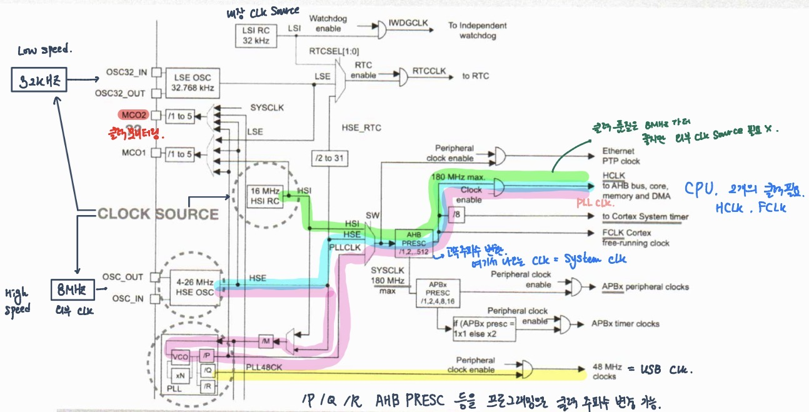
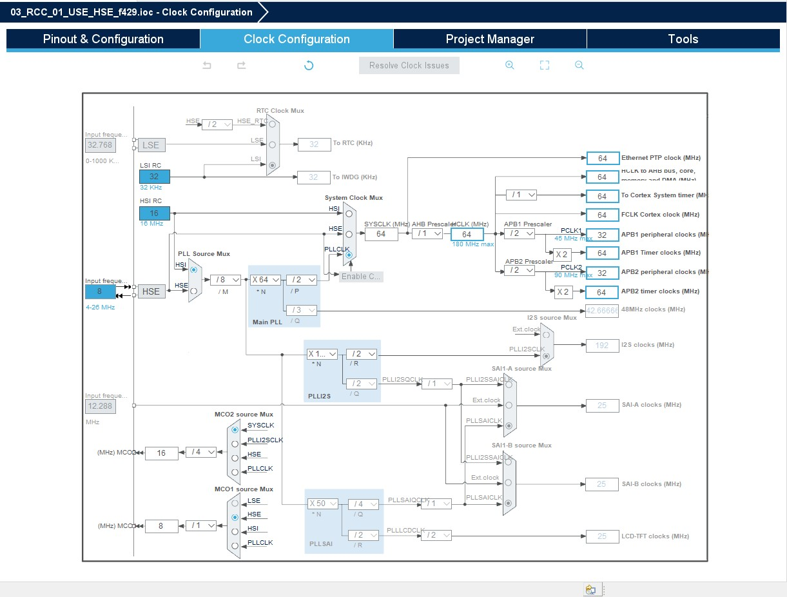
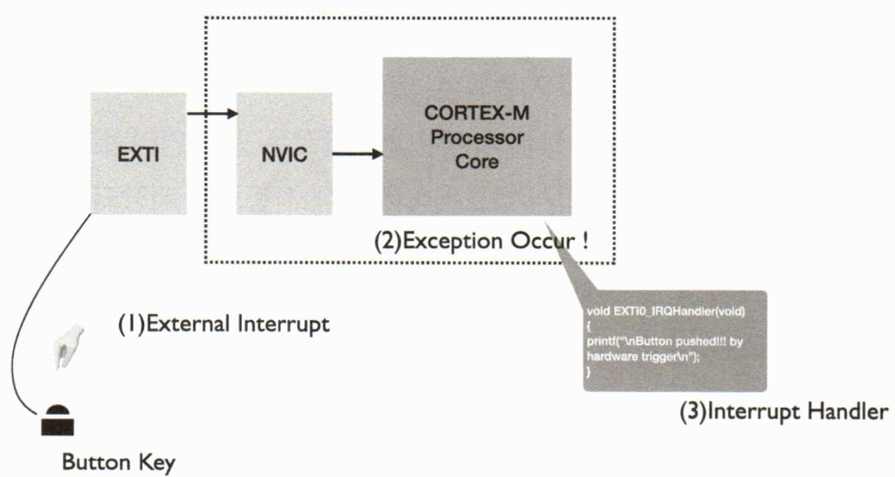
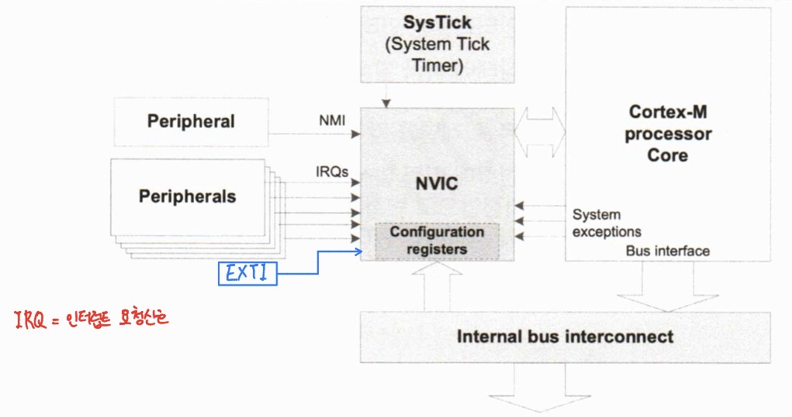
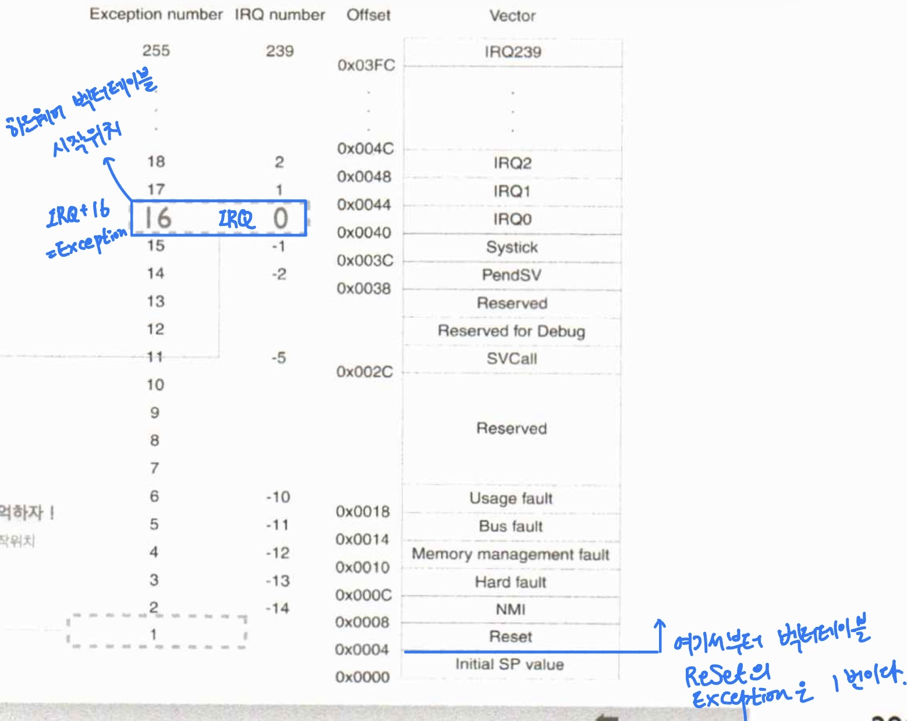
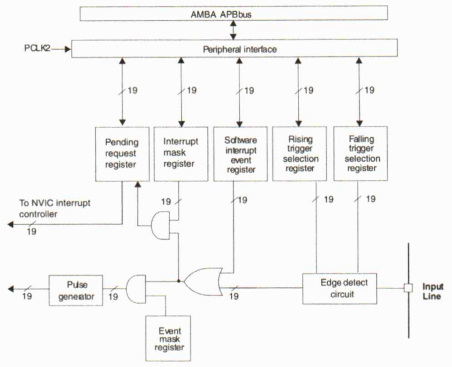
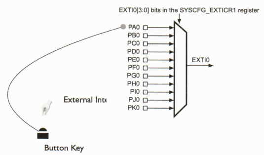
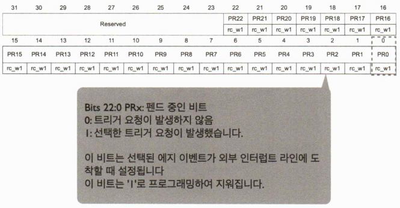
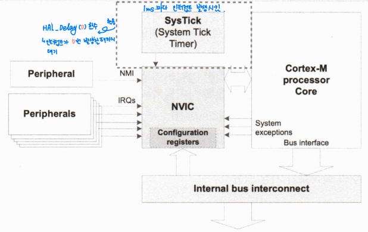

# 프로세서 구조 및 디바이스 프로그래밍 day03

날짜: 2026년 1월 30일

## CH4. RCC

## CLOCK

### 클럭이란?

- 클럭 신호는 논리 상태 H와 L이 주기적으로 나타나는 방형파 신호
- 동기 처리를 위해 필요 → 순차회로의 플리플롭에서 반드시 필요
- 디지털 회로에서는 다양한 주차수 필요
    - 가장 빠른 주파수를 수정 발진기를 사용하여 만들어 내고 분배
    - 내부의 카운터 회로에 의해 주파수 변환하여 사용

### PLL (위상 고정 루프 회로)

- 위상 고정 루프 회로는 저주파 외부 소스에서 고주파 시스템 클록을 제공하는데 활용
- STM32에서 주파수 분배기와 다양한 저전력 모드 옵션 제공

### 클럭 시스템 (제어기)

→ STM32 cube IDE 활용하면 계산할 필요 없이 CLK 변경 가능

### 클럭 소스 3가지

1. HSE (High Speed External clock signal)
    - 고속 외부 클럭 신호는 두가지 클럭 소스에서 생성할 수 있다.
        - HSE 외부 크리스탈 / 세라믹 공진기
        - HSE 외부 사용자 클럭
2. HSI (High Speed Internal clock signal)
    - HSI 클럭 신호는 내부 16MHz RC 발진기에서 생성되며 시스템 클록으로 직접 사용하거나 PLL입력으로 사용
3. PLL (Phase Locked Loop)
    - PLL 클록 소스로 HSI 또는 HSE 발진기 중 1가지를 선택하고 분할 요소 M, N, P 및 Q 구성한 후 사용

### Cortex processor clocks

- 프로세서에는 3개의 기능적 클럭 입력
- FCLK 및 HCLK는 서로 동기화 됨
- FCLK는 HCLK의 자유 실행 버전 이므로 절전모드를 제외하고 항상 동일한 주파수여야 함

## RESET

### Resets

- PORESETn
    - SWJ-DP를 제외한 전체 프로세서 시스템 리셋
- SYSRESETn
    - 디버그 논리를 제외하고 전체 프로세서 시스템 리셋
- nTRST
    - SWJ-DP reset

## 소프트웨어 리셋

### SCB:AIRCR (0xE000ED0C)

## CH5. NVIC와 EXTI

## 인터럽트 일반

### 인터럽트

- 인터럽트는 현재 처리 중인 작업을 중단하고 즉시 또 다른, 더 중요한 작업에 CPU를 전환하는 방법을 제공
- 인터럽트는 MCU 내부에서 또는 외부 주변 장치에 의해 트리거 될 수 있다.
- 인터럽트 컨트롤러는 온칩 주변 장치와 오프 칩 주변 장치 모두에서 인터럽트 이벤트를 수집
- 시간이 지정된 이벤트 또는 상태 변경을 모니터링하는 또 다른 방법은 ‘폴링’ 이라 한다.
- 폴링을 사용하면 타이머의 상태 또는 상태 변경이 주기적으로 확인
    - 단점
        - 실제 변경과 감지 사이 과도한 대기시간 지연 위험
        - 변경 사항을 모두 놓칠 가능성
        - 필요한 처리 시간 및 전력 증가
- `interrupt function` 제공됨.
- HW적으로 ex. 버튼 → EXTI → NVIC → CPU 단자 이렇게 연결되어 있기 때문에 바로 신호 들어감
- 인터럽트가 발생하면 인터럽트 신호가 생성되어 CPU가 현재 작업을 중지하고 현재 상태를 저장하며 인터럽트 관련된 ISR(인터럽트 서비스 루틴) 또는 인터럽트 핸들러라는 처리 프로그램 시작 (비동기)
- 인터럽트 처리 완료 시 CPU는 이전 상태를 복원하고 중단된 지점 다시 시작

### 인터럽트와 우선순위

- 인터럽트 우선 순위는 우선 순위 레벨을 기반으로 한다
- CPU가 현재 인터럽트 서비스 루틴을 처리하고 있고 더 높은 우선 순위의 인터럽ㅌ느가 게시되면 더 놓은 우선 순위의 인터럽트가 서비스 된다.
- 새로운 인터럽트의 우선 순위가 현재 인터럽트의 우선 순위보다 낮거나 같으면 현재 인터럽트 핸들어의 실행이 계속된다.
- 새로운 인터럽트는 우선 순위가 가장 높아질 때까지 처리 지연
- 동일한 레벨 내의 인터럽트는 인터럽트 핸들러에 의해 SW에서 우선 순위가 지정되어야 한다.

### 인터럽트 초기화

1. 전체적으로 인터럽트 활성화
2. 사용할 각 인터럽트의 우선 순위를 설정, 우선 순위가 필요하지 않은 경우 이 단계 pass → 모든 인터럽트 우선 순위 0으로 설정
3. 사용하려는 인터럽트 활성화

### 인터럽트 마스크 레지스터

- 인터럽트 마스크 레지스터는 인터럽트에 해당하는 비트가 설정된 경우 특정 인터럽트를 마스킹 할 수 있음.
- 각 인터럽트 소스에 대해 하나의 제어 비트가 있다. 인터럽트가 마스킹되면 인터럽트 컨트롤러는 CPU에 대한 인터럽트 요청을 생성하지 않지만, 인터럽트 펜딩 레지스터에서 해당 상태를 계속 볼 수 있다.

### 인터럽트 상태 레지스터

- 레지스터의 비트가 설정되면 해당 인터럽트가 코어에 게시되었음을 나타낸다.
- 레지스터의 각 인터럽트 상태 비트는 해당 인터럽트 소스의 인터럽트 요청을 반영한다
- 에지 트리거 인터럽트로 프로그래밍 된 경우 레지스터의 해당 상태 비트에 1을 기록하여 지울 수 있따,
- 레벨 트리거 인터럽트로 프로그래밍 된 경우 이러한 인터럽트는 요청 소스에서 지워진다.

### 인터럽트 펜딩 레지스터

- 인터럽트 펜딩 레지스터는 펜딩 중인 인터럽트를 나타낸다
- 인터럽트 소스가 인터럽트를 요청하지만, 해당 인터럽트가 인터럽트 마스크 레지스터에 의해 마스크되면 해당 인터럽트 비트는 이 레지스터에 설정되지 않는다.
- 펜딩 중인 인터럽트가 마스크 되지 않은 경우 인터럽트 비트는 두 레지스터 모두 설정된다.

## 버튼키 인터럽트

## NVIC

### Nasted Vectored Interrupt Controller

- NVIC는 프로세스의 일부이므로 호환성 좋음
- 최대 256개의 서로 다른 우선 순위 수준으로 최대 240개의 외부 인터럽트 지원
    - 하드웨어 240 + 시스템 인터럽트 16 = 256개
- 레벨 및 펄스 인터럽트 모두 지원 (But, 결과적으로 펄스(엣지) 인터럽트만 지원)
- **프로세서 상태는 인터럽트 진입 시 하드웨어에 의해 자동으로 저장되고 인터럽트 종료 시 복원**
- NVIC는 또한 인터럽트의 테일 체인 지원
- CORTEX-M 백터 테이블은 이전 ARM 코어와 다름
    - CORTEX-M 백터 테이블은 거의 고정이므로 자유도 낮음

### 레벨과 펄스 인터럽트

- 레벨 트리거 인터럽트
    - 입력 신호의 상태에 따라 발생
    - 신호가 특정 레벨에 도달하면 인터럽트 발생
    - 만약 버튼을 누른다면 꾹 누르고 있으면 계속 인터럽트 발생
- 펄스 트리거 인터럽트
    - 신호의 에지 변환에 따라 발생
    - 상승 에지, 하강 에지에 반응 하여 인터럽트 발생
    - 에지 변화 감지하여 한번만 인터럽트 발생

### NVIC 펄스 인터럽트

- 펄스 트리거 방식의 인터럽트를 처리하는데 최적화 되어 있다,
- NVIC는 각각의 인터럽트 요청에 대한 펄스 신호를 받아서 처리하며, 이를 대기중인 인터럽트 상태로 저장한다. 인터럽트 핸들러가 호출되면 대기 중인 **인터럽트 상태가 자동으로 지워진다**.

### NVIC 개념도

### NVIC 레지스터 → 특권 모드에서만 작동

- NVIC에는 코어에서 실행되는 SW가 액세스할 수 있는 메모리 매핑 레지스터가 있다
- 레지스터는 32비트 폭, 각 비트는 하나의 인터럽트를 활성화 / 비활성화 하는 데 사용
- NVIC_ISER 밒 NVIC_ICER 레지스터는 인터럽트 활성화 / 비활성화하는 데 사용 (MASK)
- NVIC_ISPR 및 NVIC_ICPR 레지스터는 들어오는 인터럽트 처리 (핸들 레지스터)

## 예외처리 핸들러

### 예외처리 핸들러 진입

1. 현재 명령어 종료
2. 컨텍스트(32비트, 워드 8개)를 현재 스택 (MSP 또는 PSP)에 푸시
    
    xPSR, 리턴 주소, LR, R12, RT3, R2, R1, R0
    
3. 핸들러 / 특권 모드로 전환, MSP
4. 예외 핸들러 주소로 PC 로드
5. EXC_RETURN 코드로 LR 로드
6. 예외 번호로 IPSR 로드
7. 예외 핸들러 코드 실행 시작

→ 예외 요청에서 핸들러(인터럽트 레이턴시)의 첫 번째 명령 실행까지 12 사이클 소요

### 예외처리 핸들러 종료

1. 예외 반환 처리를 트리거하는 명령어 실행
2. 반환 스택 선택, 해당 스택에 컨텍스트 복원
3. 복원된 주소에서 코드 실행 재개

## 스택 프레임과 익셉션 리턴

### 스택 프레임

- 프로세서에서 익셉션이 발생하면 익셉션이 테일 체인 또는 지연 도착하는 익셉션이 아니면 프로세서는 현재 스택에 정보를 푸시한다.
    
    → 스태킹, 이때 사용하는 데이터 워드 8개 주소 = 스택 프레임
    
- 부동 소수점 루틴을 사용할 때 프로세서는 익셉션 발생시 부동 소수점 관련 레지스터들을 자동으로 스태킹한다.
- 스태킹 직후 스택 포인터는 스택 프레임에서 가장 낮은 주소를 나타낸다.
- 스택 프레임의 정렬은 구성 제어 레지스터 (CCR)의 STKALIGN 비트 통해 제어

### 익셉션 리턴

- 스택 프레임에는 리턴 주소 포함
    
    인터럽트된 프로그램에서 다음 명령어의 주소
    
    이 값은 익셉션 리턴시 PC로 복원되어 중단된 프로그램 다시 시작
    
- 스택 박업과 병행하여 프로세서는 벡터 테이블에서 예외 처리기 시작 주소를 읽는 벡터 가져오기 수행
    
    스태킹 완료되면 프로세서가 예외 처리기 실행 시작
    
    동시에 프로세서는 EXC_RETURN 값을 LR에 넣기
    
    → 스택 포인터와 엔트리가 발생하기 전에 프로세서가 어떤 작동 모드에 있었는지를 나타냄
    
- 프로세서가 익셉션 처리기 모드에 있고 다음 명형 중 하나를 실행하여 EXC_RETURN 값을 PC에 로드 할 때 익셉션 리턴 발생
    - PC를 로드하는 LDM 또는 POP 명령어
    - PC를 타켓으로 하는 LDR 명령어
    - 레지스터를 사용하는 BX 명령어
- EXC_RETURN은 예외 입력시 LR에 로드된 값
    
    익셉션 메커니즘은 프로세서가 익셉션 처리기를 완료한 시기를 감지하기 위해 이 값에 의존
    
    가장 낮은 5 비트는 리턴 스택 및 프로세서 모드에 대한 정보를 제공한다
    
- 모든 EXC_RETURN 값은 비트 [ 31 : 5 ]가 1로 설정된다.
    
    이 값이 PC에 로드되면 프로세서에 예외가 완료되었음을 알리고 프로세서는 적절한 익셉션 리턴 시퀀스를 시작
    

## 메모리 재배치

### STM32의 메모리 재배치(REMAP)

- 부트 핀이 선택되면 애플리케이션 소프트웨어는 코드 영역에서 액세스할 수 있는 메모리를 수정할 수 있음 → 이 방법으로 코드는 시스템 버스 대신 ICode 버스를 통해 실행될 수 있음
- 이 수정은 SYSCFG 컨트롤러에서 SYSCFG 메모리 재맵핑 레지스터 (SYSCFG_MEMRMP)를 프로그래밍하여 수행
- 다시 매핑 가능한 메모리
    - 메인 플래시 메모리
    - 시스템 메모리

### c.f ) 임베디드 시스템에서 0번지의 의미

전원 리셋, 시스템 리셋, 워치도그타이머 리셋, 소프트웨어 리셋

→ 대부분 MPU는 리셋 시 PC = 0

플래시 메모리 실제 주소는 0x08 → how 부팅이 되는가?

0번지도 플래시 메모리를 작동 시키고 0x08로 가도 플래시 메모리 작동한다

그렇기 때문에 부팅이 된다. → 0은 플래시 메모리의 엘리아스 주소

### SYSCFG_MEMRMP

## VTOR와 벡터 재배치

### 벡터 테이블 재배치의 필요성

- 벡터 테이블의 위치가 FLASH의 경우 수정이 불가능
- 벡터 테이블의 위치를 RAM으로 재배치할 수 있다면 필요할 때 벡터를 재 등록(수정)하는 것이 가능하다
- VTOR 레지스터를 수정하여 벡터 테이블의 위치를 변경하는 것이 가능

## 예외처리 벡터 테이블

### 예외처리 벡터 테이블

- 벡터 테이블에는 대부분 다른 ARM 코어와 달리 명령어가 아닌 예외 처리기 및 ISR의 주소가 포함되어 있음
- 초기 스택 포인터와 리셋 핸들러의 주소는 각 0x0과 0x4에 위치해야 한다
- 다음 이 값은 리셋 시 적절한 CPU 레지스터에 로드된다.

### CORTEX 인터럽트 구성

- 처음 16개 예외는 시스템 예외 → 변경 불가, 시스템이 모든 것 처리
- 240개의 인터럽트는 사용자 인터럽트이다.

### 예외처리 벡터 테이블 (암기 하자)

## EXTI

### EXTernal Interrupt controller

- 외부 인터럽트 컨트롤러는 연결 라인 장치에 있는 최대 20개의 에지 감지기 또는 요청을 생성하기 위한 다른 장치에 있는 19개의 에지 감지기로 구성
- 각 입력 라인은 타입 및 해당 트리거 이벤트를 선택하도록 독립적으로 구성 가능
- 각 라인은 독립적으로 마스킹 가능
- PEND 레지스터는 인터럽트 요청 상태를 유지한다.

### EXTI 블록 다이어그램

### EXTI0

### 인터럽트 시퀀스

- 인터럽트를 생성하려면 인터럽트 라인을 구성하고 활성화해야함
- 원하는 에지 감지로 두 개의 트리거 레지스터 (EXTI_RTSR, EXTI_FTSR)를 프로그래밍
- 인터럽트 마스크 레지스터 (EXTI_IMR)의 해당 비트에 1을 기록하여 인터럽트 요청 활성화
- 선택된 에지가 외부 인터럽트 라인에서 발생하면 인터럽트 요청 생성
- 인터럽트 라인에 해당하는 PEND 비트도 생성
- 이 요청은 PEND 레지스터 (EXTI_PR)에 1을 작성하여 리셋
- 인터럽트 요청은 소프트웨어 인터럽트 레지스터 (EXTI_SWIER)에 1을 써서 소프트웨어에 의해 생성될 수 있다 → HW에 오류가 있는지 SW에 오류가 있는지 확인할 때 사용

## 인터럽트 상태 클리어

### Pending register (EXTI_PR)

### 레벨 인터럽트 vs. 펄스 인터럽트

- 레벨 인터럽트
    - 장치에 엑세스하는 ISR에 의해 지워질 때까지 어설션된 상태 유지
    - 인터럽트 루틴에서 복귀하기 전에 신호가 선언 해제되지 않으면 인터럽트 계속됨
    - ISR이 활성화 되면 펜딩 비트가 지워진다
- 펄스 인터럽트
    - 에지 인터럽트와 동일한 표현
    - 에지는 비동기 대신 프로세서 클럭 FCLK의 상승 에지에서 샘플링
- STM32 EXTI의 경우 펄스 인터럽트만 지원

### 인터럽트 지연

- 인터럽트 진입을 위한 인터럽트 대기 시간은 프로세서에 도달하는 인터럽트 신호와
인터럽트 핸들러의 첫 번째 명령을 실행하는 프로세서 사이의 프로세서 클록 사이클 수
    - Cortex-M의 인터럽트 대기 시간은 12 사이클(FPU 미포함), 17 사이클(FPU 포함)
- 인터럽트 종료 대기 시간은 인터럽트 리턴 명령어의 실행과 인터럽트된 실행 컨텍스트에서 다음 명령어의 실행 사이의 프로세서 클록 사이클 수
    - 대기 시간은 10 사이클(FPU 미포함), 17 사이클(FPU 포함)
- 인터럽트가 동시에 발생한 경우, 인터럽트 지연 시간이 가장 해결해야하는 숙제임
- 인터럽트 함수의 최적화 중요

## SYSTICK

### SYSTICK 개념도

## 우선순위

### 인터럽트 선점의 두 가지 형태

1. 실행 중인 프로그램은 인터럽트에 의해 실행 중단
2. 익셉션 처리를 실행하는 중에 또 다른 익셉션이 발생할 수 있는데, 이때 새로운 익셉션의 우선 순위가 현재 처리 중인 익셉션의 우선 순위보다 높으면 새 익셉션 처리를 선점한다

### 인터럽트 우선순위 그룹

- 인터럽트가 있는 시스템에서 우선 순위 제어를 높이기 위해 NVIC는 우선 순위 그룹화 지원
    
    → 인터럽트 우선 순위 레지스터 항목을 두 개의 필드로 나눔
    
    1. 그룹 우선 순위를 정의하는 상위 필드
    2. 그룹 내 하위 우선 순위를 정하는 하위 필드

### 선점 우선 순위와 서브 우선 순위

- 현재 실행되고 있는 인터럽트 핸들러를 선점하는 경우
    - 새로 발생한 인터럽트의 선점 우선 순위가 더 높으면 현재 핸들러 중단 → 새 인터럽트 먼저 처리
- 현재 실행되고 있는 인터럽트 핸들러를 선점하지 않는 경우
    - 새 인터럽트의 선점 순위가 같거나 낮은 경우 선점 불가 → 현재 핸들러가 끝날 때까지 대기
- 대기 중인 2개 인터럽트의 선점 우선 순위가 다른 경우
    - 선점 우선 순위가 더 높은 인터럽트 먼저 처리
- 대기 중인 2개 인터럽트의 선점 우선 순위가 동일하고 서브 우선 순위는 다른 경우
    - 서브 우선 순위가 더 높은 인터럽트 먼저 처리
- 대기 중인 2개의 인터럽트의 선점 우선 순위, 서브 우선 순위 모두 동일한 경우
    - IRQ 번호가 더 낮은 인터럽트가 먼저 처리

### 익셉션과 우선순위

- 여러 PENDING 중인 익셉션의 우선 순위가 동일한 경우 익셉션 번호가 가장 낮은 것을 우선한다
- 프로세서가 익셉션 처리기를 실행할 때 우선 순위가 더 높은 익셉션이 발생 → 익셉션 처리기가 선점된다.
- 처리 중인 익셉션과 동일한 우선 순위로 익셉션 발생 → 익셉션 번호에 관계 없이 선점 X & 새 인터럽트의 상태는 PENDING으로 변경
- 소프트웨어가 우선 순위를 구성하지 않으면 컨피규레이션 가능한 우선 순위를 가진 모든 익셉션의 우선순위는 0이 된다.
- 리셋 (-3), NMI (-2), 하드 폴트 익셉션 (-1)은 항상 다른 익셉션보다 우선 순위 높음
- 익셉션 우선 순위 구성
    - 시스템 핸들러 우선 순위 레지스터 (SHPRx)
    - 인터럽트 우선 순위 레지스터 (NVIC_IPRx)