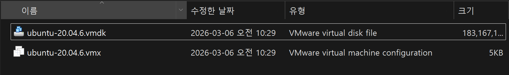
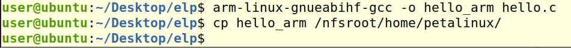
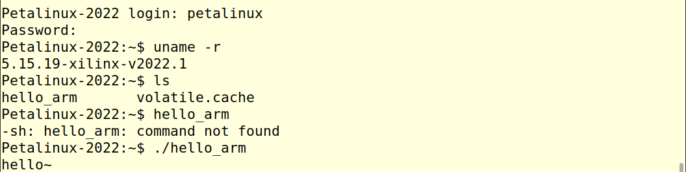
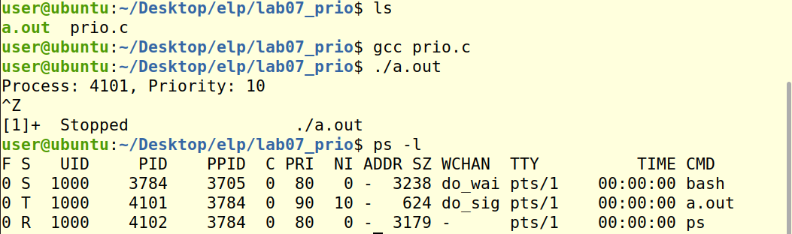
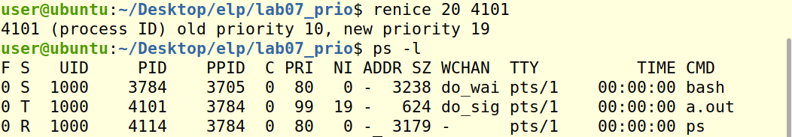
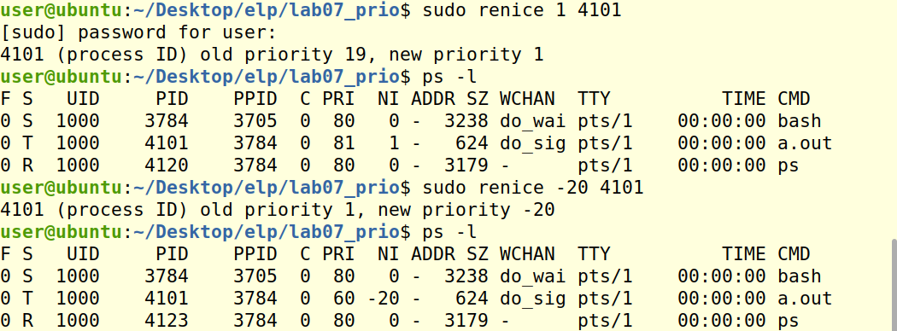

# 임베디드 리눅스 시스템 프로그래밍 day02

날짜: 2026년 3월 6일

### 가상 리눅스 종료 명령어

`sudo init 0`

### 리눅스 백업

가상 머신 종료후 → Library → ubuntu 우클릭 → open VM directory



이 두 파일 외장 SSD에 백업 해 놓을 것

### ZYNQ 설정

ZYNQ IP : 10.0.0.3

VMware Ubuntu IP : 10.0.0.2

edit → Virtual Network Editor → change setting → VMnet0 Bridged → Intel Ethernet… 선택

터미널 → ifconfig

Ethernet ens33 → setting → ens33 톱니 → IPv4 10.0.0.2로 수정 → 네트워크 off 다시 on

터미널 → m(alias로 설정함, 원래 : 'minicom -D/dev/ttyUSB1 -w’) → 시리얼 터미널 실행

시리얼 터미널 종료 → ctrl + b → x → Enter

~~ID petalinux~~

~~PW 1~~

임베디드 리눅스 커널 버전 : 5.15.19-xilinx-v2022.1

### ZYNQ 테스트





# GCC

## GCC 기초

### GCC란

GNU Compiler Collection

오픈소스 컴파일러 모음

리눅스 시스템에서 표준 컴파일러

임베디드 시스템부터 대규모 서버 어플리케이션까지 다양한 분야에서 사용

### 주요 특징

- 다양한 언어 지원
- 멀티 플랫폼 지원
- 오픈소스 및 무료
- 표준 준수 및 확장 기능

### 역할

1. 전처리 : 헤더파일 포함 및 매크로 치환
2. 컴파일 : 소스코드를 어셈블리어로 변환
3. 어셈블리 : 어셈블리 코드를 오브젝트 파일로 변환
4. 링크 : 오브젝트 파일과 라이브러리 결합하여 실행파일 생성

### 프로그램 컴파일 및 실행

```bash
$ gcc hello.c -o hello
$ ./hello
```

## forGCC 컴파일 옵션

일반 컴파일 옵션

| 옵션 | 설명 | 예시 |
| --- | --- | --- |
| `-o` | 출력 파일의 이름 지정 | `gcc main.c -o app` |
| `-c` | 컴파일만 수행하여 오브젝트 파일 생성 (링크 제외) | `gcc -c main.c` |
| `-S` | 어셈블리 코드 생성 (소스 → 어셈블리) | `gcc -S main.c` |
| `-E` | 전처리만 수행하여 결과를 stdout으로 출력 | `gcc -E main.c` |
| `-I` | 헤더파일 포함 경로 지정 | `gcc -I./include main.c` |
| `-L` | 라이브러리 경로 지정 | `gcc main.c -L./lib -lmylib` |

# fork

- `fork()`는 **현재 프로세스를 복제하여 자식 프로세스를 생성하는 시스템 호출**이다.
- 부모의 PID가 3316이라면
    
    → **자식의 PPID는 3316**, **자식의 PID는 새로운 PID(예: 3317)** 를 가진다.
    
- 부모와 자식은 **독립적인 가상 주소 공간을 가지며**, 부모의 메모리 내용을 **복사(copy)** 받아 시작한다.
- 부모 프로세스는 `wait()` 또는 `waitpid()`를 통해 **자식 프로세스의 종료 상태(exit status)** 를 알 수 있다.
- 부모가 자식보다 먼저 종료되면
    
    → 자식 프로세스의 **PPID는 `init`(PID 1) 또는 systemd로 변경**된다.
    
    → 이를 **고아 프로세스(orphan process)** 라고 한다.
    
- 자식 프로세스가 종료되었지만 부모가 `wait()`를 호출하지 않으면
    
    → 자식 프로세스는 **좀비 프로세스(zombie process)** 가 된다.
    
- `fork()` 후 `exec()` 계열 함수를 호출하면
    
    → **자식 프로세스를 완전히 다른 프로그램으로 실행할 수 있다.**
    

## c.f )

리눅스에서 사용하는 시스템 함수는 크게 두 가지 존재

1. 시스템 호출 함수 - 커널이 도와줘야 하는 함수 (HW를 제어하는 함수)
 ex) printf, LED를 껐다 켰다 하는 함수, malloc
2. 아닌 함수 - ex) string copy

# PRI (우선순위)



PRI는 우선 순위를 뜻한다

숫자가 작을 수록 우선 순위가 높은 것이다.

NI는 NICE 값 == defult 우선순위보다 얼마나 늦은지

`renice <변경할 나이스 값> <PID>`



NICE 값이 19로 변경됨 → 우선순위가 가장 낮은 PRI는 99이므로 더 이상 커질 수 없기 때문



NICE 값을 현재보다 낮추기 위해서는 sudo 권한 존재

일반 프로세스가 가질 수 있는 가장 높은 우선순위는 PRI 60이다

이것보다 우선 순위가 높은 프로세스는 실시간 프로세스 → NICE 적용 대상이 아님