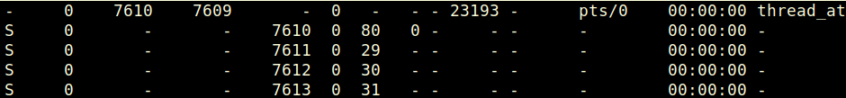

# 임베디드 리눅스 시스템 프로그래밍 day03

날짜: 2026년 3월 9일

# 가상 메모리

## 페이지 할당 관리

### 페이지 할당 개념 이해

- 페이지 : 프로세스가 보는 가상 메모리의 단위 보통 4KB
- 페이지 프레임 : 실제 물리 메모리의 단위

운영체제는 페이지 테이블을 통해 가상 페이지와 페이지 프레임을 연결한다

### 페이지 폴트 이해하기

페이지 폴트 : CPU가 접근하려는 페이지가 물리 메모리에 없을 때 발생

→ 리눅스 커널은 페이지 폴트를 처리하여 페이지를 물리 메모리에 로드

c.f ) 페이지 테이블을 먼저 만들어 놓지 않기 떄문에 발생하는 문제이므로 부정적인 표현과는 다르게 부정적 상황은 아니다.

주요 원인

- 프로세스가 처음 접근하는 메모리 영역인 경우 (디맨드 페이징)
- 페이지가 스왑(메모리가 부족할 때 디스크 영역을 사용) 영역에 있을 때
- 접근권한이 없는 페이지 접근 시 (예 : 보호된 메모리에 접근 시 (이건 부정적인 상황)

페이지 폴트 처리 과정

1. CPU가 MMU를 통해 주소 변환 시 페이지 테이블에 페이지가 없음을 확인한다.
2. CPU는 Page Fault 예외(exception)를 발생시킨다.
3. CPU는 커널 내 Page Fault 핸들러를 호출한다.
4. 커널은 페이지 폴트 원인을 조사한다.
    - 유효한 페이지 요청이면 페이지를 메모리에 로드
    - 잘못된 접근이라면 Segmentation Fault(SIGSEGV)를 프로세스에 전달
5. 페이지가 정상적으로 메모리에 로드되면 페이지 테이블을 업데이트하고 재시도

### 페이지 할당 방식 : Demand Paging

리눅스는 디맨드 페이징 방식 사용

- 필요할 때만 페이지를 메모리에 로딩하는 방식
- 프로그램 실행 시 메모리를 더 효율적으로 사용할 수 있음

대표적으로 프로그램 실행 시 텍스트 영역과데이터 영역은 처음부터 모두 로딩되지 않고,
처음 접근 시에만 로딩

## 페이지 폴트와 COW (Copy-On-Write)

### 페이지 폴트가 발생하는 이유

→ fork() 시스템 콜에서 COW 발생

1. `fork()` 호출
    - 부모와 자식 프로세스는 **같은 물리 메모리 페이지를 공유**함
    - 대신 페이지를 **읽기 전용(read-only)** 으로 변경
    - 아직 실제 복사는 안 함 → **COW (Copy-On-Write)**
2. 부모나 자식이 그 페이지에 **쓰기(write)** 를 시도
    - 페이지가 **읽기 전용이라서 CPU가 페이지 폴트 발생**
    1. OS가 페이지 폴트 처리
- “아, 이건 COW 상황이구나” 확인
    - 새 물리 페이지를 만들어 기존 내용을 복사
    - 쓰려는 프로세스만 **자기 복사본 페이지 사용**

# Sched_param

c.f ) 우선 순위

-40 ~ 59 → 실시간 프로세스

60 ~ 99 → 일반 프로세스 

```c
/*****************************************
 * Filename: sched_param.c
 * Title: Scheduling
 * Desc: Set and get scheduling parameters
 *
 * int sched_setparam(pid_t pid, const struct sched_param *p);
 * int sched_getparam(pid)t pid, struct sched_param *p);
 * 
 * ****************************************/ 
#include <stdio.h>
#include <sys/types.h>
#include <sched.h> // sched_getparam()
#include <stdlib.h>
#include <unistd.h>

//
// Root privileges are required to reduce the priority level.
// PS command prio[0~58]:RT, prio[60~99]:other
int main(void)
{
    struct sched_param param;
    int policy;
    char *policy_name;

    pid_t current_pid = getpid();

    sched_getparam(current_pid, &param);
 param.sched_priority = 1; // 1~59(HIGHEST)
    sched_setscheduler(current_pid, SCHED_RR, &param);
    sched_setparam(current_pid, &param);
    sched_getparam(current_pid, &param);
    policy = sched_getscheduler(current_pid);

    if (policy == 0) 		policy_name = "SCHED_OTHER";
    else if (policy == 1) 	policy_name = "SCHED_FIFO";
    else if (policy == 2) 	policy_name = "SCHED_RR";
    else 			 		policy_name = "Unknown";
    printf("Current PID: %d\n", (int)current_pid);
    printf("Scheduling Policy: %d, %s\n", policy, policy_name);
    printf("RT Sched Priority: %d\n", param.sched_priority);

    while(1) sleep(1);

    return 0;
}
```

### 실시간 프로세스 (RT)의 특징

1. 스스로 양보(yield)하지 않는 한 CPU 를 무한정 소유
2. 현대 리눅스에서는 시스템을 독점할 수 있는 이런 부분들을 보완 (CFS)
    
    CFS (completely fair scheduling) :  특정 사용자, 특정 프로그램이 시스템을 독점하지 못하도록 스케줄링 관리 
    

### 임베디드 리눅스에서 PRI

`ps` 명령어를 통해서 우선순위를 확인할 수 없다.

# ZYNQ 와 ubuntu linux 사이 파일 이동

부팅을 위한 SD카드 제작

- 1번 파티션을 부트 파티션
    - BOOT.BIN = FSBL (First Stage Boot Loader) + u-boot (부트 로더) + FPGA Bit Stream
        
        → 부트 로더는 리눅스 부팅하기 위해 CPU, 내부 클럭, DRAM controller, Network, GPIO 등 필수 하드웨어 초기화를 진행함
        
- 2번 파티션은 linux 파티션 → 리눅스 커널을 넣어 놓으면 LAN 케이블 없이도 부팅 가능

linux 부팅하는 방법

1. SD 카드 부팅
    
    1번 파티션(부트 파티션) + 2번 파티션(리눅스 파티션) → 2번 파티션에 리눅스 커널을 넣어 놓으면 부팅 가능
    
2. NET 사용 부팅
    
    우분트 내부 디렉토리에 존재하는 uImage(리눅스 커널)에 접근하여 부팅
    
    uImage 는 /nfsroot 디렉토리를 네트워크 파티션으로 사용
    
    /nfsroot 디렉토리는 ZYNQ의 시리얼 터미널에서 root  디렉토리로 확인됨
    
    따라서, 우분트에서 제작한 코드를 따로 SD카드로 옮기지 않아도 파일을 공유하여 작동 가능 
    

# Thread

```c
/***************************************
 * Filename: thread_test.c
 * Title: Creating/terminating threads(1)
 * Desc: 쓰레드 생성 제거 예제
 * Revision History
 * 
 ***************************************/
#include <stdio.h>
#include <unistd.h>
#include <pthread.h>

int thread_args[3] = { 0, 1, 2 };  /* 쓰레드가 사용할 인자 */
//-------------------------------------------------------------
/* 쓰레드로 수행할 함수 */
void* Thread( void *arg )
{
    int i;
    for ( i=0; i<3; i++ ){
        printf( "thread %d: %dth iteration\n", *(int*)arg, i );
    sleep(1);
    }
pthread_exit(0);  /* 쓰레드 종료 함수 */
}
//-------------------------------------------------------------
int main( void )
{
    int i, clock_get;
    pthread_t threads[3]; /* 쓰레드 아이디를 위한 변수 */
    
    for ( i=0; i<3; i++ )  /* 쓰레드 생성 */
        // TODO: 스레드 생성하기
        pthread_create( &threads[i],                /* 쓰레드ID */
                        NULL,                       /* 쓰레드 속성 */
                        ( void* (*)(void*) )Thread, /* 쓰레드 시작 함수 */
                        &thread_args[i] );          /* 생성된 쓰레드에 전달 인자 */
        (void) pthread_join(threads[0], NULL);
        (void) pthread_join(threads[1], NULL);
        (void) pthread_join(threads[2], NULL);
  
pthread_exit(0); /*메인 쓰레드 종료 */
}

/****************************************
 Run:
*****************************************
thread 0: 0th iteration
thread 0: 1th iteration
thread 0: 2th iteration
thread 1: 0th iteration
thread 1: 1th iteration
thread 1: 2th iteration
thread 2: 0th iteration
thread 2: 1th iteration
thread 2: 2th iteration

****************************************/

```

 

### Multi Thread

1LWP == 1 Thread

1. 하나의 가상 공간을 공유
→ Thread를 몇 개를 만들어도 하나의 가상 공간을 사용하기 때문에 별도의 공간 할당 필요 X
2. 리눅스에서는 LWP 단위로 실행 시간 할당
3. 하나의 Thread에 종료 시그널이 전달되면 모든 Thread가 종료됨
→ 하나의 가상 공간을 공유하고 있기 때문에 안전을 위해 
4. 하나의 Thread가 비정상적 종료가 되어도 마찬가지로 모든 Thread 종료됨
5. 하나의 Thread는 독립적으로 휴면은 가능

### Thread Attribute

```c
/***************************************
 * Filename: thread_attr.c
 * Title: Thread Attributes(1)
 * Desc: 쓰레드 속성 예제
 * Revision History & Comments
 ***************************************/
#include <stdio.h>
#include <pthread.h>
#include <sched.h>
#include <unistd.h>
#include <sys/types.h>

int thread_args[3] = { 0, 1, 2 };
pthread_t threads[3];
int buffer[3];
int seq=0;

//
// ps command for thread check
// $ ps -elLf | grep a.out
// $ (./a.out &) && ps -elLf | grep a.out > ~/Desktop/elp/lab10_thread_attr/log
//
//------------------------------------------------------------------------------
void* Thread( void *arg )
{
    int i;
    int ret;
    int no = *(int*)arg;

    // struct sched_param is used to store the scheduling priority
    struct sched_param  param;

     // Now verify the change in thread priority
     int policy = 0;
     ret = pthread_getschedparam(threads[no], &policy, &param);
     if (ret != 0) {
         printf("Couldn't retrieve real-time scheduling paramers\n");
         return;
     }

     // We'll set the priority to the maximum.
     //param.sched_priority = sched_get_priority_max(SCHED_RR);
     //param.sched_priority = 30;
     param.sched_priority = 30 - no;
     //param.sched_priority = 30 + no;
     printf("MAX PRIO(SCHED_RR) : %d\n", param.sched_priority);
     
     // Attempt to set thread real-time priority to the SCHED_RR policy
     ret = pthread_setschedparam(threads[no], SCHED_RR, &param);
     if (ret != 0) {
         // Print the error
         printf("Unsuccessful in setting thread realtime prio[ERR %d]\n", ret);
         return;     
     }

     ret = pthread_getschedparam(threads[no], &policy, &param);
     if (ret != 0) {
         printf("Couldn't retrieve real-time scheduling paramers\n");
         return;
     }
 
     // Check the correct policy was applied
     if(policy != SCHED_RR) {
         printf("Scheduling is NOT SCHED_RR!\n");
     } else {
         printf("SCHED_RR OK\n");
     }

    for ( i=0; i<10000000; i++ ){
       // if ((i%1000)==0)
       //     printf( "%d",  *(int*)arg);
       //     fflush(stdout);
        ;
    }
    printf("쓰레드를 종료합니다[ID:%d]\n", no);
    fflush(stdout);

    //buffer[seq]=no;
    //seq++;
    
    pthread_exit(0);  
}

//------------------------------------------------------------------------------
int main( void ) {
    int i;
    int ret;
    
    /*쓰레드 속성지정을 위한 변수 */
    pthread_attr_t  thread_attrs;
    // struct sched_param is used to store the scheduling priority
    struct sched_param  param;

    for ( i=0; i<3; i++ ) {
        /* 쓰레드 속성 초기화 */
        pthread_attr_init( &thread_attrs );
        pthread_attr_getschedparam( &thread_attrs, &param );
        /* 생성할 쓰레드의 우선순위 설정 */
        param.sched_priority = 0;
        /* 스케줄링 정책 속성 설정 */
        pthread_attr_setschedpolicy( &thread_attrs, SCHED_RR );
        // RR의 반댓말은 FIFO
        pthread_attr_setschedparam( &thread_attrs, &param );

        /* 쓰레드 생성 */
        pthread_create( &threads[i], 
                        &thread_attrs, 
                        ( void* (*)(void*) )Thread, 
                        &thread_args[i] );

    }
         (void) pthread_join(threads[0], NULL);
         (void) pthread_join(threads[1], NULL);
         (void) pthread_join(threads[2], NULL);
    
    printf("%d, %d, %d\n", buffer[0], buffer[1], buffer[2]);
    pthread_exit(0); /*메인 쓰레드 종료 */
}
```

- 종료되지 않게 만들고 Thread 별 우선 순위 확인
    
    
    
    → 우선 순위가 코드에 의해 변경됨
    
- 우선 순위를 가지고 있더라도 실행되게 되면 Thread의 실행 순서는 예측하기 어려움
- 프로세서의 문맥 전환 → 문맥 == 레지스터 + 페이지 테이블
- Thread의 문맥 전환 → 문맥 == 레지스터 → 이 부분이 장점이 된다.
- Thread의 단점도 존재 : 실행 순서를 예측할 수 없기 때문에 디버깅 할 때 어려움 존재

### Semaphore

```c
/***************************************
 * Filename: posix_sem_test.c
 * Title: Semaphore
 * Desc: POSIX Semaphore simple test
 ***************************************/
#include <stdio.h>
#include <semaphore.h>
#include <pthread.h>

sem_t sem;  /*TODO: semaphore variable - sem */
pthread_t task1, task2;
pthread_attr_t attr;
struct sched_param param;
//----------------------------------------
void get_thread( void ) {
    int i = 0;
    int val;
  
    while(1) {
        i++;
        sem_wait( &sem ); /* TODO: obtains semaphore, reduce it by 1 */
        sem_getvalue( &sem, &val ); /* obtains the semaphore value */
        printf( "WAIT!\tsem count = %d\n" ,val );
        if ( i > 5 ) break;
    }
}
//----------------------------------------
void put_thread(void) {
    int i = 0;
    int val;

    while(1) {
        i++;
        sem_post( &sem ); /* TODO: semaphore post */
        sleep(1);
        sem_getvalue( &sem, &val ); /* obtains the semaphore value */
        printf( "POST!\tsem count = %d\n", val );
        if ( i > 5 ) break;
    }
}
//----------------------------------------
int main( void ) {
    int i = 0, j, val;

    sem_init( &sem, 0, 3 ); /* TODO: initialize unnamed semaphore */
    sem_getvalue(&sem, &val);
    printf( "INIT!\tsem count = %d\n", val );

    pthread_attr_init(&attr);
    param.sched_priority = 20;
    pthread_attr_setschedparam(&attr, &param);
    pthread_attr_setschedpolicy( &attr, SCHED_FIFO );

    pthread_create( &task1, &attr, (void*(*)(void*))get_thread, NULL );
    pthread_create( &task2, &attr, (void*(*)(void*))put_thread, NULL );
 
        (void) pthread_join(task1, NULL);
        (void) pthread_join(task2, NULL);
    
    pthread_exit(0);
}
```

### mutex

```c
/***************************************
 * Filename: mutex_test.c
 * Title: Mutex
 * Desc: 뮤텍스를 이용한 예제 
 ***************************************/
#include <stdio.h>
#include <semaphore.h>
#include <pthread.h>
#include <sys/types.h>

/* TODO: 뮤텍스 변수 선언 mutex, 선언과 동시에 초기화 */
pthread_mutex_t mutex = PTHREAD_MUTEX_INITIALIZER; // 정적 초기화

int val=0;
int arg1 = 0, arg2 = 1;
//-------------------------------------------
void *Thread( void* arg ) 
{
    int i, j;
    
    for( i = 0; ; i++ ) {

    /* TODO: mutex 잠그기 */
    pthread_mutex_lock( &mutex );

    val = *(int*)arg;
    printf( "thread %d: %dth iteration: val=%d\n", *(int*)arg, i, val);

    /* TODO: mutex 풀기 */
    pthread_mutex_unlock( &mutex );

        //for ( j=0; j<1000000; j++ );
        sleep(1);
    }
}
//-------------------------------------------
int main( void ) {
    pthread_t  thread1, thread2;
    pthread_attr_t attr;
    
    struct sched_param param;
    int policy;
    
    pthread_getschedparam( pthread_self(), &policy, &param );
    param.sched_priority = 1;
    policy = SCHED_RR;
    if ( pthread_setschedparam( pthread_self(), policy, &param ) != 0 ) {
        printf("main\n");
        while(1);
    }
    pthread_attr_init( &attr );
    pthread_attr_setschedpolicy( &attr, SCHED_RR );
    
    pthread_create( &thread1, &attr, (void*(*)(void*))Thread, &arg1 );
    pthread_create( &thread2, &attr, (void*(*)(void*))Thread, &arg2 );
    
    (void) pthread_join(thread1, NULL);
    (void) pthread_join(thread2, NULL);

    pthread_exit(0);
    return 0;

}
/****************************************
 Run:
*****************************************
thread 0: 0th iteration: i = 0                                                  
thread 1: 0th iteration: i = 1                                                  
thread 0: 1th iteration: i = 0                                                  
thread 1: 1th iteration: i = 1                                                  
thread 0: 2th iteration: i = 0                                                  
thread 1: 2th iteration: i = 1                                                  
thread 0: 3th iteration: i = 0                                                  
thread 1: 3th iteration: i = 1                                                  
thread 0: 4th iteration: i = 0                                                  
thread 1: 4th iteration: i = 1                                                  
thread 0: 5th iteration: i = 0                                                  
thread 1: 5th iteration: i = 1                                                  
thread 0: 6th iteration: i = 0                                                  
thread 1: 6th iteration: i = 1                                                  
thread 0: 7th iteration: i = 0       
...
*****************************************/

```

상호배제 목적 활용

리눅스 뮤텍스 특징

1. ownership
    
    어떤 Thread가 mutex를   lock 하면 해당 Thread에서만 lock을 풀 수 있음
    
    다른 Thread에서는 lock을 풀 수 없음
    
2. 우선순위 상속 / 천정
    
    문제 상황
    
    - **Low priority task (L)** : mutex를 잡고 있음
    - **High priority task (H)** : mutex가 필요해서 기다림
    - **Medium priority task (M)** : mutex와 상관없지만 CPU 사용
    
    상황 흐름
    
    1. L이 mutex를 잡음
    2. H가 mutex를 요청 → **block**
    3. 그 사이 M이 실행됨
    4. L은 CPU를 못 받아 mutex를 못 풀음
    5. H는 계속 기다림
    
    우선 순위 상속
    
    1. L이 mutex 보유
    2. H가 mutex 요청 → block
    3. OS가 L의 priority를 **H 수준으로 올림**
    4. L이 빨리 실행됨
    5. mutex release
    6. L의 priority 원래대로 복구
    
    결과
    
    - M이 끼어들지 못함
    - H가 빨리 mutex 획득
    
    우선 순위 천정
    
    ```
    mutex A → ceiling priority = 90
    ```
    
    어떤 task가 이 mutex를 lock 하면
    
    → **task priority가 자동으로 ceiling priority로 올라갑니다**
    
    즉
    
    ```
    task priority = max(task priority, ceiling priority)
    ```
    
    효과
    
    - 다른 task가 끼어들지 못함
    - deadlock 방지 가능
    - priority inversion 방지

### mutex_signal

```c
/***************************************
 * Filename: mutex_signal.c
 * Title: Mutex
 * Desc: 잠금 대기에 관한 예제 
 ***************************************/
#include <stdio.h>
#include <pthread.h>

pthread_t  thread;

/* 뮤텍스 초기화 */
pthread_mutex_t  mutex = PTHREAD_MUTEX_INITIALIZER;
/* TODO: 조건 변수의 초기화 */
pthread_cond_t  cond = PTHREAD_COND_INITIALIZER;

/* 전역 변수 */
int count = 0;
//------------------------------------------------
void* Thread ( void* arg ) {
    
    pthread_mutex_lock ( &mutex ); 
    
    /* TODO: count가 5가 될 때까지 기다림, 블록될 경우에는 뮤텍스를 푼다 */
    while ( count < 5 ) {
        printf( "count = %d: wait...\n", count );
        pthread_cond_wait ( &cond, &mutex );
    }
    
/*
생성되자마자 뮤텍스를 lock하고 휴면에 들어가면서 뮤텍스 lock을 풀어줌
*/

    printf( "count = %d: condition true.\n", count );
    
    pthread_mutex_unlock ( &mutex );
}
//------------------------------------------------
void main ( void ) {
    int i;
    pthread_create( &thread, NULL, (void*(*)(void*))Thread, NULL );
    
    for ( i = 0; i < 10; i++ ) {
        sleep(1);
        pthread_mutex_lock( &mutex );
                // 휴면하면서 lock을 풀어줘서 작동할 수 있음
                
        count++;
        /* TODO: 쓰레드에 시그널 보내기 */
        pthread_cond_signal( &cond );
        printf( "condition signal %d\n", i );

        pthread_mutex_unlock( &mutex );
    }
    (void) pthread_join(thread, NULL);
    pthread_exit(0);
}
/****************************************
 Run:
*****************************************
count = 0: wait...
condition signal 0
count = 1: wait...
condition signal 1
count = 2: wait...
condition signal 2
count = 3: wait...
condition signal 3
count = 4: wait...
condition signal 4
count = 5: condition true.
condition signal 5
condition signal 6
condition signal 7
condition signal 8
condition signal 9
*****************************************/
```

# IPC

## unnamed Pipe(친족 프로세스 간에서만 사용)

```c
#include <stdio.h>
#include <stdlib.h>
#include <string.h>
#include <errno.h>
#include <unistd.h>

#define BUFSIZE 15

//--------------------------------------
// Create a pipe, write to it, and read from it.
int main( int argc, char **argv )
{
    static const char mesg[] = "Don't Panic!";
    char buf[BUFSIZE];
    ssize_t rcount, wcount;
    int pipefd[2]; /*pipe에서 사용할 파일기술자*/
    size_t len; /* TODO: pipe 를생성한다. (에러 처리할 것) */

    if ( pipe(pipefd) < 0 ) 
    {
        fprintf(stderr, "%s: pipe failed : %s\n", argv[0], strerror(errno));
        exit(1);
    }
    printf( "Read end = fd %d, write end = fd %d\n",pipefd[0], pipefd[1]);/* write에사용할message의길이*/
    len = strlen(mesg);
    wcount = write( pipefd[1], mesg, len);
    rcount = read( pipefd[0], buf, BUFSIZE);

    /* 읽은 데이터를 보통의 문자열로 만들기 위해*/
    buf[rcount] = '\0';

    printf( "Read <%s> from pipe \n", buf );

    close( pipefd[0] );
    close( pipefd[1] );

    return 0;
}

/*
Read end = fd 3, write end = fd 4
Read <Don't Panic!> from pipe 
*/
```

두 개의 프로세서 사이에서 Pipe를 제작하여 데이터를 주고 받을 수 있음  

위 코드의 경우 하나의 프로세스에서 스스로 쓰고 읽기를 진행

`fork()` 를 활용하여 부모가 파이프에 적고, 자식이 파이프를 읽는 코드 변형

```c
#include <stdio.h>
#include <stdlib.h>
#include <string.h>
#include <errno.h>
#include <unistd.h>

#define BUFSIZE 15

//--------------------------------------
// Create a pipe, write to it, and read from it.
int main( int argc, char **argv )
{
    static const char mesg[] = "Don't Panic!";
    char buf[BUFSIZE];
    ssize_t rcount, wcount;
    int pipefd[2]; /*pipe에서 사용할 파일기술자*/
    size_t len; /* TODO: pipe 를생성한다. (에러 처리할 것) */
    pid_t pid;

    if ( pipe(pipefd) < 0 ) 
    {
        fprintf(stderr, "%s: pipe failed : %s\n", argv[0], strerror(errno));
        exit(1);
    }
    pid=fork();

    if (pid < 0)
    {
        fprintf(stderr, "%s: pipe failed : %s\n", argv[0], strerror(errno));
        exit(1);
    }

    if (pid == 0) {
        close(pipefd[1]);

        rcount = read( pipefd[0], buf, BUFSIZE);	

        buf[rcount] = '\0';

        printf( "Child read <%s> from Pipe\n", buf);

        close(pipefd[0]);
    }

    else {
        close(pipefd[0]);

        printf( "Read end = fd %d, write end = fd %d\n",pipefd[0], pipefd[1]);/* write에사용할message의길이*/
        len = strlen(mesg);
        wcount = write( pipefd[1], mesg, len);
        printf( "Parent write <%s> to Pipe\n", mesg);

        close(pipefd[1]);	
    }

    return 0;
}

/*
Read end = fd 3, write end = fd 4
Parent write <Don't Panic!> to Pipe
Child read <Don't Panic!> from Pipe
*/
```

## named Pipe (모든 프로세스 간에 통신 가능)

receiver

```c
#include <stdio.h>
#include <stdlib.h>
#include <string.h>
#include <fcntl.h>
#include <unistd.h>

#define FIFO_FILE "/tmp/fifo"
#define BUFF_SIZE 1024

int main( void)
{
    int counter = 0;
    int fd;
    char buff[BUFF_SIZE];

    if ( -1 == mkfifo( FIFO_FILE, 0666))
    {
        perror( "mkfifo() 실행에러");exit( 1);
    }

    if ( -1 == ( fd = open( FIFO_FILE, O_RDWR))) 
    {
        perror( "open() 실행에러");
        exit( 1);
    }
    while( 1 )
    {
        memset( buff, 0, BUFF_SIZE);
        read( fd, buff, BUFF_SIZE);
        printf( "%d: %s\n", counter++, buff);
    }
    close( fd);
}
```

sneder

```c
#include <stdio.h>
#include <stdlib.h>
#include <string.h>
#include <fcntl.h>
#include <unistd.h>

#define FIFO_FILE "/tmp/fifo"

int main(void)
{
    int fd;
    char *str = "forum.falinux.com";
    if ( -1 == ( fd = open( FIFO_FILE, O_WRONLY)))
    {
        perror( "open() 실행에러");
        exit( 1);
    }
    write( fd, str, strlen(str));
    close( fd);
}
```

결과

```c
//sender
/*
$ ./fifo_sender
****$ ./fifo_sender
****$ ./fifo_sender
****$ ./fifo_sender
$ ./fifo_sender
*/

//receiver
/*
$ ./fifo_receiver 
0: forum.falinux.com
1: forum.falinux.com
2: forum.falinux.com
3: forum.falinux.com
4: forum.falinux.com

*/
```