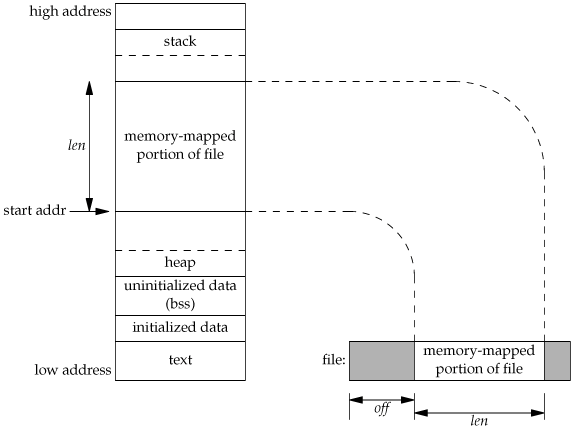

# 임베디드 리눅스 시스템 프로그래밍 day04

날짜: 2026년 3월 10일

# IPC

## POSIX Message Queue

client

```c
#include <stdlib.h>
#include <fcntl.h>
#include <mqueue.h>
#include <stdio.h>

// 컴파일 요령
// gcc mq_client.c -lrt

/*
struct mq_attr {
    long mq_flags; // 플래그 (mq_open ()에 대해 무시 됨)
    long mq_maxmsg; // MAX. 대기열 메시지 수
    long mq_msgsize; // MAX. 메시지 크기 (바이트)
    long mq_curmsgs; // 현재 대기중인 메시지 수
                     (mq_open ()에서 무시 됨)
};
*/
// ls /proc/sys/fs/mqueue
// cat /etc/security/limits.conf 
int main(int argc, char **argv)
{
    struct mq_attr attr;
    attr.mq_maxmsg = 10;
    attr.mq_msgsize = 4;
    int value = 0;

    mqd_t mfd;

    mfd = mq_open("/my_mq", O_WRONLY, 0666, &attr);
    if(mfd == -1)
    {
        perror("open error");
        exit(0);
    }

    while(1)
    {
        if((mq_send(mfd, (char *)&value, attr.mq_msgsize, 1)) == -1)
        {
            perror("send error");
            exit(-1);
        }
        sleep(1);
        value ++;
    }
}

```

Server

```c
#include <stdlib.h>
#include <fcntl.h>
#include <mqueue.h>
#include <stdio.h>

// 컴파일 요령
// gcc mq_server.c -lrt

/*
struct mq_attr {
    long mq_flags; // 플래그 (mq_open ()에 대해 무시 됨)
    long mq_maxmsg; // MAX. 대기열 메시지 수
    long mq_msgsize; // MAX. 메시지 크기 (바이트)
    long mq_curmsgs; // 현재 대기중인 메시지 수
                     (mq_open ()에서 무시 됨)
};
*/
// ls /proc/sys/fs/mqueue
// cat /etc/security/limits.conf 
int main(int argc, char **argv)
{
    struct mq_attr attr;
    attr.mq_maxmsg = 10;
    attr.mq_msgsize = 4;
    int value;

    mqd_t mfd;
        // 메세지 큐도 파일 open과 비슷한 형식
    mfd = mq_open("/my_mq", O_RDWR | O_CREAT,  0666, &attr);
    if (mfd == -1) // 리눅스에서 오류가 발생하면 -1을 반환하기 때문에 이렇게 작성해도 상관 X
    {
            perror("open error");
            exit(0);
    }

    while(1)
    {
            if((mq_receive(mfd, (char *)&value, attr.mq_msgsize,NULL)) == -1)
            {
                    exit(-1);
            }
            printf("Read Data %d\n", value);
    }
}
```

```bash
$ ls /proc/sys/fs/mqueue
msg_default  msg_max  msgsize_default  msgsize_max  queues_max

$ cat /etc/security/limits.conf
# /etc/security/limits.conf
#
#Each line describes a limit for a user in the form:
#
#<domain>        <type>  <item>  <value>
#
#Where:
#<domain> can be:
#        - a user name
#        - a group name, with @group syntax
#        - the wildcard *, for default entry
#        - the wildcard %, can be also used with %group syntax,
#                 for maxlogin limit
#        - NOTE: group and wildcard limits are not applied to root.
#          To apply a limit to the root user, <domain> must be
#          the literal username root.
#
#<type> can have the two values:
#        - "soft" for enforcing the soft limits
#        - "hard" for enforcing hard limits
#
#<item> can be one of the following:
#        - core - limits the core file size (KB)
#        - data - max data size (KB)
#        - fsize - maximum filesize (KB)
#        - memlock - max locked-in-memory address space (KB)
#        - nofile - max number of open file descriptors
#        - rss - max resident set size (KB)
#        - stack - max stack size (KB)
#        - cpu - max CPU time (MIN)
#        - nproc - max number of processes
#        - as - address space limit (KB)
#        - maxlogins - max number of logins for this user
#        - maxsyslogins - max number of logins on the system
#        - priority - the priority to run user process with
#        - locks - max number of file locks the user can hold
#        - sigpending - max number of pending signals
#        - msgqueue - max memory used by POSIX message queues (bytes)
#        - nice - max nice priority allowed to raise to values: [-20, 19]
#        - rtprio - max realtime priority
#        - chroot - change root to directory (Debian-specific)
#
#<domain>      <type>  <item>         <value>
#

#*               soft    core            0
#root            hard    core            100000
#*               hard    rss             10000
#@student        hard    nproc           20
#@faculty        soft    nproc           20
#@faculty        hard    nproc           50
#ftp             hard    nproc           0
#ftp             -       chroot          /ftp
#@student        -       maxlogins       4

# End of file

$ cat /proc/sys/fs/mqueue/msg_max
10
```

## sysV message queue

receive

```c
#include <stdio.h>
#include <stdlib.h>
#include <string.h>
#include <unistd.h>
#include <sys/types.h> 
#include <sys/ipc.h> 
#include <sys/msg.h> 
#include <sys/stat.h> 

struct msgbuf  
{
    long msgtype;
    char mtext[256];
    char myname[16];
    int  seq;
};

int main(int argc, char **argv)
{
    key_t key_id;
    struct msgbuf mybuf;
    int msgtype;

    if (argc != 2)
    {
    printf(" Usage: msgsnd 번호(3 혹은 4)\n");
    exit(-1);
    }
    msgtype = atoi(argv[1]);

    key_id = msgget(1234, IPC_CREAT|0666);
    if (key_id < 0)
    {
        perror("msgget error : ");
        exit(0);
    }
    while(1)
    {
        if (msgrcv( key_id, /* msgq 식별자 */
        (void *)&mybuf, /* 데이터 구조체 */
        sizeof(struct msgbuf), /* 구조체의 크기 */
        msgtype, /* 가져올 메시지 타입 */
        0) == -1) /* 세부 조정 옵션 */
        {
            perror("msgrcv error : ");
            exit(0);    
        }
/* msgtyp == 0 메시지 큐의 첫번째 데이타를 돌려준다. 
   msgtyp > 0 메시지의 mtype 가 msgtyp 와 같은 첫번째 데이타를 돌려준다. 
   msgtyp < 0 메시지의 mtype 이 msgtyp 의 절대값보다 작거나 같은 첫번째 데이타를 돌려준다. 
*/
        printf("%d\n", mybuf.seq);
    }
    exit(0);
}
```

send

```c
#include <stdio.h>
#include <stdlib.h>
#include <string.h>
#include <unistd.h>
#include <sys/types.h>
#include <sys/ipc.h> 
#include <sys/msg.h> 
#include <sys/stat.h> 

struct msgbuf
{
    long msgtype;
    char mtext[256];
    char myname[16];
    int  seq;
};

int main()
{
    key_t key_id;
    int i;
    struct msgbuf mybuf, rcvbuf;

    key_id = msgget((key_t)1234, IPC_CREAT|0666);
    if (key_id == -1)
    {
        perror("msgget error : ");
        exit(0);
    }

    printf("Key is %d\n", key_id);

    memset(mybuf.mtext, 0x00, 256); 
    memset(mybuf.myname, 0x00, 16); 
    memcpy(mybuf.mtext, "hello world 4", 13);
    memcpy(mybuf.myname, "yundream", 8);
    mybuf.seq = 0;
    i = 0;

    while(1)
    {
        // 짝수일경우 메시지 타입이 4
        // 홀수일경우에는 메시지 타입이 3
        if (i % 2 == 0)
            mybuf.msgtype = 4;
        else 
            mybuf.msgtype = 3;
        mybuf.seq = i;

        // 메시지를 전송한다. 
        if (msgsnd( key_id, (void *)&mybuf, sizeof(struct msgbuf), IPC_NOWAIT) == -1)
        {
            perror("msgsnd error : ");
            exit(0);
        } 
        printf("send %d\n", i);
        i++;
        sleep(1);
    }

    printf("%ld \n", rcvbuf.msgtype);
    printf("%s \n", rcvbuf.mtext);
    printf("%s \n", rcvbuf.myname);
    exit(0);
}

```

## mmap



파일을 가상 메모리 공간에 올려 주게 됨

offset point를 고민할 필요 없이 작성할 수 있음 + 속도 빠름

```c
#include <stdio.h>
#include <errno.h>
#include <stdlib.h>
#include <unistd.h>
#include <sys/types.h>
#include <sys/stat.h>
#include <fcntl.h>
#include <sys/mman.h>
#include <semaphore.h>

// 컴파일 요령
// gcc mmap.c -lpthread

int main(int argc, char **argv)
{
    int fd, i, count=0, nloop=10, zero=0, *ptr;
    sem_t mutex;
    
    if ( (fd = open("/dev/zero", O_RDWR)) < 0)
        perror("open error");
    if ( (ptr = mmap(0, 
                                    sizeof(int), // 가상메모리에 올릴 범위 (그림에서 len)
                                    PROT_READ | PROT_WRITE,
                                    MAP_SHARED,
                                    fd,
                                    0))  // offset
                                    == (int*)-1)
        perror("mmap error");
    close(fd);		/* can close /dev/zero now that it's mapped */
    
    if ( sem_init(&mutex,1,1) < 0)
    {
        perror("semaphore initialization");
        exit(0);
    }

    if ( fork() == 0 )
    { /* child */
        for (i=0; i < nloop; i++)
        {
            sem_wait(&mutex);
            printf("child: %d\n", (*ptr)++);
            sem_post(&mutex);
        }
        exit(0);
    }/* return to parent */
    
    for (i=0; i < nloop; i++)
    {
        sem_wait(&mutex);
        printf("parent: %d\n", (*ptr)++);
        sem_post(&mutex);
    }
    exit(0);
}
```