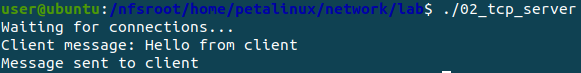
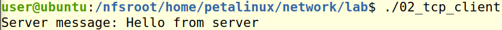
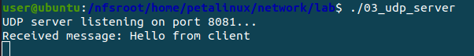
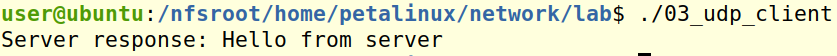
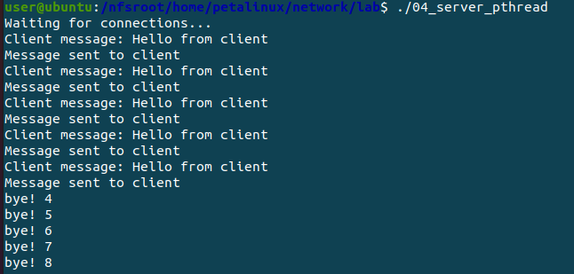
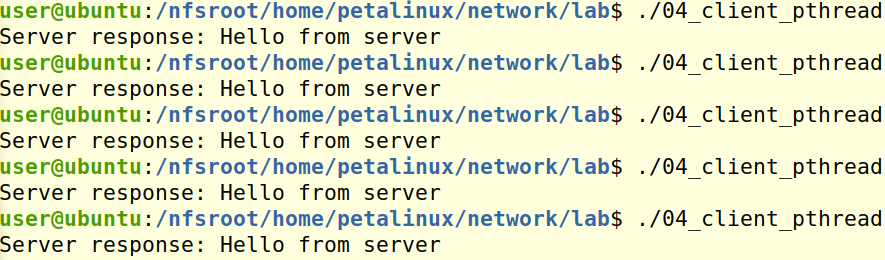
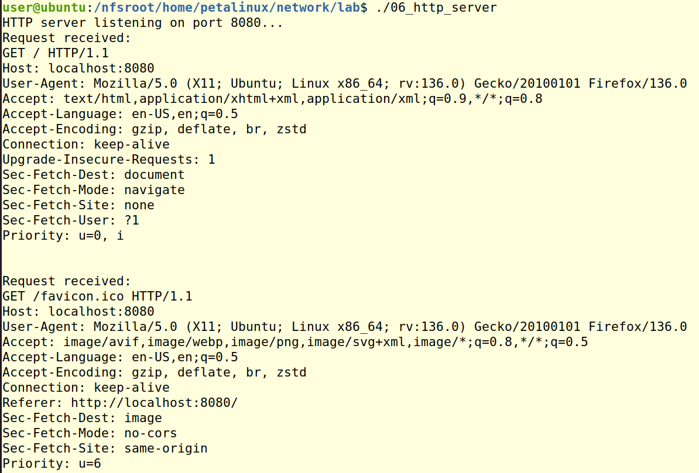
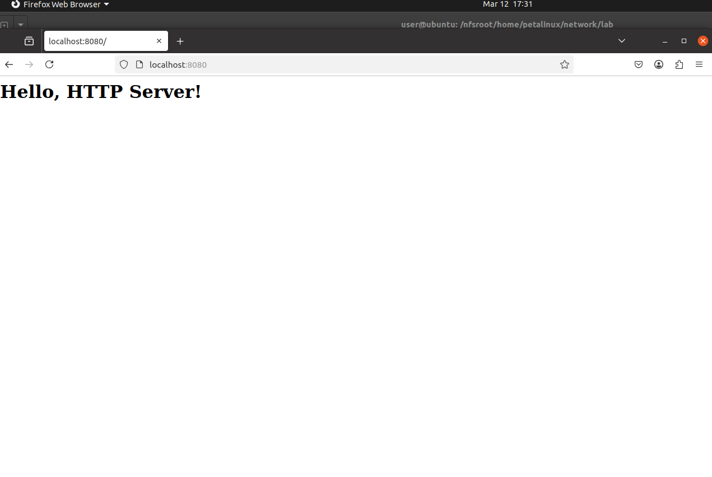

# 임베디드 SW 네트워크 프로그래밍 day01

날짜: 2026년 3월 12일

# 네트워크

## TCP

### TCP 개념

- TCP(Transmission Control Protocol)는 신뢰성 있는 데이터 전송을 제공하는 연결 기반의 프로토콜
- 클라이언트와 서버가 연결을 설정한 후, 데이터를 교환 가능
    - TCP 소켓: 데이터를 주고받기 위해 사용되는 소프트웨어 인터페이스로, IP 주소와 포트 번호를 결합
    하여 데이터를 전송
    - 연결 지향적: 데이터 전송 전, 송수신 장치 간에 연결을 설정해야 합니다.

### TCP 연결

1. 서버
    - 소켓 생성
    - 주소와 포트를 바인딩(bind)
    - 클라이언트의 연결 요청을 대기(listen)
    - 연결 요청 수락(accept)
2. 클라이언트
    - 소켓 생성
    - 서버에 연결(connect)

서버와 클라이언트 간의 연결이 설정되면 데이터를 주고받을 수 있음

### 예제

server

```c
/*
    서버는 클라이언트의 연결을 기다리고, 연결이 이루어지면 데이터를 송수신
*/

#include <stdio.h>
#include <stdlib.h>
#include <string.h>
#include <unistd.h>
#include <arpa/inet.h>

#define PORT 8081
#define BUFFER_SIZE 1024

int main() {
    int server_fd, new_socket;
    struct sockaddr_in address;
    int addrlen = sizeof(address);
    char buffer[BUFFER_SIZE] = {0};

    // 소켓 생성
    // SOCK_STREAM == TCP
    // AF_INET == IPv4 TCP
    if ((server_fd = socket(AF_INET, SOCK_STREAM, 0)) == 0) {
        perror("Socket failed");
        exit(EXIT_FAILURE);
    }

    address.sin_family = AF_INET;
    // 모든 네트워크 어뎁터든 상관 없으면 INAEER_ANY 작성
    address.sin_addr.s_addr = INADDR_ANY;
    // 서로 빅엔디안인지 리틀엔디안인지 모르고 통신 가능하도록 htons 사용
    // htons는 2바이트를 빅엔디안으로 변경해줌
    address.sin_port = htons(PORT);
    
        //server는 1. 바인딩, 2. listen 3. accept 순서로 작동
    // 바인딩
    if (bind(server_fd, (struct sockaddr *)&address, sizeof(address)) < 0) {
        perror("Bind failed");
        exit(EXIT_FAILURE);
    }

    // 연결 대기
    if (listen(server_fd, 3) < 0) {
        perror("Listen failed");
        exit(EXIT_FAILURE);
    }

    printf("Waiting for connections...\n");

    // 클라이언트 연결 수락
    if ((new_socket = accept(server_fd, (struct sockaddr *)&address, (socklen_t*)&addrlen)) < 0) {
        perror("Accept failed");
        exit(EXIT_FAILURE);
    }

    // 클라이언트로부터 데이터 받기
    read(new_socket, buffer, BUFFER_SIZE);
    printf("Client message: %s\n", buffer);

    // 클라이언트로 데이터 보내기
    send(new_socket, "Hello from server", 17, 0);
    printf("Message sent to client\n");

    // 소켓 종료
    close(new_socket);
    close(server_fd);

    return 0;
}
```

client

```c
/*
    클라이언트는 서버에 연결하고, 데이터를 전송하여 서버로부터 응답을 받는다
*/

#include <stdio.h>
#include <stdlib.h>
#include <string.h>
#include <unistd.h>
#include <arpa/inet.h>

#define PORT 8081 // server 코드 따라가기
#define SERVER_ADDR "127.0.0.1" // loop-back 주소 == 자기 자신의 주소를 표현할 때 사용
#define BUFFER_SIZE 1024

int main() {
    int sock = 0;
    struct sockaddr_in server_address;
    char buffer[BUFFER_SIZE] = {0};

    // 소켓 생성
    // TCP 이므로 SOCK_STREAM
    if ((sock = socket(AF_INET, SOCK_STREAM, 0)) < 0) {
        perror("Socket creation failed");
        return -1;
    }

    server_address.sin_family = AF_INET;
    // 서로 빅엔디안인지 리틀엔디안인지 모르고 통신 가능하도록 htons 사용
    // htons는 2바이트를 빅엔디안으로 변경해줌
    // 4바이트의 경우 htonl을 사용
    server_address.sin_port = htons(PORT);

    // 서버 주소 변환
    if (inet_pton(AF_INET, SERVER_ADDR, &server_address.sin_addr) <= 0) {
        perror("Invalid address");
        return -1;
    }

    // 서버에 연결
    if (connect(sock, (struct sockaddr *)&server_address, sizeof(server_address)) < 0) {
        perror("Connection failed");
        return -1;
    }

    // 서버로 메시지 보내기
    send(sock, "Hello from client", 17, 0);

    // 서버로부터 응답 받기
    read(sock, buffer, BUFFER_SIZE);
    printf("Server message: %s\n", buffer);

    // 소켓 종료
    close(sock);

    return 0;
}
```

결과





## UDP

### UDP 개념

- UDP (User Datagram Protocol): 연결을 설정하지 않고 데이터를 주고받는 비연결형 프로토콜
- 신뢰성은 보장되지 않지만, 빠르게 데이터를 전송
- 비연결형: 데이터를 전송하기 전에 상대방과의 연결을 설정하지 않습니다. 이로 인해 오버헤드가 적음
- 장점: 속도가 빠르고, 실시간 통신에 유리합니다.
- 단점: 데이터 손실, 순서 변경, 중복이 발생할 수 있습니다.

### 동작 원리

1. 서버:
    - 소켓 생성
    - 특정 포트를 바인딩(bind)
    - 클라이언트로부터 데이터를 수신
2. 클라이언트
    - 소켓 생성
    - 서버에 데이터를 전송

UDP는 연결을 설정하지 않기 때문에 데이터를 전송할 때마다 상대방의 주소와 포트를 명시해야 함

### 예제

server

```c
/*
    UDP 서버는 클라이언트가 전송하는 데이터를 수신하고, 그에 대한 응답을 전송한다.
*/

#include <stdio.h>
#include <stdlib.h>
#include <string.h>
#include <unistd.h>
#include <arpa/inet.h>

#define PORT 8081
#define BUFFER_SIZE 1024

int main() {
    int sock;
    struct sockaddr_in server_addr, client_addr;
    socklen_t client_addr_len = sizeof(client_addr);
    char buffer[BUFFER_SIZE];

    // 소켓 생성
    // SOCK_DGRAM == UDP
    if ((sock = socket(AF_INET, SOCK_DGRAM, 0)) < 0) {
        perror("Socket creation failed");
        exit(EXIT_FAILURE);
    }

    // 서버 주소 설정
    memset(&server_addr, 0, sizeof(server_addr));
    server_addr.sin_family = AF_INET;
    server_addr.sin_addr.s_addr = INADDR_ANY;
    server_addr.sin_port = htons(PORT);

    // 소켓 바인딩
    if (bind(sock, (const struct sockaddr *)&server_addr, sizeof(server_addr)) < 0) {
        perror("Bind failed");
        exit(EXIT_FAILURE);
    }

    printf("UDP server listening on port %d...\n", PORT);

    // 클라이언트로부터 데이터 수신
    while (1) {
            // TCP와 다르게 read가 아니라 recvfrom
        int n = recvfrom(sock, (char *)buffer, BUFFER_SIZE, MSG_WAITALL,
                         (struct sockaddr *)&client_addr, &client_addr_len);
        buffer[n] = '\0';
        printf("Received message: %s\n", buffer);

        // 클라이언트로 응답 전송
        // TCP와 다르게 send가 아니라 snedto
        sendto(sock, (const char *)"Hello from server", 17, MSG_CONFIRM,
               (const struct sockaddr *)&client_addr, client_addr_len);
    }

    close(sock);
    return 0;
}
```

client

```c
/*
    클라이언트는 UDP 서버로 메시지를 보내고, 응답을 받는다
*/

#include <stdio.h>
#include <stdlib.h>
#include <string.h>
#include <unistd.h>
#include <arpa/inet.h>
#include <sys/socket.h>  // MSG_CONFIRM 플래그 정의를 위해 필요

#define PORT 8081
#define SERVER_ADDR "127.0.0.1"
#define BUFFER_SIZE 1024

int main() {
    int sock;
    struct sockaddr_in server_addr;
    char buffer[BUFFER_SIZE] = "Hello from client";

    // 소켓 생성
    if ((sock = socket(AF_INET, SOCK_DGRAM, 0)) < 0) {
        perror("Socket creation failed");
        return -1;
    }

    server_addr.sin_family = AF_INET;
    server_addr.sin_port = htons(PORT);
    server_addr.sin_addr.s_addr = inet_addr(SERVER_ADDR);

    // 서버로 데이터 전송
    sendto(sock, (const char *)buffer, strlen(buffer), MSG_CONFIRM,
           (const struct sockaddr *)&server_addr, sizeof(server_addr));

    // 서버로부터 응답 받기
    int n = recvfrom(sock, (char *)buffer, BUFFER_SIZE, MSG_WAITALL, // MSG_WAITALL: 요청한 크기만큼 데이터가 수신될 때까지 대기
                     (struct sockaddr *)&server_addr, (socklen_t *)sizeof(server_addr));
    buffer[n] = '\0';
    printf("Server response: %s\n", buffer);

    close(sock);
    return 0;
}
```

TCP 와 다른 점은 ACK를 전달하지 않기 때문에 서로 받았는지 받지 않았는지 모름 

→ UDP가 TCP보다 불안정적이라는 이유

결과





UDP는 client 통신 이후 자동으로 종료되지 않음

## TCP 소켓 통신을 Thread로 구현

server

```c
/*
    멀티스레딩을 활용하여 여러 클라이언트의 요청을 동시에 처리하는 TCP 서버를 구현
    각 클라이언트 연결마다 새 스레드를 생성하여 독립적으로 클라이언트와 통신
*/

#include <stdio.h>
#include <stdlib.h>
#include <string.h>
#include <unistd.h>
#include <pthread.h>
#include <arpa/inet.h>

#define PORT 8081
#define BUFFER_SIZE 1024

// 클라이언트 처리 함수
void *handle_client(void *arg) {
    int new_socket = *((int *)arg);
    char buffer[BUFFER_SIZE];
    
    // 클라이언트로부터 메시지 수신
    int n = read(new_socket, buffer, BUFFER_SIZE);
    buffer[n] = '\0';
    printf("Client message: %s\n", buffer);

    // 클라이언트로 응답 보내기
    send(new_socket, "Hello from server", 17, 0);
    printf("Message sent to client\n");
        
        sleep(30);

    printf("bye! %d\n", new_socket);
        
    close(new_socket);
    return NULL;
}

int main() {
    int server_fd, new_socket;
    struct sockaddr_in address;
    int addrlen = sizeof(address);
    pthread_t thread_id;

    // 소켓 생성
    if ((server_fd = socket(AF_INET, SOCK_STREAM, 0)) == 0) {
        perror("Socket failed");
        exit(EXIT_FAILURE);
    }

    address.sin_family = AF_INET;
    address.sin_addr.s_addr = INADDR_ANY;
    address.sin_port = htons(PORT);

    // 바인딩
    if (bind(server_fd, (struct sockaddr *)&address, sizeof(address)) < 0) {
        perror("Bind failed");
        exit(EXIT_FAILURE);
    }

    // 연결 대기
    if (listen(server_fd, 3) < 0) {
        perror("Listen failed");
        exit(EXIT_FAILURE);
    }

    printf("Waiting for connections...\n");

    // 클라이언트 연결 처리
    // whlie loop로 여러개의 클라이언트 연결 가능
    while (1) {
        if ((new_socket = accept(server_fd, (struct sockaddr *)&address, (socklen_t*)&addrlen)) < 0) {
            perror("Accept failed");
            continue;
        }

        // 새 스레드 생성하여 클라이언트 처리
        // 새 스레드 생성할 때 socket을 매개 변수로 받음
        // client가 접속할 때마다 스레드 생성
        if (pthread_create(&thread_id, NULL, handle_client, (void *)&new_socket) != 0) {
            perror("Thread creation failed");
        }

        // 스레드를 분리상태로 유지
        pthread_detach(thread_id);
    }

    close(server_fd);
    return 0;
}

```

client

```c
/*
    클라이언트는 서버에 여러 번 연결하여 메시지를 주고받는다. 서버에서 처리된 응답을 출력
*/

#include <stdio.h>
#include <stdlib.h>
#include <string.h>
#include <unistd.h>
#include <arpa/inet.h>

#define PORT 8081
#define SERVER_ADDR "127.0.0.1"
#define BUFFER_SIZE 1024

int main() {
    int sock;
    struct sockaddr_in server_addr;
    char buffer[BUFFER_SIZE] = "Hello from client";

    // 소켓 생성
    if ((sock = socket(AF_INET, SOCK_STREAM, 0)) < 0) {
        perror("Socket creation failed");
        return -1;
    }

    server_addr.sin_family = AF_INET;
    server_addr.sin_port = htons(PORT);
    server_addr.sin_addr.s_addr = inet_addr(SERVER_ADDR);

    // 서버에 연결
    if (connect(sock, (struct sockaddr *)&server_addr, sizeof(server_addr)) < 0) {
        perror("Connection failed");
        return -1;
    }

    // 서버로 메시지 보내기
    send(sock, (const char *)buffer, strlen(buffer), 0);

    // 서버로부터 응답 받기
    int n = read(sock, buffer, BUFFER_SIZE);
    buffer[n] = '\0';
    printf("Server response: %s\n", buffer);

    close(sock);
    return 0;
}
```

결과





## 비동기 I/O

### 개념

비동기 I/O는 I/O 작업을 요청한 후, 해당 작업이 완료될 때까지 기다리지 않고 다른 작업을 동시에 수행할
수 있게 하는 기법

이는 주로 서버가 여러 클라이언트의 요청을 동시에 처리해야 할 때 유용합니다.

- 블로킹 I/O: 클라이언트로부터 데이터를 읽을 때, 서버는 데이터가 오기를 기다리며 다른 작업을 할
수 없습니다.
- 비동기 I/O: 서버는 데이터를 기다리지 않고 다른 작업을 수행할 수 있습니다. select() ,
poll() , epoll() 등의 시스템 호출을 통해 비동기 I/O를 구현할 수 있습니다.

### select() 함수

select() 함수는 여러 파일 디스크립터에 대해 입출력 가능한지 확인하여, 데이터를 읽거나 쓸 준비가
된 파일 디스크립터를 알려줌

이 함수는 비동기식으로 동작하여, 서버가 여러 클라이언트의 요청을 동시에 처리할 수 있게 함

- 사용 방법
    
    select() 함수는 읽기, 쓰기, 예외 처리가 가능한 소켓을 모니터링하며, 준비된 소켓에
    대해서만 데이터를 처리
    

### 예제

server

```c
/*
    서버가 여러 클라이언트의 요청을 동시에 처리할 수 있게 한다.
    select() 함수는 읽기, 쓰기, 예외 처리가 가능한 소켓을 모니터링하며, 
    준비된 소켓에 대해서만 데이터를 처리한다
*/

#include <stdio.h>
#include <stdlib.h>
#include <string.h>
#include <unistd.h>
#include <arpa/inet.h>
#include <sys/select.h>

#define PORT 8081
#define BUFFER_SIZE 1024

int main() {
    int server_fd, new_socket, max_sd;
    struct sockaddr_in address;
    fd_set readfds;
    char buffer[BUFFER_SIZE];
    
    // 소켓 생성
    if ((server_fd = socket(AF_INET, SOCK_STREAM, 0)) == 0) {
        perror("Socket failed");
        exit(EXIT_FAILURE);
    }

    address.sin_family = AF_INET;
    address.sin_addr.s_addr = INADDR_ANY;
    address.sin_port = htons(PORT);

    // 소켓 바인딩
    if (bind(server_fd, (struct sockaddr *)&address, sizeof(address)) < 0) {
        perror("Bind failed");
        exit(EXIT_FAILURE);
    }

    // 연결 대기
    if (listen(server_fd, 3) < 0) {
        perror("Listen failed");
        exit(EXIT_FAILURE);
    }

    printf("Waiting for connections...\n");

    // 파일 디스크립터 집합 초기화
    FD_ZERO(&readfds);
    FD_SET(server_fd, &readfds);
    max_sd = server_fd;

    while (1) {
        // `select()`를 이용한 비동기식 I/O
        fd_set tempfds = readfds;
        int activity = select(max_sd + 1, &tempfds, NULL, NULL, NULL);
        if (activity < 0) {
            perror("Select error");
            exit(EXIT_FAILURE);
        }

        // 서버 소켓에 새로운 연결이 들어왔을 때
        if (FD_ISSET(server_fd, &tempfds)) {
            if ((new_socket = accept(server_fd, NULL, NULL)) < 0) {
                perror("Accept failed");
                exit(EXIT_FAILURE);
            }
            FD_SET(new_socket, &readfds);
            if (new_socket > max_sd)
                max_sd = new_socket;
            printf("New connection accepted\n");
        }

        // 각 클라이언트 소켓에 대해 데이터를 읽어 처리
        for (int i = 0; i <= max_sd; i++) {
            if (FD_ISSET(i, &tempfds) && i != server_fd) {
                int valread = read(i, buffer, BUFFER_SIZE);
                if (valread == 0) {
                    // 클라이언트가 연결 종료
                    close(i);
                    FD_CLR(i, &readfds);
                    printf("Client disconnected\n");
                } else {
                    // 클라이언트로부터 받은 데이터 출력
                    buffer[valread] = '\0';
                    printf("Received message: %s\n", buffer);
                    send(i, "Message received", 16, 0);
                }
            }
        }
    }

    close(server_fd);
    return 0;
}
```

## HTTP

### 개념

HTTP(HyperText Transfer Protocol)는 클라이언트와 서버 간에 데이터를 주고받을 때 사용되는 텍스
트 기반의 프로토콜. 기본적으로 요청-응답 방식으로 동작합니다.

- HTTP 요청: 클라이언트가 서버에 정보를 요청하는 메시지입니다.
- HTTP 응답: 서버가 클라이언트의 요청에 대한 결과를 반환하는 메시지입니다.

### HTTP 메시지 구성:

1. 요청 라인: 요청 메소드(GET, POST 등), URI, HTTP 버전
2. 헤더: 메타데이터(예: Host , User-Agent , Content-Type 등)
3. 본문: 요청 또는 응답의 실제 내용

### 예제

server

```c
/*
    HTTP 서버는 클라이언트의 요청을 수신하고, 요청에 맞는 응답을 반환하는 기능을 수행
    이 서버는 텍스트 기반 HTTP 요청을 파싱하고, 해당 요청에 대한 응답을 처리한다.
    HTTP 클라이언트의 요청을 받아서 HTML 문서를 응답하는 간단한 웹 서버
    http://localhost:8080/
*/

#include <stdio.h>
#include <stdlib.h>
#include <string.h>
#include <unistd.h>
#include <arpa/inet.h>

#define PORT 8080
#define BUFFER_SIZE 1024

// HTTP 응답 작성 함수
void send_http_response(int new_socket) {
    const char *response = "HTTP/1.1 200 OK\r\n"
                           "Content-Type: text/html\r\n"
                           "\r\n"
                           "<html><body><h1>Hello, HTTP Server!</h1></body></html>\r\n";
    
    send(new_socket, response, strlen(response), 0);
}

int main() {
    int server_fd, new_socket;
    struct sockaddr_in address;
    int addrlen = sizeof(address);
    char buffer[BUFFER_SIZE] = {0};

    // 소켓 생성
    if ((server_fd = socket(AF_INET, SOCK_STREAM, 0)) == 0) {
        perror("Socket failed");
        exit(EXIT_FAILURE);
    }

    address.sin_family = AF_INET;
    address.sin_addr.s_addr = INADDR_ANY;
    address.sin_port = htons(PORT);

    // 바인딩
    if (bind(server_fd, (struct sockaddr *)&address, sizeof(address)) < 0) {
        perror("Bind failed");
        exit(EXIT_FAILURE);
    }

    // 연결 대기
    if (listen(server_fd, 3) < 0) {
        perror("Listen failed");
        exit(EXIT_FAILURE);
    }

    printf("HTTP server listening on port %d...\n", PORT);

    while (1) {
        // 클라이언트 연결 수락
        if ((new_socket = accept(server_fd, (struct sockaddr *)&address, (socklen_t*)&addrlen)) < 0) {
            perror("Accept failed");
            exit(EXIT_FAILURE);
        }

        // 클라이언트로부터 HTTP 요청 받기
        read(new_socket, buffer, BUFFER_SIZE);
        printf("Request received: \n%s\n", buffer);

        // HTTP 응답 보내기
        send_http_response(new_socket);

        // 소켓 종료
        close(new_socket);
    }

    close(server_fd);
    return 0;
}
```

결과





## 소켓을 이용한 파일 전송

파일 전송은 네트워크 프로그래밍에서 중요한 작업 중 하나

클라이언트가 서버에 파일을 요청하거나, 서버가 클라이언트에게 파일을 보내는 기능을 구현

TCP 소켓을 사용하면 신뢰성 있는 파일 전송이 가능하며, 파일의 크기가 크더라도 전송을 성공 가능

### 파일 전송 과정

1. 서버 측:
    - 파일을 읽어서 클라이언트에게 전송합니다.
    - 클라이언트의 연결을 수락하고 파일을 송신합니다.
2. 클라이언트 측:
    - 서버에 연결하고, 파일을 요청하거나 수신합니다.
    - 수신한 파일을 로컬 시스템에 저장합니다.

### 예제

server

```c
/*
    서버와 클라이언트는 파일을 송수신하기 위해 소켓을 사용한다.
    fopen()과 fread()를 사용하여 파일을 읽고, send()를 통해 파일 데이터를 전송한다.
*/

#include <stdio.h>
#include <stdlib.h>
#include <string.h>
#include <unistd.h>
#include <arpa/inet.h>

#define PORT 8081
#define FILENAME "sample.txt"
#define BUFFER_SIZE 1024

int main() {
    int server_fd, new_socket, opt = 1;
    struct sockaddr_in address;
    FILE *file;
    char buffer[BUFFER_SIZE];

    // 소켓 생성
    if ((server_fd = socket(AF_INET, SOCK_STREAM, 0)) == 0) {
        perror("Socket failed");
        exit(EXIT_FAILURE);
    }

    // 소켓 옵션: 즉시 재사용 설정
    if (setsockopt(server_fd, SOL_SOCKET, SO_REUSEADDR, &opt, sizeof(opt)) < 0) {
        perror("setsockopt failed");
        exit(EXIT_FAILURE);
    }

    address.sin_family = AF_INET;
    address.sin_addr.s_addr = INADDR_ANY;
    address.sin_port = htons(PORT);

    // 바인딩
    if (bind(server_fd, (struct sockaddr *)&address, sizeof(address)) < 0) {
        perror("Bind failed");
        exit(EXIT_FAILURE);
    }

    // 연결 대기
    if (listen(server_fd, 3) < 0) {
        perror("Listen failed");
        exit(EXIT_FAILURE);
    }

    printf("Server listening on port %d...\n", PORT);

    // 클라이언트 연결 수락
    if ((new_socket = accept(server_fd, NULL, NULL)) < 0) {
        perror("Accept failed");
        exit(EXIT_FAILURE);
    }

    // 파일 열기
    file = fopen(FILENAME, "rb");
    if (file == NULL) {
        perror("File not found");
        close(new_socket);
        exit(EXIT_FAILURE);
    }

    // 파일 읽어서 클라이언트에 전송
    int bytes_read;
    while ((bytes_read = fread(buffer, 1, BUFFER_SIZE, file)) > 0) {
        send(new_socket, buffer, bytes_read, 0);
    }

    printf("File sent successfully\n");

    // 파일 종료 및 소켓 종료
    fclose(file);
    close(new_socket);
    close(server_fd);

    return 0;
}
```

client

```c
/*
    클라이언트는 서버에 연결하여 파일을 수신하고, 로컬 시스템에 저장한다.
    fopen() 과 fwrite() 를 사용하여 서버에서 받은 데이터를 파일로 저장한다.
*/

#include <stdio.h>
#include <stdlib.h>
#include <string.h>
#include <unistd.h>
#include <arpa/inet.h>

#define PORT 8081
#define FILENAME "received_sample.txt"
#define BUFFER_SIZE 1024

int main() {
    int sock;
    struct sockaddr_in server_addr;
    FILE *file;
    char buffer[BUFFER_SIZE];

    // 소켓 생성
    if ((sock = socket(AF_INET, SOCK_STREAM, 0)) < 0) {
        perror("Socket creation failed");
        return -1;
    }

    server_addr.sin_family = AF_INET;
    server_addr.sin_port = htons(PORT);
    server_addr.sin_addr.s_addr = inet_addr("127.0.0.1");

    // 서버에 연결
    if (connect(sock, (struct sockaddr *)&server_addr, sizeof(server_addr)) < 0) {
        perror("Connection failed");
        return -1;
    }

    // 파일 열기
    file = fopen(FILENAME, "wb");
    if (file == NULL) {
        perror("Unable to open file");
        close(sock);
        return -1;
    }

    // 서버에서 파일 수신
    int bytes_received;
    while ((bytes_received = recv(sock, buffer, BUFFER_SIZE, 0)) > 0) {
        fwrite(buffer, sizeof(char), bytes_received, file);
    }

    printf("File received successfully\n");

    // 파일 종료 및 소켓 종료
    fclose(file);
    close(sock);

    return 0;
}
```